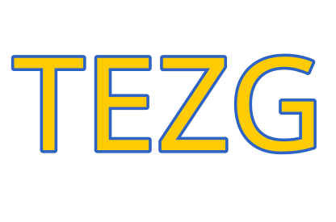

<b>TCG — but EZ</b> · Collection Tracker + Local Marketplace for Colombia

### One accurate, COP-priced view of your Pokémon TCG collection — with a local marketplace growing on top of it.

 

 

&nbsp;

Colombian Pokémon TCG collectors, buyers, individual sellers, and small businesses today stitch together eBay, PriceCharting, and Collectr — and eat cross‑border shipping and import‑tax costs to do it. Everything else that exists locally is informal WhatsApp/Telegram groups with no structure.

**TEZG** is being designed as **a collection tracker with a local marketplace attached**: one accurate, COP‑priced view of a collector's cards, their market value, and their wishlist — growing, over time, into a real place to buy, sell, and trade directly with other Colombian collectors.

> Collection‑tracking value ships first and stands on its own. Marketplace liquidity — the seller community — is built on top of it. That's a deliberate sequencing decision, not a gap.

| | | | |
|:---:|:---:|:---:|:---:|
|  |  |  |  |
| **Collection** | **Marketplace** | **Trading** | **Community** |
| Binder-style tracking of what you own, its condition, and its current market value in COP | Peer‑to‑peer listings for individual sellers and verified businesses — no payment gateway in the middle | Direct card‑for‑card trade offers between individual collectors | Built local‑first for Colombia, growing with the people who actually use it |

&nbsp;

&nbsp;

- **Peer‑to‑peer settlement, no payment gateway** — the platform never holds funds; buyers and sellers confirm payment and receipt between themselves.
- **Module boundaries are real boundaries** — each module (catalog, listings, orders, trading, commission, collection, identity...) owns its own data and exposes a public interface; nothing reaches into another module's internals.
- **Local‑first, COP‑native** — money, dates, and pricing are designed around Colombia from the start, not bolted on later.

TCG, but EZ.

