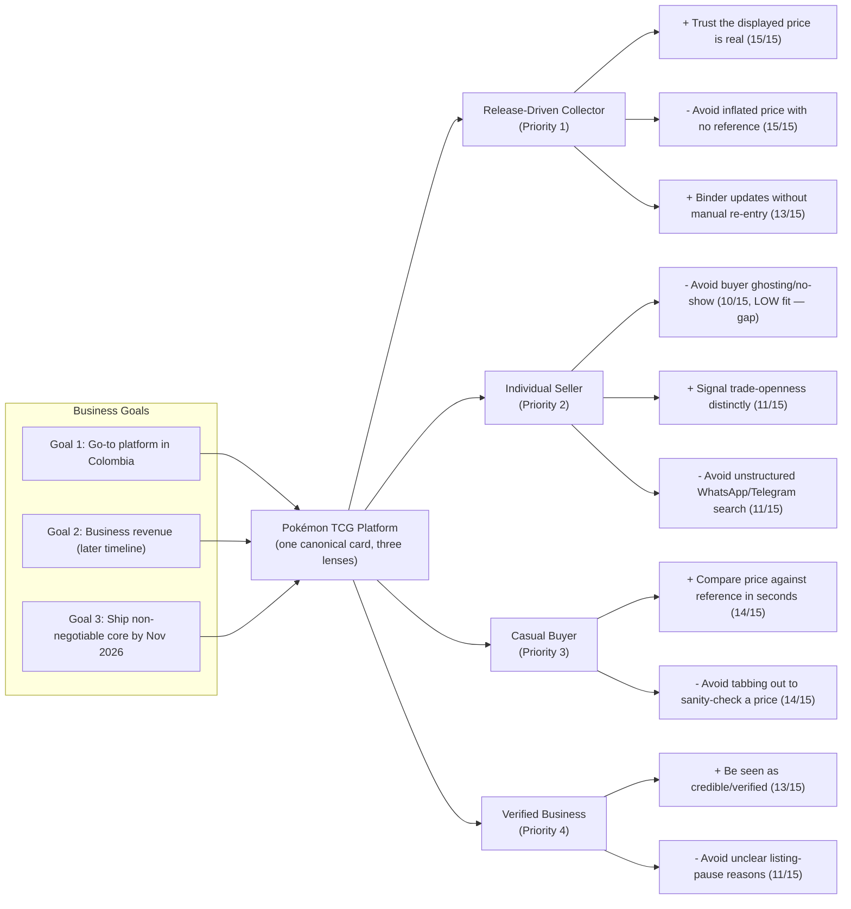

# Trigger Map: Pokémon TCG Marketplace and Collection Management Platform

> WDS Phase 2 (Trigger Mapping) — produced retroactively via the "from existing documentation" path, using `project-brief.md`, `SPEC.md`, `persona-archetypes.md`, and `review-adversarial-divergence.md` as source material. Originally skipped per exercise scope; re-run as Repair Plan Step 1 (Suggest mode) following the closure document's remediation plan.

**Created:** 2026-09-01
**Mode:** Suggest (AI-generated from existing docs + Saga's methodology guide, human-reviewed at each layer during the preceding workshop dialogue)
**Method reference:** `_bmad/wds/data/agent-guides/saga/trigger-mapping.md` (Effect Mapping adaptation — psychology-focused, solutions removed from the map)

---

## Business Goals

### Goal 1: Become the go-to Pokémon TCG platform in Colombia (Primary Outcome)

- **Objective 1.1:** Grow active users who've made the platform their primary collection tracker, moving activity off Collectr — tracked directionally for now (no hard number set; too early for a pre-launch project to commit honestly, per Success Criteria)
- **Objective 1.2:** Zero need to leave the platform to sanity-check a price — every card detail view shows external reference prices (PriceCharting, TCGplayer) inline alongside platform listings
- **Objective 1.3:** Become the recognized go-to place to purchase cards in Colombia (the experience-quality bar stated directly in Success Criteria)

### Goal 2: Build sustainable business-side revenue (Prerequisite — deliberately later timeline)

- **Objective 2.1:** Grow the number of registered/verified businesses (directional metric)
- **Objective 2.2:** Grow transaction volume through verified-business in-platform purchases (directional metric)
- **Objective 2.3:** Maintain the prepaid-commission model with zero collections risk — balance pauses listings at zero rather than requiring after-the-fact invoicing

### Goal 3: Ship the non-negotiable core by the November 2026 deadline (Prerequisite — Work Smarter)

- **Objective 3.1:** Ship the collection tracker, virtual binder, and trading system by end of November 2026 — the fixed, non-negotiable scope
- **Objective 3.2:** Deliberately allow the transactional/payments piece specifically to slip past November if needed — it's the highest-complexity piece, flagged and de-risked in advance
- **Objective 3.3:** Replace the three-tool manual-reconciliation workflow (eBay + PriceCharting + Collectr) with the "one canonical card, three lenses" unified data model

**Alignment check:** Objective 3.3 is structural (product concept), not a metric masquerading as a goal — kept because it's the mechanism the other two goals depend on, not because it's independently measurable.

---

## Product/Solution

**Pokémon TCG Marketplace and Collection Management Platform** (name not yet decided) — a Colombia-only responsive web app built on "one canonical card, three lenses": every card lives once in the catalog and is viewed through a marketplace lens (local individual/business listings), a collection lens (binder), and a market lens (price/trend), replacing the fragmented eBay + PriceCharting + Collectr chain.

---

## Target Groups (Prioritized)

```
Goal 1 (go-to platform) ─────┬── Priority 1: Release-Driven Collector (primary archetype)
                              └── Priority 3: Casual Buyer

Goal 3 (non-negotiable core) ── Priority 2: Individual Seller (trading system)

Goal 2 (business revenue)  ──── Priority 4: Verified Business / Specialized Store
```

Two archetypes from `persona-archetypes.md` are deliberately excluded from this map per the "3-4 groups max" rule: the **Platform Administrator** (an operational/internal actor, not a demand-side user with driving forces to design against) and the **Pokémon TCG Community** (a non-transactional usage *mode* every other persona can be in, not a distinct psychology).

Full persona detail: see `personas/` — one file per target group.

---

## Prioritization Rationale

1. **Release-Driven Collector** — explicitly named the primary archetype in the Product Brief and `persona-archetypes.md`; the platform must be useful to this persona standalone, before marketplace liquidity exists, per the "collection tracker first, marketplace grows in" sequencing.
2. **Individual Seller** — the trading system and individual-seller flow are fixed/non-negotiable constraints (not flexible like the revenue mechanism), and this persona is the seller-side liquidity the go-to-platform goal eventually depends on.
3. **Casual Buyer** — secondary in the ICP; directly maps to the Success Criteria's "never leave the platform to sanity-check a price" bar, and is the funnel into both individual-seller contact and verified-business purchase.
4. **Verified Business** — carries Goal 2 (revenue) directly, but Goal 2 is explicitly the later-timeline track; monetization is business-only at launch precisely because this segment doesn't have to prove out first for the collection-tracking value to stand.

---

## Design Focus Statement

> For the **Release-Driven Collector**, whose highest-scoring driving force is trusting the displayed price is the real Colombian market price (not stale or inflated) every time they decide to buy — the platform must make price-trustworthiness visible at the point of decision, not just present it as a possibly-questionable number.
>
> For the **Casual Buyer**, whose top driving force is comparing a listing against a fair reference value within seconds — this is the same underlying need (price trust) expressed as a lower-commitment, faster decision. Both point at the same design priority: **the card detail / listing view is the single highest-leverage surface in the product.**

This is a genuine convergence, not a coincidence of scoring — both the Vision statement and the Success Criteria's qualitative bar independently name price-trust as the platform's central value proposition.

---

## Cross-Cutting Gap Surfaced During Mapping

**Individual Seller driving force "avoid being ghosted or scammed by a buyer who never follows through" scores LOW on the priority table (10/15) despite HIGH intensity (5/5), because Fit is low (2/5)** — the platform can't guarantee outcomes it doesn't process (the actual exchange happens off-platform, matching the external-handoff model). Per the guide's own interpretation rule, a high-intensity/low-fit force signals a **product limitation**, not a force to quietly deprioritize.

This surfaced a genuine tension with `SPEC.md`'s flagged "Risky" assumption that individual-seller reviews have no purchase-verification gate. Resolved during the workshop as a two-tier split:

- **In scope for this Trigger Map's design focus:** label reviews as unverified vs. verified-purchase, so a buyer/trade-partner can see at a glance whether a review reflects a confirmed transaction — an honest, achievable UX response to the fear, not a false promise of protection.
- **Out of scope, logged as a future research item:** any actual enforcement mechanism (escrow-like holds, mandatory confirmation gates for individual sellers) — this would change the "no escrow, identity-backed reputation" trust model that was a deliberate Platform Mechanics decision, and isn't a UX-layer fix.

---

## Visual Trigger Map



---

## Sources

- `_bmad-output/A-Product-Brief/project-brief.md` (Vision, Positioning, Business Model, ICP, Product Concept, Success Criteria, Platform Mechanics, Constraints)
- `_bmad-output/specs/spec-pokemon-tcg-marketplace/SPEC.md` (CAP-1–CAP-28, Success Signal, Open Questions)
- `_bmad-output/specs/spec-pokemon-tcg-marketplace/companion-files/persona-archetypes.md` (base archetypes, deepened here with psychology and driving forces)
- `_bmad-output/planning-artifacts/architecture/.../reviews/review-adversarial-divergence.md` (informed the review-gate tension noted above; the technical event-contract findings in that review are handled separately, not folded into this UX-focused map — see Repair Plan Step 1's "Do both" split)
- `_bmad/wds/data/agent-guides/saga/trigger-mapping.md` (methodology reference actually present in this repo)

**Next:** Feature Impact Analysis (`feature-impact-analysis.md`) for the full scored driving-force table; individual persona files in `personas/`.
