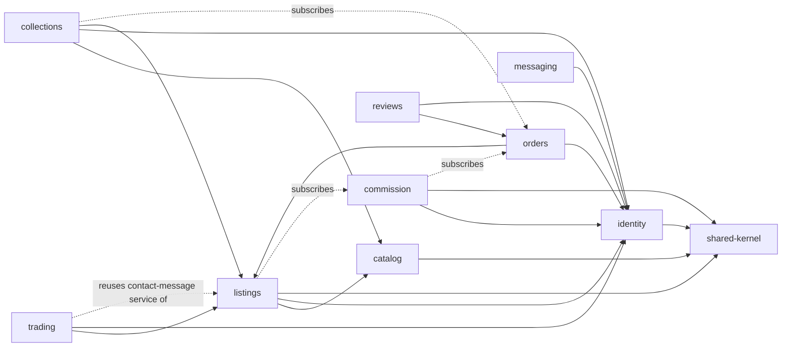
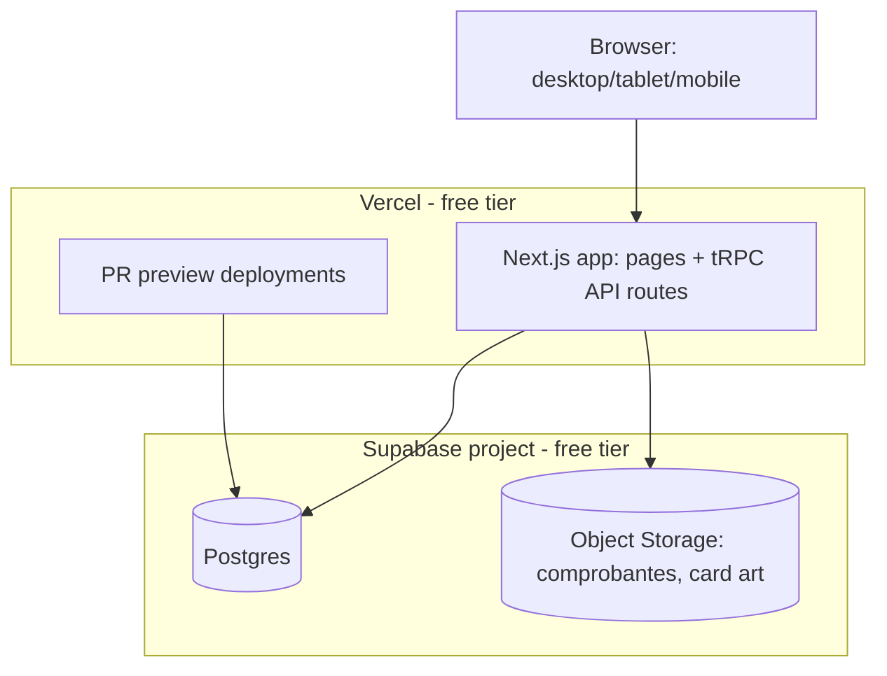
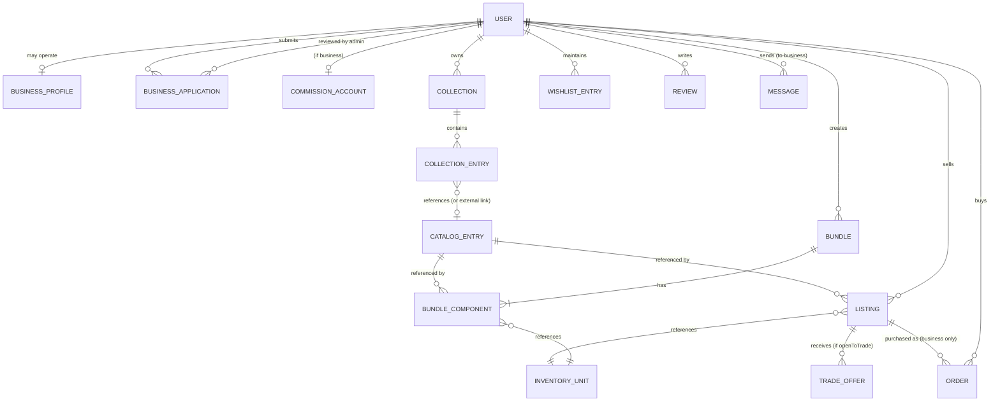

# Architecture Spine — Pokemon TCG Marketplace and Collection Management Platform

## Design Paradigm

**Modular monolith, hexagonal per module, in-process domain events.** One deployable. The system is split into domain modules, each internally hexagonal (a framework-free domain core, application services, and adapters for HTTP/tRPC and persistence). Cross-module effects travel two ways, not one: correctness-critical writes (e.g. an inventory decrement) go through a direct synchronous call into the owning module's public application service, in the same transaction (AD-6); everything else travels as a published domain event on an in-process bus, a typed emitter, not a message queue (AD-9/AD-10). Chosen over a plain layered monolith (too little boundary enforcement) and over microservices/message-bus event-driven (infra cost incompatible with a 2-person, free-tier team).

Modules: `catalog`, `listings` (incl. bundles + shared inventory), `trading`, `orders`, `commission`, `collections` (incl. binder + wishlist), `reviews`, `messaging`, `identity` (users, business profiles/applications, admin), `shared-kernel` (ids, money, domain-error codes, event bus).

## System Boundaries & Dependencies

One deployable — there are no service-to-service network boundaries to cross. A browser talks to the Next.js app over HTTP through typed tRPC procedures (not REST, not gRPC); every module lives in the same process, so a "call" between `orders` and `listings` is an in-process TypeScript function call, never a network hop, message broker, or service mesh. Two call shapes exist, and only two (Consistency Conventions): a direct synchronous call into the target module's public application service, for the one case where a shared transaction is required (`listings.reserveInventory(...)`, AD-6), or an in-process domain-event publish/subscribe for everything else (AD-9/AD-10). Ownership is enforced at two independent levels so the import graph can't be quietly bypassed: the compile-time dependency direction (AD-1, graph below) and physical table ownership (AD-8, Prisma models written only by their owning module's repository). External dependencies — the third-party catalog/price data source and the external messaging app a buyer is handed off to — are adapters at the `catalog` and `listings` module boundaries respectively, never called from inside another module's core.

| Component | Owns | Talks to | Protocol |
| --- | --- | --- | --- |
| Next.js app (single deployable) | UI rendering, tRPC routers | Browser | HTTP (tRPC over HTTP) |
| `catalog`, `listings`, `trading`, `orders`, `commission`, `collections`, `reviews`, `messaging`, `identity` | their own Prisma tables (AD-8) | each other, in-process only | direct TS call (AD-6, correctness-critical) or domain event (AD-9/AD-10) |
| `shared-kernel` | ids, money/reference-price value objects, `DomainError` enum, event bus | everything depends on it; it depends on nothing | in-process import |
| External price/catalog feed | — | `catalog`'s ingestion adapter | HTTP (outbound, adapter-isolated) |
| External messaging app (WhatsApp/etc.) | — | buyer's browser, via a generated link from `listings` (CAP-6) | none — handoff only, platform never calls it |

See AD-1's dependency graph below for the full per-module edge list.

## State Mutation & Invariant Rules

Every piece of mutable state that more than one module could plausibly touch has exactly one owning module and one defined mutation rule — the table below is a scannable index into the ADs that establish each one.

| State | Single source of truth | Mutation rule | Governing AD |
| --- | --- | --- | --- |
| Sellable quantity (card or sealed product) | `InventoryUnit(sellerId, itemRef).quantity`, owned by `listings` | Decremented only via `listings.reserveInventory(...)`, synchronously, at reservation time (order/trade-offer creation) — never at close/confirmation | AD-6 |
| Business-purchase order status | `Order`'s three independently-timestamped confirmation fields | Each timestamp set only by its owning party's own confirmation action; never collapsed into one status enum | AD-2 |
| Commission balance | `CommissionAccount(businessId).balanceCOP`, owned exclusively by `commission` | Deducted only in reaction to the `OrderPaymentConfirmedByBusiness` event; `listings` never stores or mutates a balance copy | AD-3 |
| Trade-offer completion | `TradeOffer`'s two independent confirmation booleans | "Completed" is a computed property (`buyerConfirmed && sellerConfirmed`), never a separately-stored status that could drift from the two booleans | AD-4 |
| Cross-module side effects (non-correctness-critical) | the in-process domain-event bus (`shared-kernel`) | Published only post-commit; a subscriber's failure is caught and logged, never rolled back or retried against the publisher | AD-9, AD-10 |
| `DomainError` codes | one owning, throwing module per code (explicit list) | A module that detects another module's error condition propagates it unchanged, never re-throws its own copy | AD-11 |
| Listing/review visibility after moderation | `hiddenAt`/`hiddenReason` on the owning aggregate (`Listing`, `Review`) | Hide only, never delete; every default read query filters `hiddenAt IS NULL` | AD-12 |

## Invariants & Rules

### AD-1 — Module boundary & dependency direction

- **Binds:** all modules
- **Prevents:** circular or "upward" dependencies that let two modules co-own the same concept
- **Rule:** dependencies flow one direction only, per the graph below. A module may import another module's *public* application-service interface — both query methods (reads) and command methods (writes the target module makes to its own tables on the caller's behalf, e.g. `listings.reserveInventory(...)` called from `orders`, AD-6) — but never another module's domain core, repository, or Prisma models directly. `shared-kernel` has no dependents that don't need it and no dependencies of its own.
- **Context & Problem:** modules are built somewhat independently against the same domain; without an explicit dependency direction, two modules could each assume ownership of overlapping concepts (e.g. both `listings` and `orders` reaching into inventory) or form circular imports that make the module folders' boundaries meaningless in practice.
- **Decision Taken:** fix one allowed dependency direction system-wide (the graph below); cross-module calls only through the target's public application-service interface, never its internals.
- **Status:** Accepted
- **Consequences & Trade-offs:** independent module development without runtime boundary violations; every cross-module write needs an explicit application-service command (more ceremony than a shared repository call), and enforcement is PR-review-only until an automated dependency-graph linter is adopted (Deferred).
- **Rejected Alternatives:** (a) no enforced direction / import-anything monolith — lets two modules silently co-own a concept, the exact divergence this spine exists to prevent. (b) full microservices with network boundaries — infra cost incompatible with a 2-person, free-tier team (Design Paradigm). (c) a shared mutable "core" package — reintroduces implicit coupling exactly where table ownership matters most (AD-8).



`collections --> listings` (CAP-14, wishlist sort/filter by price and availability) is a compile-time dependency on `listings`' read-only query API, not a runtime precondition — `collections` features work over an empty result set before any listing exists, so this doesn't reintroduce the "collection value needs marketplace liquidity" coupling the Product Brief's phasing avoids.

(Dashed edges are event subscriptions or a reused application service, not compile-time dependencies — they still count as "who may be affected by whom" for AD-2 through AD-6.)

### AD-2 — Order state is confirmations, never fund custody

- **Binds:** CAP-17, CAP-20, CAP-21, CAP-22, CAP-27 (`orders` module)
- **Prevents:** the platform accidentally modeling itself as a payment processor, or an order state collapsing into one ambiguous "complete" flag
- **Rule:** `Order` carries three independently-timestamped confirmation facts — `buyerPaidConfirmedAt` (set only once a comprobante file reference exists and the buyer confirms), `sellerReceivedConfirmedAt` (set only by the business, independently), `buyerItemReceivedConfirmedAt` (the only field that closes the order). `orders` never integrates a payment gateway, never models a "funds held" state, and the comprobante is a stored file reference owned by the `Order` aggregate, never inline payment data. "Completed platform purchase" (CAP-7's review-gate test) means `buyerItemReceivedConfirmedAt IS NOT NULL` against that business — the closed state, not merely `buyerPaidConfirmedAt`. `OrderClosed` (fired at that same transition) only ever triggers a dismissible "add to collection?" prompt surfaced by `collections` — it never writes a `CollectionEntry` itself; `AddToCollection` stays a separate, buyer-initiated call (CAP-27).
- **Context & Problem:** business purchases must track payment/fulfillment status, but the platform explicitly never touches funds (peer-to-peer settlement, CAP-20). Without an explicit rule, "complete" could collapse into one ambiguous flag hiding which party confirmed what, or `orders` could drift into modeling itself as a payment processor.
- **Decision Taken:** three independently-timestamped confirmation facts, never a payment-gateway integration or a "funds held" state; the review-gate test and collection-prompt trigger are both pinned to the closing timestamp specifically.
- **Status:** Accepted
- **Consequences & Trade-offs:** granular, independently-queryable states support CAP-22's UI and let CAP-27 hook a dismissible prompt off closure without coupling `orders` to `collections`' write path; more fields than a single status enum, and a stalled confirmation (buyer says paid, seller never confirms) has no auto-escalation defined — an accepted gap, not remediated here.
- **Rejected Alternatives:** (a) a single "status" enum (pending/paid/complete) — collapses states CAP-22 requires independently visible. (b) integrating a payment gateway to hold/release funds — contradicts the peer-to-peer settlement decision and SPEC's explicit non-goal. (c) auto-creating a `CollectionEntry` on order close — rejected per the Product Brief's buyer-choice framing (CAP-27).

### AD-3 — Commission balance is the single source of listing purchasability

- **Binds:** CAP-21 (`commission`, `listings`)
- **Prevents:** `listings` keeping its own copy of a business's balance and drifting out of sync with `commission`
- **Rule:** `commission` exclusively owns `CommissionAccount(businessId).balanceCOP` and is the only writer to it. `listings` never stores or mutates a balance figure — it reacts to `CommissionBalanceExhausted(businessId)` (pause purchasability, keep listings visible/editable) and `CommissionBalanceReplenished(businessId)` (resume, without recreating listings). Deduction is triggered only by the `OrderPaymentConfirmedByBusiness` event from `orders` (i.e. `sellerReceivedConfirmedAt`), never by `listings` or by a direct call from `orders` into `commission`'s ledger table.
- **Context & Problem:** both `commission` (owns the ledger) and `listings` (decides purchasability) care about a business's balance; if both stored a copy, concurrent updates could drift them out of sync.
- **Decision Taken:** `commission` exclusively owns the balance column; `listings` only reacts to two events (`Exhausted`/`Replenished`), never holds a writable balance copy; deduction triggers only off `OrderPaymentConfirmedByBusiness`.
- **Status:** Accepted
- **Consequences & Trade-offs:** `listings` never needs a distributed transaction with `commission` on the purchasability hot-read-path; trade-off is a brief window where a listing can still show purchasable just after balance hits zero, until the event is processed (acceptable given AD-10's best-effort, in-process, same-request dispatch).
- **Rejected Alternatives:** (a) `listings` queries `commission` synchronously on every browse/purchase check — unnecessary cross-module coupling on a hot read path for a fact that only changes on discrete events. (b) `listings` keeps its own balance copy kept in sync by `commission` — exactly the drift this AD exists to prevent.

### AD-4 — Trading is a parallel, one-directional flow off `listings`

- **Binds:** CAP-25, CAP-26 (`trading`)
- **Prevents:** `listings` growing purchase-flow-shaped knowledge of trading, and trade closure being modeled as a payment
- **Rule:** `trading` depends on `listings` (to read the `openToTrade` flag); `listings` has zero knowledge of `trading`. `openToTrade` defaults `false` and `listings` rejects setting it `true` on a verified-business listing — trading is individual-seller-only, enforced in `listings` at the `Listing` aggregate boundary (the field's owner), not by `trading` trusting the caller. `TradeOffer` closure is its own mutual-confirmation shape (`buyerConfirmed` / `sellerConfirmed`, both independently settable, no comprobante, no payment field) — structurally similar to `Order`'s confirmation pattern but never the same aggregate or table. "Both confirmed" is a computed property (`buyerConfirmed && sellerConfirmed`) evaluated on read, never a separately-stored status field that could drift from the two timestamps. An accepted trade hands off via the same contact-message application service `listings` exposes for CAP-6, called by `trading`, not reimplemented — and decrements the same `InventoryUnit` via `listings.reserveInventory(...)` (AD-6), the same call `orders` makes, so a traded card and a sold card can never both claim the last unit.
- **Context & Problem:** trading is a new capability layered onto the existing listings/purchase model; without an explicit rule, `trading` could grow purchase-flow assumptions into `listings` (a reverse dependency), or trade closure could be modeled as a payment when it structurally isn't one.
- **Decision Taken:** one-directional `trading` → `listings` dependency; `openToTrade` owned and enforced by `listings`; trade closure is its own confirmation shape; trade acceptance reuses `listings`' inventory-reservation and contact-message services rather than reimplementing them.
- **Status:** Accepted
- **Consequences & Trade-offs:** keeps `listings` free of trading-specific knowledge (AD-1); reuse of `reserveInventory` means a traded card and a sold card can never both claim the last unit, but also means trading's oversell-correctness now depends on AD-6's synchronous transaction guarantee — a future change to AD-6 must re-verify trading still holds.
- **Rejected Alternatives:** (a) a bidirectional `listings`↔`trading` dependency — violates AD-1's one-directional rule. (b) a separate inventory-decrement path for trades — the pre-fix design (before the adversarial reviewer's Critical finding) that let a trade and a purchase independently oversell the same unit.

### AD-5 — Location/distance filtering is one query path, seller-type is a read-model annotation

- **Binds:** CAP-1 (`listings`)
- **Prevents:** a second, business-specific filter implementation drifting from the individual-seller one
- **Rule:** one filter path (lat/lng/radius) in `listings`' catalog-browse query. The pickup-vs-convenience distinction is a derived boolean (`pickupAvailable`, true only when `sellerType = individual`) attached to each result row by the query layer — never a second filter branch, never a field stored redundantly per listing.
- **Context & Problem:** individual-seller and business listings both need location-aware filtering but mean different things by proximity (pickup vs. convenience); a naive implementation could grow two separate filter code paths that drift apart.
- **Decision Taken:** one filter path; the pickup-vs-convenience distinction is a derived boolean computed on read, never a second stored/filtered field.
- **Status:** Accepted
- **Consequences & Trade-offs:** the two seller types can never end up with inconsistent filter behavior; the derived flag must stay correctly computed if `sellerType` ever changes (e.g. an individual seller becoming a verified business), which is automatic since it's computed on read, not cached.
- **Rejected Alternatives:** a business-specific second filter branch, or a stored `pickupAvailable` column recomputed on writes — both risk drifting from `sellerType` at read time when computing on read is free.

### AD-6 — `InventoryUnit` is the sole quantity owner across bundle and individual listing

- **Binds:** CAP-4, CAP-16 (`listings`)
- **Prevents:** a bundle-component sale and an individual-listing sale of the same physical card decrementing two different counters and overselling
- **Rule:** `InventoryUnit(sellerId, itemRef) → quantity` is the only place a sellable quantity is stored, where `itemRef` is either a card or a sealed product. For a card: an individual `Listing` references an `InventoryUnit`; each `BundleComponent` for that card references the same `InventoryUnit` — the shared-pool reconciliation this AD exists for. For a sealed product: it is always listed individually and can never be a `BundleComponent` (sealed products don't bundle), so its `InventoryUnit` is independent by construction, with no cross-listing pooling logic to apply. Neither `Listing` nor `BundleComponent` carries its own `quantity` column. `listings` exposes one command, `reserveInventory(inventoryUnitId, qty)`, that atomically checks-and-decrements the row (rejecting on insufficient quantity) — it is `listings`' own repository writing its own table (AD-8 is unbroken), just invoked synchronously by the caller. `orders.PurchaseListing` and `trading`'s accept-trade flow both call it **at creation time** (order/trade-offer row insert), not at close/confirmation — decrementing on the reservation, not the eventual completion, is what prevents two concurrent purchases (or a purchase and an accepted trade) from overselling the same last unit. The call and the Order/TradeOffer insert share one Prisma transaction (an interactive `$transaction`, passing the transaction client through the cross-module call) — this is a direct synchronous command, not a domain event, precisely because oversell correctness can't tolerate the eventual-consistency semantics AD-9/AD-10 apply to other cross-module effects.
- **Context & Problem:** a physical card can be sold two ways (bundle component or individual listing) by the same seller; without a single quantity owner, the two paths could each decrement independent counters and jointly oversell past the real physical quantity — worsened by trading (AD-4) adding a third path. Separately, sealed products (CAP-4) needed an inventory model too, and the original `cardId`-keyed design had no case for them.
- **Decision Taken:** generalize the `InventoryUnit` key to `(sellerId, itemRef)`; cards use the shared-pool reconciliation across bundle/individual paths; sealed products are always independently listed (never a bundle component) so they get their own `InventoryUnit` with no pooling logic; decrement on reservation (creation), not on close, inside one shared transaction with the caller.
- **Status:** Accepted
- **Consequences & Trade-offs:** eliminates the concurrent-oversell bug class across all three card sale paths (individual purchase, business purchase, trade) for free on the sealed-product side, since there's no second path to reconcile; the trade-off is a hard synchronous coupling between `orders`/`trading` and `listings`' transaction — the one exception to the event-based pattern used elsewhere — justified because oversell correctness can't tolerate AD-10's eventual/best-effort semantics.
- **Rejected Alternatives:** (a) decrementing at confirmation/close instead of reservation — rejected (adversarial reviewer Critical finding): leaves a window where two concurrent purchases/trades can both reserve the same unit. (b) per-listing quantity tracking (bundle and individual listing each keep their own count) — the original oversell bug this AD exists to prevent. (c) treating sealed-product inventory the same as card inventory, shareable across bundle components — rejected per user decision: sealed products never participate in bundles, so a shared-pool mechanism for them would be unused complexity.

### AD-7 — Catalog, Listing, and Binder are three independently-existing records

- **Binds:** CAP-2, CAP-24 (`catalog`, `listings`, `collections`)
- **Prevents:** any module treating catalog membership as a precondition for a listing or a binder entry to exist
- **Rule:** `catalog` has zero dependency on `listings` or `collections`. `Listing` always references a `CatalogEntry` (CAP-2 requires the catalog to exist first for a listing) plus an optional seller-set `condition` field that lives on `Listing`, never on `CatalogEntry` — condition is a per-sale attribute, not part of a card's catalog identity. `BinderEntry.cardRef` is a tagged union — either `{ catalogEntryId }` or `{ externalLink, displayName, imageUrl }` — so CAP-24 (link-added, no catalog entry) never needs a synthetic catalog row. `CollectionEntry.source` (`PlatformPurchase` \| `Manual`, CAP-12) is a required field, always surfaced in the binder/collection view — never dropped once a card is added, regardless of `cardRef` shape.
- **Context & Problem:** catalog, listings, and binder entries are logically related but must not become existence-dependent — CAP-2 requires a card to exist in the catalog with zero listings, and CAP-24 requires a binder entry to exist with no catalog entry at all.
- **Decision Taken:** `catalog` has zero dependency on `listings`/`collections`; `Listing.condition` lives on `Listing`, not `CatalogEntry`; `BinderEntry.cardRef` is a tagged union (catalog-backed or external-link); `CollectionEntry.source` is always required and surfaced.
- **Status:** Accepted
- **Consequences & Trade-offs:** structurally guarantees CAP-2 and CAP-24's independence requirements rather than relying on convention; the trade-off is `BinderEntry` needs a tagged-union read path (two shapes to render) instead of one uniform shape.
- **Rejected Alternatives:** (a) auto-creating a placeholder `CatalogEntry` for link-added binder items — reintroduces the catalog/binder coupling CAP-24 explicitly avoids. (b) storing `condition` on `CatalogEntry` — condition is a per-sale attribute, not part of a card's canonical catalog identity.

### AD-8 — Cross-module writes never cross a table boundary

- **Binds:** all modules
- **Prevents:** AD-1's dependency graph being true only in import statements while Prisma's single shared schema file lets any module read or write any other module's tables directly
- **Rule:** one physical Postgres database, but table ownership mirrors module ownership. A module's Prisma models are written only by that module's own repository. A module reading another module's data goes through that module's public query function, never a raw join across module-owned tables.
- **Context & Problem:** a single shared Prisma schema file makes it trivial for any module's client to read or write any other module's tables directly, silently defeating AD-1's import-level boundary even when the TypeScript import graph looks clean.
- **Decision Taken:** table ownership mirrors module ownership; cross-module reads go through the owning module's public query function, never a raw join.
- **Status:** Accepted
- **Consequences & Trade-offs:** keeps the single-database deployment's simplicity while preserving AD-1's boundary; some read paths a raw SQL join could satisfy in one query now require multiple query-function calls composed in application code.
- **Rejected Alternatives:** (a) separate databases/schemas per module — unnecessary operational overhead for a 2-person, free-tier team; the modular-monolith paradigm doesn't need physical database separation to get boundary enforcement. (b) allowing read-only cross-module joins as an exception — a "just this once" exception is exactly what erodes the boundary over time; no carve-out was adopted.

### AD-9 — Domain events carry self-contained snapshot payloads

- **Binds:** all published domain events (`commission`, `listings`, `collections` as subscribers)
- **Prevents:** a subscriber needing a synchronous back-call into the publisher to get data it needs, which would silently reintroduce a compile-time dependency the event was supposed to avoid
- **Rule:** every domain event payload carries the data its known subscribers need to act, not just an id to look up later — e.g. `OrderClosed` carries `buyerId`, `businessId`, and the purchased listing/item summary the collection-prompt UI renders, not just `orderId`. A subscriber may still call back into the publisher's public query API for data no current subscriber needs, but the event itself is not designed as a bare pointer.
- **Context & Problem:** the event bus (AD-10) dispatches asynchronously relative to the publisher's own request logic; if a payload were just an id, every subscriber would need to call back into the publisher for the data it actually needs, silently reintroducing the compile-time dependency the event was meant to avoid.
- **Decision Taken:** every domain event payload is a self-contained snapshot carrying what known subscribers need, not just an id.
- **Status:** Accepted
- **Consequences & Trade-offs:** subscribers stay decoupled at read time; costs some payload duplication (e.g. the same order summary data can appear in more than one event type) and requires updating payload shapes when a new subscriber needs new data.
- **Rejected Alternatives:** bare-id "thin" events with a mandatory publisher callback for details — defeats the purpose of using events instead of a synchronous call in the first place.

### AD-10 — Event dispatch is post-commit, in-process, best-effort

- **Binds:** `shared-kernel` event bus; all publishers/subscribers
- **Prevents:** two builders independently guessing incompatible answers to "does a listener failure roll back the publisher's write?" or "can an event fire before its data is durably committed?"
- **Rule:** a module publishes only after its own database transaction commits (never mid-transaction). The bus then invokes subscribers synchronously, in-process, in the same request. A subscriber that throws has its error caught and logged; it never rolls back or retries the publisher's already-committed transaction, and never blocks the response to the original caller. There is no durable queue or automatic retry — at this scale (free-tier, single deployable) a missed side effect (e.g. a commission deduction that didn't fire) is a Deferred operational-remediation gap, not solved by a retry infrastructure now. Any handler with an at-least-once retry path in the future must be idempotent (e.g. `commission` dedupes by `orderId`) so re-adding retries later doesn't require re-deciding this.
- **Context & Problem:** cross-module effects that don't need AD-6's transactional guarantee still need a defined failure/ordering contract, or two builders will independently guess incompatible answers about whether a listener failure rolls back the publisher, or whether an event can fire before its data is committed.
- **Decision Taken:** publish only post-commit; subscribers invoked synchronously in-process, same request; a subscriber's error is caught/logged, never rolls back/retries/blocks; no durable queue at this scale; future retry paths must be idempotent.
- **Status:** Accepted
- **Consequences & Trade-offs:** simple to reason about and free to run (no queue infrastructure); a missed side effect is silently swallowed beyond a log line — an accepted operational gap at this scale, not remediated by this spine (Deferred).
- **Rejected Alternatives:** (a) a durable queue with retries (a Postgres-backed job table or external queue service) — unnecessary infra cost/complexity for a 2-person, free-tier team at this scale; named as a future add if the missed-side-effect risk proves unacceptable. (b) firing events mid-transaction, before commit — risks a subscriber acting on data that later rolls back.

### AD-11 — Each `DomainError` code has exactly one owning, throwing module

- **Binds:** `shared-kernel`'s `DomainError` enum; all modules
- **Prevents:** two modules each defining their own copy of, say, `NotBusinessListing`, so a client-side switch on error code silently stops matching once one module's copy drifts
- **Rule:** every code in the Contract's error set is thrown from exactly one module — `SellerNotVerified`/`IndividualSellerProfileIncomplete`/`NotBusinessAccount` from `identity`; `InvalidItemRef`/`InvalidPrice`/`EmptyComponentList`/`NotBusinessListing`/`NotIndividualSellerListing`/`InsufficientQuantity` from `listings`; `ListingNotFound` from `listings`; `ApplicationNotPending` from `identity`; `TargetNotFound`/`NotVerifiedPurchaser` from `reviews`; `CollectionNotFound` from `collections`. A module that detects another module's error condition (e.g. `orders` calling `listings.reserveInventory` and getting insufficient quantity) propagates the thrown error unchanged — it never catches and re-throws its own copy. `SellerNotVerified` fires only for an unapproved-business account attempting to create/publish a listing; it never applies to an individual seller, whose only listing gate is the separately-owned `IndividualSellerProfileIncomplete` — the two are adjacent-sounding but mutually exclusive gates on different account types.
- **Context & Problem:** several modules can each detect conditions that look like they'd produce the same conceptual error (e.g. "this seller isn't allowed to list"); without one owning module per code, two modules could each define their own copy of a same-named error, and a client-side switch on error code would silently stop matching once one copy's shape drifted from the other. `SellerNotVerified` and `IndividualSellerProfileIncomplete` in particular sit close enough in meaning that a reader could conflate them.
- **Decision Taken:** every `DomainError` code is thrown from exactly one module (explicit ownership list); a module detecting another's error condition propagates it unchanged; `SellerNotVerified` is scoped explicitly to unapproved-business listing attempts, never individual sellers.
- **Status:** Accepted
- **Consequences & Trade-offs:** any client-side error-code switch stays valid platform-wide without per-module drift; a module detecting another module's error condition must resist wrapping/re-throwing its own more "locally convenient" shape.
- **Rejected Alternatives:** (a) each module defining its own error enum, mapped centrally at the tRPC boundary — still allows the two-copies-drift failure mode this AD exists to prevent, just moves it to the mapping layer. (b) a single generic error code with a message string — defeats CAP-level success-signal testability (SPEC.md's success signals name specific codes like `NotBusinessListing`).

### AD-12 — Admin moderation hides, never deletes, and stays owned by the moderated module

- **Binds:** CAP-28 (`listings`, `reviews`, `identity`)
- **Prevents:** moderation being modeled as a destructive delete that loses the audit trail CAP-28 requires, or as a new shared "moderation" module/table that crosses AD-1/AD-8's ownership boundaries
- **Rule:** `listings` and `reviews` each own a nullable `hiddenAt`/`hiddenReason` pair on their own aggregate (`Listing`, `Review`). Moderation hides, never deletes. All default browse/read queries filter `hiddenAt IS NULL`; only the admin moderation view includes hidden records. The hide/unhide command is a method on the owning module's own application service (`listings.hideListing(adminId, listingId, reason)`, `reviews.hideReview(adminId, reviewId, reason)`), invoked from an admin-only tRPC procedure gated by `identity`'s `isAdmin` role — never a shared cross-module moderation table.
- **Context & Problem:** CAP-28 (added in this remediation pass) gives admins the ability to hide/remove a listing or review that violates policy. Without an explicit rule, this could be modeled as a hard delete (losing CAP-28's required audit trail) or as a new shared module that would need to know about `listings`' and `reviews`' internal state, violating AD-8.
- **Decision Taken:** each moderated aggregate owns its own `hiddenAt`/`hiddenReason` fields and hide/unhide command; no shared moderation module or table.
- **Status:** Accepted
- **Consequences & Trade-offs:** keeps moderation ownership consistent with AD-1/AD-8 and satisfies CAP-28's audit-retention requirement for free; every read query in `listings`/`reviews` must remember the `hiddenAt` filter — a missed filter would leak hidden content — a natural target for a shared query-builder helper at implementation time, not decided here.
- **Rejected Alternatives:** (a) hard delete on moderation — violates CAP-28's explicit "retained for audit" success signal. (b) a dedicated shared moderation module owning a cross-module moderation-log table — unnecessary indirection for two fields on two existing aggregates, and would violate AD-8's table-ownership rule.

## Consistency Conventions

| Concern | Convention |
| --- | --- |
| Naming (entities, files, interfaces, events) | Module = plural noun directory (`catalog/`, `listings/`...). tRPC router per module (`catalog.router.ts`). Domain events past-tense (`OrderPaymentConfirmedByBusiness`, `CommissionBalanceExhausted`, `TradeAccepted`, `OrderClosed`). |
| Data & formats (ids, dates, error shapes, money) | IDs: `cuid2` string primary keys. Money: integer COP (no decimals) for all transactional/listing prices; USD/COP reference-price pairs (CAP-3) are a distinct value object, never merged with transactional money fields. Dates stored UTC ISO 8601, rendered in `America/Bogota` at the presentation layer only. Errors: a shared `DomainError` code enum in `shared-kernel` carrying the Contract's exact names (`NotBusinessListing`, `IndividualSellerProfileIncomplete`, `NotVerifiedPurchaser`, `NotBusinessAccount`, etc.) — modules throw/extend it, the tRPC error formatter maps it to the client, never ad-hoc error strings. |
| State & cross-cutting (mutation, errors, logging, config, auth) | All writes go through the owning module's application service — no generic CRUD layer. Cross-module writes are either a direct synchronous command call in the caller's transaction (AD-6, correctness-critical only) or an in-process domain event (AD-9/AD-10) — never a third pattern. Auth session via Better Auth, session cookie carries `userId`; role is derived (`isIndividualSellerProfileComplete`, `businessId` if verified, `isAdmin`), not a single fixed enum, since a user can be buyer + individual seller simultaneously per the SPEC's account model. |
| Boundary enforcement | AD-1/AD-8's import and table-ownership rules are enforced at PR review time (no automated dependency-graph linter adopted yet — a `dependency-cruiser`-style check is a natural later add, not decided now, see Deferred). |

## Stack

| Name | Version |
| --- | --- |
| Next.js (App Router, TypeScript) | 16.3.3 (Active LTS) |
| tRPC | 11.18.x |
| Prisma ORM | 7.6.x (requires `@prisma/adapter-pg` driver adapter against Supabase Postgres — no longer optional as of Prisma 7) |
| PostgreSQL | via Supabase managed Postgres, free tier (500MB DB, 1GB storage, 2-project cap, 7-day auto-pause on inactivity, no backup retention on free tier) |
| Better Auth | 1.x (current stable; superseded Auth.js, which entered maintenance-only mode in early 2026) |
| Tailwind CSS | 4.3.3 |
| Supabase Storage | free tier (comprobante uploads, card art cache; same 1GB cap above) |
| Vercel | free tier (hosting, CI/CD, PR preview environments) — see Deferred: Hobby-tier commercial-use terms flagged as an open risk, not resolved here |

## Structural Seed

### Deployment & environments

Single Colombia-serving deployment; no multi-region or geo-routing infra (Colombia-only scope, per SPEC constraint). No offline-first data layer, no service-worker sync, no push-notification service — always-online web app, no native-device-feature dependency.



No separate staging tier beyond Vercel's ephemeral PR previews (2-person team, free-tier budget). A second free Supabase project for local/dev isolation is a Deferred option, not adopted now.

### Operations

Logging: Vercel's and Supabase's built-in request/query logs (free tier), no dedicated log aggregator. Monitoring/error-tracking: none pinned yet — a free-tier Sentry-style service is a natural later add, Deferred, not decided now. Backups: none on Supabase's free tier (see Stack) — accepted as a free-tier trade-off, not mitigated here. Secrets/config: Vercel project environment variables, scoped per environment (production/preview); nothing beyond that (no secrets manager) at this scale.

### Core-entity relationships



### Source tree

```text
app/
  catalog/          # CatalogEntry domain core, application services, tRPC router, Prisma repo
  listings/          # Listing, Bundle, BundleComponent, InventoryUnit; depends on catalog, identity
  trading/            # TradeOffer; depends on listings, identity
  orders/              # Order (3-phase confirmation); depends on listings, identity
  commission/           # CommissionAccount; subscribes to orders events, emits balance events
  collections/           # Collection, CollectionEntry (binder), WishlistEntry; depends on catalog, identity
  reviews/                 # Review; depends on orders (purchase gate), identity
  messaging/                # Message; depends on identity (business verification)
  identity/                  # User, BusinessProfile, BusinessApplication, admin review
  shared-kernel/               # ids, Money/ReferencePrice value objects, DomainError codes, event bus
```

## Capability → Architecture Map

| Capability / Area | Lives in | Governed by |
| --- | --- | --- |
| CAP-1 (browse/filter incl. location) | `listings` (query), `catalog` (data) | AD-5 |
| CAP-2 (catalog/listing independence) | `catalog`, `listings` | AD-7 |
| CAP-3 (three distinct price values) | `catalog` (last-transaction price + historical trend, both externally-sourced reference data — see Deferred, not derived from `orders`), `listings` (listing price) | Consistency Conventions: money vs. reference-price value objects |
| CAP-4, CAP-16 (bundles, listings) | `listings` | AD-6 |
| CAP-5, CAP-15 (business verification, admin review) | `identity` | AD-1 |
| CAP-6, CAP-19 (individual-seller contact, profile-step gate) | `listings`, `identity` | AD-4 (contact-message service reused by trading) |
| CAP-7 (profiles, reputation) | `identity`, `reviews` | AD-1 |
| CAP-8–CAP-13, CAP-24 (collections, binder, wishlist) | `collections` | AD-7 |
| CAP-14 (wishlist planning by price/availability) | `collections` (compile-time dependency on `listings`' read-only query API) | AD-1 |
| CAP-17, CAP-20, CAP-22, CAP-27 (business purchase, 3-state confirmation, post-close prompt) | `orders` | AD-2 |
| CAP-18 (in-app business messaging) | `messaging` | AD-1 |
| CAP-21 (prepaid commission gating) | `commission`, `listings` | AD-3 |
| CAP-25, CAP-26 (trading) | `trading` | AD-4 |
| CAP-28 (admin listing/review moderation) | `listings`, `reviews`, `identity` | AD-12 |

## Deferred

- Exact fields of the individual-seller profile step, business-application review UI/workflow detail — spec Non-goal, resolved at epics/stories.
- Binder grid configuration (rows/columns, combinable slots, multi-page, display toggles, custom sort order) — UX-level detail (`wds-4-ux-design` / epics), not an invariant; AD-7 only fixes that a binder entry can exist without a catalog entry.
- Trade-offer negotiation UI (counter-offer flow specifics) — beyond AD-4's confirmation-shape rule, this is story-level.
- Currency-conversion source/rate/refresh mechanism for USD→COP reference prices — explicit SPEC Non-goal.
- Price-estimation/market-value algorithm and external catalog seed-data source — explicit SPEC Non-goal; `catalog` module's ingestion adapter is a placeholder boundary, not a decided integration.
- Individual-seller monetization mechanism — explicitly an open strategic question in the Product Brief, not an architecture decision.
- Individual-seller-to-verified-business account transition mechanics — flagged as a risky, unresolved assumption in SPEC.md; `identity` module's account-role model (AD-1) accommodates a future transition event but does not define one yet.
- Second Supabase project / formal staging environment — not adopted now, free-tier budget; revisit if PR-preview-against-shared-DB proves too risky once real user data exists.
- Native mobile app, offline mode, push notifications — explicit SPEC non-goals; no seed left for them in this deployment topology.
- The specific policy criteria an admin applies when deciding to moderate a listing or review — CAP-28/AD-12 fix the moderation mechanism (hide, never delete; owning-module ownership), not the rulebook of what counts as a violation. Explicit SPEC Non-goal.
- Timeline risk, not an architecture decision: because AD-3 (commission deduction) and CAP-7's review purchase-gate both trigger off `orders` events, they inherit the Product Brief's "payments piece may slip past the November deadline" exemption transitively — not just the order-confirmation capabilities narrowly. Worth carrying into epic/story sequencing so this isn't missed.
- **Flagged for the team, not resolved here:** Vercel's Hobby (free) tier terms of service reportedly restrict commercial/payment-related use — this platform takes a commission, so hosting a commission-taking marketplace on Hobby may be non-compliant even though funds never flow through Vercel itself. Options if confirmed: upgrade to Vercel Pro (breaks the all-free-tier constraint, ~$20/mo) or reconsider the hosting choice. This was a previously coached, user-confirmed stack decision — reopening it needs the team's sign-off, not a silent architecture change, so it's surfaced here rather than fixed.
