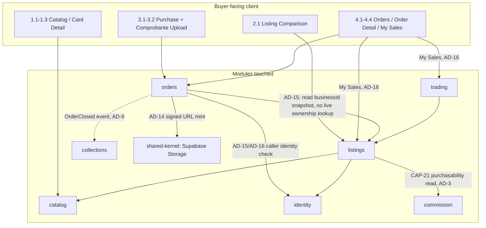

# Architecture Spine — TEZG Buyer/Collector Track

## Cross-Track Note

Two of this file's three new decisions — **AD-14** (comprobante read-access) and **AD-15** (Order read-ownership) — are **shared, system-wide decisions**, not exclusive to this track. They are resolved **once, here**, because Buyer/Collector's architecture phase runs before Seller/Business's. The Seller/Business track's own `ARCHITECTURE.md` (a later, separate pass — **not yet written**, see `companions` above) must cite `AD-14` and `AD-15` as **[ADOPTED]** from this file — it does not re-decide either, and a conflicting later AD would be a bug in that pass, not a legitimate override. `AD-16` (dual-role identity) is exclusive to this track; Seller/Business architects its own related-but-distinct axis (individual-seller/verified-business mutual exclusivity) separately.

**Reviewer Gate note:** this file went through `bmad-review-adversarial-general` (`review-arch-adversarial.md`, 12 findings) and `bmad-review-edge-case-hunter` (`review-arch-edge-cases.md`, 13 findings) before being set to `status: final`. Four findings surfaced genuine open tradeoffs and were put to the user directly (Ley 1581 comprobante handling → **AD-17**; business Order-read access after closure → AD-15 amendment; AD-14's TTL range → fixed at 10 minutes; `Order.businessId` shape → resolved as a stored column). All other findings were mechanical/documentation gaps and are fixed inline below.

## Inherited Invariants

All 13 ADs from the whole-system spine bind here unchanged, read-only, not re-derived. Listed for traceability; full text lives in the parent file.

| Inherited | From parent | Binds here |
| --- | --- | --- |
| AD-1 — Module boundary & dependency direction | ARCHITECTURE-SPINE.md | This track's new ADs must respect the existing dependency graph — `orders` may depend on `listings`/`identity`, never the reverse |
| AD-2 — Order state is confirmations, never fund custody | ARCHITECTURE-SPINE.md | The three-timestamp model (`buyerPaidConfirmedAt`, `sellerReceivedConfirmedAt`, `buyerItemReceivedConfirmedAt`) is the substrate AD-15 attaches read-ownership rules to |
| AD-3 — Commission balance is the single source of listing purchasability | ARCHITECTURE-SPINE.md | Not touched by this track; cited for context on `commission` boundary only |
| AD-4 — Trading is a parallel, one-directional flow off `listings` | ARCHITECTURE-SPINE.md | `openToTrade` semantics referenced by AD-16's My Sales tab query, not modified |
| AD-5 through AD-10, AD-12 | ARCHITECTURE-SPINE.md | Unaffected by this track's 4 scenarios; cited where individually relevant below |
| AD-11 — Each `DomainError` code has exactly one owning module | ARCHITECTURE-SPINE.md | Extended, not overridden — this track adds new `orders`-owned codes for gaps its own `prd.md` (Open Question 6) and the Seller/Business `prd.md` explicitly flagged as missing from AD-11's existing taxonomy; see **DomainError additions** below |
| AD-13 — `legalIdentity` handling satisfies Ley 1581 as ordinary personal data | ARCHITECTURE-SPINE.md | Pattern precedent (not content) for AD-14 and AD-17 — see below for why the comprobante needs its own AD rather than falling under AD-13's scope, which is explicitly `legalIdentity`-only |

**Stack and Consistency Conventions:** not restated here — both are inherited unchanged from `ARCHITECTURE-SPINE.md` (Sections "Stack" and "Consistency Conventions"). This track introduces no new technology, transport, or naming convention; a reader needing those tables should consult the parent spine.

## Invariants & Rules

### AD-14 — Comprobante read-access is enforced via signed, time-limited URLs

- **Binds:** CAP-20 (`orders` module — comprobante file reference)
- **Prevents:** convention-only access control (AD-13's weaker admin-only precedent) being reused for a file with two legitimate readers and real financial stakes; a bare/permanent object URL leaking via logs, browser history, or a forwarded link and granting indefinite access
- **Rule:** the `orders` module's application service mints a signed URL from Supabase Storage, fixed at exactly **10 minutes** TTL (confirmed with the user 2026-09-05 — not a range; two independently-built callers must mint the same lifetime, not each pick a value inside a band), on each authorized read request. No endpoint or event payload ever returns a bare/permanent Supabase Storage object URL. Authorization check before minting a URL: the caller is `Order.buyerId`, OR the caller is the verified business identified by `Order.businessId` (the stored column set at Order creation — see AD-15) **and** `AD-15`'s visibility condition is satisfied. Every other caller (other buyers, other businesses, unauthenticated requests) is rejected before a URL is ever minted, returning the single `DomainError` code `OrderNotVisibleToCaller` regardless of which specific check failed — a distinguishable error per failure reason would let a caller enumerate valid Order IDs or infer comprobante existence. If the Order has no comprobante uploaded yet, minting rejects with `ComprobanteNotYetUploaded` rather than attempting to sign a nonexistent object. A buyer's re-upload (replacing an earlier failed/retried upload, per `EXPERIENCE.md`'s upload states) overwrites the same object key, so a previously-minted URL naturally serves the current file — no separate invalidation step is needed. The rejection, not the URL's expiry, is the actual security boundary; expiry is defense-in-depth against a leaked link, not the primary control. Rate-limiting the minting endpoint itself is deferred (see Deferred) — not sized for this course-project's scale, but named explicitly rather than left silent.
- **Context & Problem:** AD-13 established a precedent for regulated file access (`legalIdentity` documents) but explicitly by convention only — "no other module reads them directly, even though nothing at the storage layer physically prevents it" — because that file has exactly one reader class (admin review). The comprobante has two legitimate reader classes on the same object (the uploading buyer, and the business once payment is confirmed) and is also CAP-7's review-gate signal, so a convention-only pattern would leave a materially higher-stakes file with materially weaker enforcement than a lower-stakes one.
- **Decision Taken:** signed, time-limited URLs minted per-request by the owning module, over both convention-only access (rejected: doesn't fit two-reader stakes) and full server-proxied byte streaming (rejected: adds a proxy code path and per-view server load this course-project's scale doesn't need, given signed URLs already give real storage-layer enforcement). Confirmed with the user via explicit tradeoff discussion (2026-09-05) — a genuinely open call, not inferred.
- **Status:** Accepted
- **Consequences & Trade-offs:** real enforcement at the storage layer, not just convention; requires a URL-minting endpoint/service method in `orders` (a small new surface) rather than reusing a stored public URL string as-is. A signed URL forwarded within its TTL window is still usable by whoever holds it — accepted as a known, bounded exposure window, not remediated further at this scale.
- **Rejected Alternatives:** (a) convention-only, same as AD-13 — insufficient for two-reader financial evidence, see Context above. (b) server-proxied streaming — strongest enforcement, but the added proxy code path and per-request server load isn't justified at this project's scale once signed URLs already give real storage-layer enforcement.

### AD-15 — Order read-ownership: buyer always, selling business from `buyerPaidConfirmedAt` onward

- **Binds:** CAP-17, CAP-20, CAP-22, CAP-27 (`orders` module); **adopted-by-reference as the answer to Seller/Business's `prd.md` FR-S7/FR-S8** (that PRD's own `[ASSUMPTION]` on this exact question is resolved here, not re-opened there)
- **Prevents:** the two tracks independently guessing incompatible answers to "when can the business see this Order?" (FR-S7's Consequences bullet flagged this as an unconfirmed inference); a business browsing Orders it has no standing to act on yet (unpaid, possibly abandoned)
- **Rule:** `Order.businessId` is a **stored column, snapshotted at Order-creation time** from the referenced listing's then-current owner — never a live join through `listings` (confirmed with the user 2026-09-05). This is load-bearing, not a data-shape footnote: both this Rule's own visibility check and AD-14's authorization check key off this exact column, and a live-join alternative would let a later change to the listing's ownership retroactively alter who can read an already-existing Order. `Order.buyerId` can read its own Order — all fields, all three confirmation timestamps — from the moment it's created, for the Order's entire lifetime, including after it closes; there is no expiry or archival cutoff on buyer access. The business identified by `Order.businessId` can read the Order, **including calling AD-14's comprobante-URL-minting endpoint**, from the moment `buyerPaidConfirmedAt IS NOT NULL` onward — and this access **persists indefinitely after the Order closes** (`buyerItemReceivedConfirmedAt` set); closure ends the Order's tri-state confirmation lifecycle, not the business's standing read access to its own sales history (confirmed with the user 2026-09-05, over an ends-at-closure or time-boxed alternative). Before `buyerPaidConfirmedAt` is set, the Order does not appear in the business's incoming-orders view at all — not hidden-but-present, genuinely absent from that query. An Order that never reaches `buyerPaidConfirmedAt` (buyer abandons before paying) simply never enters the business's view and is not separately expired or purged by this AD — retention/cleanup of permanently-unpaid Orders is out of scope here, named rather than left silent. No other user or business can read any Order under any condition.
- **Context & Problem:** FR-S7's main requirement text says the business can view an Order "once the buyer has confirmed payment," but its own Consequences section flagged a looser, unconfirmed inference — that the Order might be visible to the business "the moment it exists, before `buyerPaidConfirmedAt`" — explicitly deferring the resolution to this Architecture phase. Left unresolved, `orders` and the Seller/Business UI could each be built against a different assumption about when the business's incoming-orders list starts showing a given Order.
- **Decision Taken:** the main FR-S7 statement wins over its own Consequences-section inference. Rationale: AD-2 already frames `buyerPaidConfirmedAt` as the first fact meaningful to a second party (before it, there's nothing the business could act on — no comprobante exists yet either, so an "early visibility" Order would show as an empty, actionless row); showing pre-payment Orders would also mean surfacing every abandoned/unpaid cart-equivalent to the business, needlessly, which the Buyer track's own 4.1 Orders List already treats as an internal, buyer-only concern (`orders-list-row-unpaid`, `Finish payment`) with no seller-facing equivalent designed anywhere in either track.
- **Status:** Accepted
- **Consequences & Trade-offs:** the business's incoming-orders view is guaranteed to only ever contain Orders with a real, comprobante-backed payment claim to evaluate — no dead/abandoned rows to filter client-side. Trade-off: the business gets zero early warning of an in-flight purchase before payment (e.g. to pre-stage a shipment) — accepted as consistent with AD-2's "confirmations, not custody" framing; nothing about Order state before payment is actionable by a party that never touches funds. Persisting business read access indefinitely after closure means a business's sales history is always fully reconstructable from Orders alone (no separate archival read path needed), at the cost of AD-14's comprobante URLs staying mintable forever for old, already-settled Orders — accepted, since AD-14's own control is the authorization check and TTL, not a closure cutoff. Storing `businessId` as a snapshotted column (rather than deriving it live) means a listing's ownership change never retroactively alters who could read a past Order, at the cost of one denormalized column to keep consistent at Order-creation time only (it is never updated afterward).
- **Rejected Alternatives:** (a) Order visible to the business immediately at creation — rejected per Decision Taken above (no actionable content pre-payment, and normalizes showing abandoned Orders to a party who can't act on them). (b) Per-track independent decisions — rejected outright: this is exactly the class of divergence a shared cross-track decision exists to prevent (see Cross-Track Note). (c) Business read access ends at Order closure — rejected: it would force a separate archival mechanism for a business to ever revisit its own settled sales, for no security benefit (the buyer's own access never ends either). (d) Time-boxed post-closure access — rejected as an arbitrary extra number to justify with no corresponding requirement asking for it. (e) `Order.businessId` derived live via a `listings` join — rejected: it couples an immutable historical fact (who could read this Order) to a mutable one (who owns the listing today).

### AD-16 — Dual-role identity is derived server-side, never client-asserted

- **Binds:** FR-9 (My Sales tab, `identity` + `listings` + `trading` read paths)
- **Prevents:** a client-supplied "I am also acting as a seller" flag or claim being trusted by the server, which would let any authenticated buyer spoof seller-only views or data by simply asserting the role client-side
- **Rule:** "acting as an individual seller" is never a session field, a JWT claim, or any client-supplied value — it is computed server-side, per request, by querying `listings` (open listings owned by `userId`) and `trading` (pending trade offers against those listings), exactly the pattern `project-context.md` already establishes platform-wide ("role is derived, not a fixed enum — check `isIndividualSellerProfileComplete`/`businessId`/`isAdmin` independently, never assume one mutually-exclusive role field"). Both counts apply the same filter inherited AD-12 already establishes elsewhere: a listing with `hiddenAt` set never counts toward "open listings," and a pending trade offer against a since-hidden listing never counts toward "pending trade offers" — hidden means administratively removed from every buyer- and seller-facing surface alike, not just the catalog. My Sales tab renders for every authenticated user unconditionally — a user with zero owned listings still gets a 200 response and the empty-state page (`my-sales-empty-state`), never a 403 or a hidden route, because owning zero listings is a data fact, not a missing permission.
- **Context & Problem:** FR-9's My Sales tab is the first UI surface in this track that must visibly act on the buyer/individual-seller dual-role fact baked into the data model (`project-context.md`'s cookie-based, non-enum role model) — without an explicit rule, a builder could take the shortcut of trusting a client-sent "isSellerMode" flag (common in role-switcher UIs) instead of deriving it, quietly reopening the exact spoofing risk the non-enum session model was built to avoid.
- **Decision Taken:** always server-derived from owned-row queries against `listings`/`trading`, reusing AD-1's public-query-API boundary (My Sales tab's read path is a normal cross-module read, not a special-cased permission check) — no new role field, session claim, or `identity`-module schema change.
- **Status:** Accepted
- **Consequences & Trade-offs:** zero new attack surface (no new claim type to forge) and zero migration cost (no schema change); the summary counts cost two extra owned-row queries per My Sales tab load rather than one flag read — negligible at this scale and already the same cost pattern AD-1's other cross-module reads accept.
- **Rejected Alternatives:** a client-supplied or session-cached "seller mode" flag — rejected as reopening the spoofing risk the derived-role model exists to prevent; a dedicated `identity`-module "is this user also a seller" endpoint — rejected as unnecessary indirection when `listings`/`trading`'s own public query APIs already answer the question directly (AD-1).

### AD-17 — Comprobante content is handled as regulated personal data, extending AD-13's pattern

- **Binds:** CAP-20 (`orders` module — comprobante file content, not just its access path)
- **Prevents:** the comprobante's content-level personal-data obligations (it typically shows a bank account number and account-holder name) being treated as covered "by proximity" to AD-13, when AD-13's own Scope note restricts it to `legalIdentity` documents only — `prd.md` (§7 Cross-Cutting NFRs, §8 Open Question 5) flagged this explicitly as a distinct, unresolved compliance question rather than assuming AD-13 already answers it
- **Rule:** the comprobante is handled under the same Ley 1581 principles AD-13 already applies to `legalIdentity` — access-minimization (only the two readers AD-14/AD-15 name, never a third party, analytics pipeline, or unscoped admin view) and no retention beyond what the Order relationship needs. This is a content-handling extension of AD-13's principle, not a re-scoping of AD-13 itself — AD-13's own text stays `legalIdentity`-only; this AD is the comprobante's equivalent, cited independently.
- **Context & Problem:** `prd.md` raised this by name and explicitly asked the Architecture phase to resolve it, distinguishing it from AD-13 on the grounds that AD-13's Scope note is document-type-specific. Leaving it unaddressed here — as the original draft of this file did — means a PRD-flagged, named compliance question went unanswered through the one phase meant to close it.
- **Decision Taken:** extend AD-13's access-minimization/retention-discipline principle to the comprobante's content, rather than treating this as an accepted MVP gap or requiring upload-time redaction of the bank-account/holder-name fields. Confirmed with the user via explicit tradeoff discussion (2026-09-05) — a genuinely open call, not inferred.
- **Status:** Accepted
- **Consequences & Trade-offs:** no new technical control beyond what AD-14 already enforces (signed URLs already minimize exposure) — this AD is primarily a scope/documentation closure, stating explicitly that the comprobante's *content* is in-scope for the same discipline AD-13 applies to `legalIdentity`, not a new mechanism. Trade-off: doesn't eliminate the underlying regulated-data exposure (the bank details are still stored and shown in full to two reader classes) — a real legal-compliance sign-off on this approach is still a project-level action item outside this document's authority to grant.
- **Rejected Alternatives:** (a) accept as a known MVP gap, pending real legal review — rejected: the PRD asked this phase specifically to resolve it, not defer it a second time. (b) redact/mask the bank-account and holder-name fields before storage — rejected as a heavier UX/implementation lift (requires reliable field detection on an arbitrary uploaded photo) not justified when the two-reader, access-minimized model AD-14 already provides is judged sufficient for this project's stakes.

## DomainError additions (extends inherited AD-11)

AD-11 fixes that each `DomainError` code has exactly one owning module; it does not freeze the set of codes. Two PRDs explicitly asked this Architecture phase to close taxonomy gaps AD-11 left open. New codes, all owned by `orders` (consistent with AD-11's ownership rule):

| Code | Owning module | Raised when |
| --- | --- | --- |
| `OrderNotVisibleToCaller` | `orders` | AD-14/AD-15's authorization check fails, for any reason — a single code regardless of which specific condition failed (see AD-14 Rule) |
| `ComprobanteNotYetUploaded` | `orders` | AD-14's URL-minting endpoint is called before any comprobante exists on the Order |
| `ComprobanteMissingOnConfirm` | `orders` | Buyer attempts to confirm `buyerPaidConfirmedAt` without a comprobante uploaded first — closes `prd.md` §8 Open Question 6 (FR-5's "reject confirm-paid-without-comprobante" case had no code before this) |
| `OrderAlreadyConfirmedByRole` | `orders` | A confirmation timestamp for the caller's role is already set (e.g. business calls confirm-received twice) — closes the duplicate-confirm gap `docs/plan-1-seller-track/prd.md` flagged for its own FR-S8 |
| `OrderNotOwnedByCaller` | `orders` | A business attempts to confirm receipt on an Order whose `businessId` doesn't match its own identity — closes the non-owned-order gap the Seller/Business `prd.md` flagged for FR-S8 |

## Structural Seed

Buyer-facing component view for this track's 4 scenarios (catalog browse, purchase decision, comprobante payment, orders + sales). Full system component graph is AD-1's; this is the slice this track's scenarios touch.

## Capability → Architecture Map

| Capability / Area | Lives in | Governed by |
| --- | --- | --- |
| CAP-1, CAP-2, CAP-3 (catalog browse/filter, card detail) | `catalog` | AD-1, AD-7 (inherited) |
| CAP-6, CAP-19 (individual-seller listing comparison, contact) | `listings`, `identity` | AD-4 (inherited) |
| CAP-17, CAP-20, CAP-22, CAP-27 (purchase, comprobante, tri-state confirmation, post-close prompt) | `orders` | AD-2, AD-11 (inherited, extended — see DomainError additions), **AD-14, AD-15, AD-17 (new)** |
| CAP-21 (commission-gated purchasability, read-only to buyer) | `commission`, `listings` | AD-3 (inherited) |
| FR-9 (My Sales tab — dual-role summary) | `listings`, `trading`, `identity` | AD-1 (inherited), **AD-16 (new)** |

## Deferred

- Whether the business gets any notification (email, in-app) the moment an Order becomes visible to it under AD-15 — a UX/epics-level question, not an architecture invariant; AD-15 only fixes *when the read becomes possible*, not whether it's proactively surfaced.
- Rate-limiting or abuse-prevention on the AD-14 URL-minting endpoint itself — not sized for this course-project's scale; would become load-bearing only past a threat model this SPEC doesn't carry. Named explicitly (not silently) because the edge-case review flagged Order-ID/comprobante enumeration as a reachable path without it.
- Retention/cleanup policy for Orders that never reach `buyerPaidConfirmedAt` (abandoned before payment) — AD-15 states these never become visible to a business, but doesn't set a deletion or archival policy; not sized for this course-project's scale.
- Seller/Business track's own open decision (individual-seller/verified-business mutual-exclusivity identity) — a related but distinct axis from AD-16, architected separately in that track's own `ARCHITECTURE.md`.
**Resolved at the Reviewer Gate, no longer deferred:** exact signed-URL TTL (fixed at 10 minutes, AD-14); `Order.businessId` shape (stored column, AD-15); business read-access duration after Order closure (persists indefinitely, AD-15); comprobante content's Ley 1581 status (AD-17); the AD-11 `DomainError` taxonomy gaps two PRDs flagged (see DomainError additions).

**Resolved at Phase 5 (Implementation Readiness), no longer deferred:** the cross-phase gap the edge-case review found — page spec `4.4-my-sales-tab.md` had no Error state for when AD-16's underlying query fails outright (not just runs slowly). The user's Phase 5 call was to treat this as a blocker rather than an accepted gap; `4.4-my-sales-tab.md` and `EXPERIENCE.md`'s My Sales State Patterns were amended in place to add a defined Error state (factual inline message + "Try again," `{colors.status-error}`), consistent with this track's existing 3.2 comprobante-failure copy conventions.
