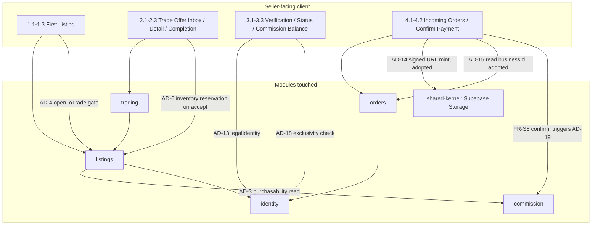

# Architecture Spine — TEZG Seller/Business Track

## Cross-Track Note

This track adopts **AD-14** (comprobante signed-URL access), **AD-15** (Order read-ownership, including the selling business's own standing) and **AD-17** (comprobante content as regulated personal data) **verbatim from `docs/plan-1-buyer-track/ARCHITECTURE.md`**, which was written first and explicitly named this track as AD-14/AD-15's second consumer. This file does not re-decide any of the three — a conflicting restatement here would be a bug in this pass, not a legitimate override (see that file's own Cross-Track Note). This track contributes two of its own new decisions instead: **AD-18** (seller-type exclusivity — this track's own open question from the governing plan) and **AD-19** (commission balance deduction concurrency — `prd.md` §8 Open Question 6, which that document explicitly asked this Architecture phase to resolve).

**Open-question disposition, for traceability:** of `prd.md`'s six Open Questions, OQ1 (cross-track UX entry point) and OQ3 (low-balance warning) remain UX/product questions outside this file's scope; OQ2 (concurrent trade offers) is already resolved as a PRD-level `[ASSUMPTION]` that carries no cross-module divergence risk (AD-6, inherited, already governs the underlying inventory-reservation atomicity), so it is not promoted to an AD here; OQ4 (reapplication cooldown — no cooldown, so a user can cycle back into `Pending`) is a PRD-level `[ASSUMPTION]` that *does* interact with AD-18's exclusivity guard during the `Pending` window — the Reviewer Gate caught this, and AD-18's Rule now explicitly covers a `Pending` (not only `Approved`) business application, so OQ4 itself still needs no new AD but is no longer waved through on the original "no divergence risk" reasoning; OQ5 (missing `DomainError` codes for FR-S8) was already closed by the Buyer track's `ARCHITECTURE.md` DomainError additions (`OrderAlreadyConfirmedByRole`, `OrderNotOwnedByCaller`) — cited below, not re-decided; OQ6 is resolved here as AD-19.

## Inherited Invariants

All 13 ADs from the whole-system spine, plus AD-14/AD-15/AD-17 from the Buyer track's own `ARCHITECTURE.md`, bind here unchanged, read-only, not re-derived.

| Inherited | From | Binds here |
| --- | --- | --- |
| AD-1 — Module boundary & dependency direction | ARCHITECTURE-SPINE.md | This track's new ADs respect the existing dependency graph — `identity` never depends on `listings`/`orders`/`commission` |
| AD-2 — Order state is confirmations, never fund custody | ARCHITECTURE-SPINE.md | `sellerReceivedConfirmedAt` (FR-S8) is one of the three independent confirmations this AD already frames; this track adds no new confirmation timestamp |
| AD-3 — Commission balance is the single source of listing purchasability | ARCHITECTURE-SPINE.md | The substrate AD-19 attaches a concurrency guarantee to |
| AD-4 — Trading is a parallel, one-directional flow off `listings`; `openToTrade` is individual-seller-only | ARCHITECTURE-SPINE.md | FR-S2/FR-S9's business-listing rejection is this AD enforced, not a new rule |
| AD-6 — `InventoryUnit` is the sole quantity owner | ARCHITECTURE-SPINE.md | FR-S3's "accepting one trade offer reserves inventory" and PRD OQ2's first-accepted-wins resolution both rest on this AD; no new inventory rule needed here |
| AD-5, AD-7 through AD-10, AD-12 | ARCHITECTURE-SPINE.md | Unaffected by this track's 4 scenarios; cited where individually relevant |
| AD-11 — Each `DomainError` code has exactly one owning module | ARCHITECTURE-SPINE.md | Extended by the Buyer track's `ARCHITECTURE.md` (`OrderAlreadyConfirmedByRole`, `OrderNotOwnedByCaller`, both raised for this track's own FR-S8) — cited here, not re-extended |
| AD-13 — `legalIdentity` handling satisfies Ley 1581 as ordinary personal data | ARCHITECTURE-SPINE.md | FR-S5's business-application legal-identity submission is this AD's second instance (the first being the Buyer track's identity data), reusing the same admin-review-only access scoping |
| **AD-14 — Comprobante read-access via signed, time-limited URLs** | `docs/plan-1-buyer-track/ARCHITECTURE.md` | FR-S7's comprobante viewing is this AD's second reader class in practice — the business half of the two-reader model AD-14 already names |
| **AD-15 — Order read-ownership: buyer always, selling business from `buyerPaidConfirmedAt` onward** | `docs/plan-1-buyer-track/ARCHITECTURE.md` | Directly resolves FR-S7's `[ASSUMPTION]` (Order visibility timing) and FR-S7's Notes cross-track deferral — the business reads via `Order.businessId`, exactly as this AD specifies, with no track-specific variation |
| **AD-17 — Comprobante content as regulated personal data** | `docs/plan-1-buyer-track/ARCHITECTURE.md` | FR-S7's comprobante-viewing business is one of the two access-minimized reader classes this AD names |

**Stack and Consistency Conventions:** not restated — inherited unchanged from `ARCHITECTURE-SPINE.md`. This track introduces no new technology, transport, or naming convention.

## Invariants & Rules

### AD-18 — Seller-type exclusivity is enforced by rejecting the second state-granting action

- **Binds:** FR-S1 (individual-seller profile completion), FR-S5 (business-verification approval) — `identity` module
- **Prevents:** a seller account silently or ambiguously holding both `isIndividualSellerProfileComplete=true` and a non-null `businessId` at once, including during the window where a business application is merely `Pending` (not yet `businessId`-bearing, per FR-S9's requirement that a business can list while `Pending`); two independently-built call sites (the individual-seller profile-completion endpoint and the admin business-approval action) each guessing a different resolution for the same conflict; two concurrent, genuinely simultaneous submissions of the conflicting actions both succeeding due to a check-then-write race
- **Rule:** `isIndividualSellerProfileComplete` and `businessId`/an open business application are mutually exclusive at the point of write, enforced server-side in `identity`, never client-asserted (same non-enum, independently-derived-flag pattern the platform already uses elsewhere — `project-context.md`). Both directions are enforced as a single atomic conditional `UPDATE` — never a `SELECT` followed by an application-computed write — mirroring AD-19's own pattern, so the guard is safe under true concurrent submission, not merely sequential submission: completing the individual-seller profile step is `UPDATE users SET is_individual_seller_profile_complete=true WHERE id=:uid AND business_id IS NULL AND NOT EXISTS (SELECT 1 FROM business_applications WHERE user_id=:uid AND status IN ('Pending','Approved'))`, rejected with a new `DomainError` (`AlreadyVerifiedBusiness`, owned by `identity`, per AD-11's one-owner-per-code rule) when zero rows are affected. Symmetrically, an admin's action to transition a business application to `Approved` (setting `businessId`) is issued as `UPDATE users SET business_id=:id WHERE id=:uid AND is_individual_seller_profile_complete=false`, rejected with `IndividualSellerProfileAlreadyComplete` (also `identity`-owned) when zero rows are affected — and submitting the business application itself (entering `Pending`) is guarded the same way, since the `NOT EXISTS` clause above must also hold at submission time, not only at approval time: a user cannot open a `Pending` business application while `isIndividualSellerProfileComplete=true`, closing the window where a `Pending` (not yet `businessId`-bearing) application would otherwise coexist with an individual-seller profile. Because each guard is embedded in the `WHERE` clause of the write itself, the two conflicting actions genuinely cannot interleave to both succeed — the database's own row-level serialization of the two `UPDATE`s (not application-level "same transaction" framing alone) is what closes the race. Neither endpoint attempts to resolve or migrate the user out of their existing state — the individual-seller-to-verified-business account transition stays exactly as out of scope as `prd.md` §5/§8 already declares it; this AD only prevents the *invalid simultaneous state*, it does not design the transition.
- **Context & Problem:** SPEC.md's "Safe" assumption states a seller account is exclusively individual-seller *or* verified-business, but names no enforcement mechanism — left unaddressed, a builder implementing FR-S1's profile-completion endpoint and a separate builder implementing FR-S5's admin-approval action could each assume the other side already prevents the conflict, and neither would.
- **Decision Taken:** reject the second state-granting action outright, over (a) auto-clearing the earlier flag on the theory that this represents a deliberate "graduation," and (b) permitting both flags to coexist in storage with per-endpoint resolution. Confirmed with the user via explicit tradeoff discussion (2026-09-06) — a genuinely open call, not inferred, since option (a) is a defensible product read of "the user is just leveling up."
- **Status:** Accepted
- **Consequences & Trade-offs:** an individual seller who wants to become a verified business (or vice versa) hits a hard rejection with no self-service path forward — this is a real UX dead end for that (out-of-scope, per PRD) transition, but it is an honest one: the alternative (silent auto-clear) would have invented transition semantics (does clearing `isIndividualSellerProfileComplete` also archive her existing listings? reassign them?) that neither this PRD nor SPEC.md has ever decided, and inventing them as a side effect of this AD would be worse than leaving the gap explicit. No schema migration needed beyond the two existing flag columns; the cost is one additional server-side check per write path, symmetric on both sides.
- **Rejected Alternatives:** (a) auto-clear the earlier flag — rejected: silently answers the transition-mechanics question SPEC.md flags as an unaddressed, Risky, platform-wide assumption, which is a bigger decision than this AD's own scope. (b) allow both flags to coexist, resolve per-check — rejected: permits an inconsistent stored state and lets future endpoints diverge on which role wins, exactly the class of divergence this AD exists to prevent. (c) check-then-write inside "the same transaction" without embedding the guard in the write itself — rejected after the Reviewer Gate: this only serializes sequential submissions, not genuinely concurrent ones, since both transactions could read stale unset flags before either commits; superseded by the atomic conditional `UPDATE` form in the Rule above.

### AD-19 — Commission balance deduction is a single atomic conditional decrement, never a read-modify-write

- **Binds:** FR-S6, FR-S8 (`commission` module, invoked from `orders` off the `sellerReceivedConfirmedAt` event)
- **Prevents:** the classic lost-update race — two orders against the same business confirming payment-received concurrently, each reading the balance, computing a new value in application code, and writing it back, with the second write silently clobbering the first's deduction
- **Rule:** commission deduction is issued as a single atomic conditional `UPDATE` at the database layer (e.g. `UPDATE commission_balance SET balance = balance - :amount WHERE business_id = :id`, never a `SELECT` followed by an application-computed `UPDATE`), executed in the same transaction as setting `sellerReceivedConfirmedAt` on the triggering Order (AD-2's confirmation event). Two concurrent confirmations against the same business each still deduct their own order's commission correctly — the database serializes the two `UPDATE` statements, and neither is lost. The balance is permitted to go transiently negative in the overlap window between two near-simultaneous confirmations that together exceed the remaining balance; this is accepted, not guarded against with a locking read, because CAP-21's guarantee is about *purchasability* (a separate, subsequent read gating whether new listings can be purchased), not about preventing an already-earned, already-confirmed sale's commission from being recorded. The next purchasability check (FR-S6) reads the resulting balance and pauses listings if it is at or below zero, regardless of how it got there. This atomic `UPDATE` is issued exactly once per Order because it runs conditioned on the same guard the adopted `OrderAlreadyConfirmedByRole` check enforces (`sellerReceivedConfirmedAt IS NULL`) — a retried confirm-payment-received call against an already-confirmed Order is rejected by that check before this `UPDATE` is ever reached, so AD-19's atomicity alone does not need to (and does not) defend against a same-Order double-submission; that protection is `orders`'s, not `commission`'s.
- **Context & Problem:** `prd.md` §8 Open Question 6 flagged that AD-3 (inherited) describes the deduction *trigger* but not this ordering edge case, and asked this Architecture phase to resolve it before it became an implementation guess.
- **Decision Taken:** atomic conditional decrement at the database layer, over a pessimistic row-lock-on-confirm approach. This is a correctness-pattern fix, not a value trade-off between two reasonable defaults — a read-modify-write here is a straightforward lost-update bug regardless of how rare the concurrent-confirmation window is in practice at this project's scale, so it was decided directly rather than raised as a coaching question.
- **Status:** Accepted
- **Consequences & Trade-offs:** no row lock needed, so no added contention cost even for a business with many simultaneous confirmations; the balance can display a transient negative value to the business between the overlap and the next purchasability check, which must render that state as "paused" (FR-S6), not as an error — `EXPERIENCE.md`'s zero-balance-state copy already treats zero/paused as a factual waiting state, and a negative balance is the same category, not a new one.
- **Rejected Alternatives:** (a) pessimistic row lock on the balance during confirm — rejected: solves the same race with strictly more contention cost, for a guarantee (balance never negative even transiently) that nothing in FR-S6's Consequences actually requires. (b) allow the deduction with no atomicity guard at all, reconciled later by a background job — rejected outright: this is exactly the lost-update bug the PRD asked this phase to close, not a deferred cleanup problem. (c) atomic conditional `UPDATE` with a floor guard (`WHERE balance >= :amount`), rejecting rather than applying a deduction that would take the balance negative — rejected after the Reviewer Gate raised it: this stays atomic and never lets the balance go negative, but it does so by refusing to record an already-earned, already-confirmed sale's commission debt, which contradicts the platform's actual intent (pause future purchasability on depletion, not refuse to honor a completed sale) — confirmed with the user (2026-09-06) as a deliberate rejection, not an oversight.

## DomainError additions (extends inherited AD-11)

Two new codes, both owned by `identity` (AD-18); the two FR-S8 codes this track's `prd.md` OQ5 asked for were already added by the Buyer track's `ARCHITECTURE.md` and are cited here, not re-added.

| Code | Owning module | Raised when |
| --- | --- | --- |
| `AlreadyVerifiedBusiness` | `identity` | AD-18: individual-seller profile-completion attempted by a user whose `businessId` is already non-null |
| `IndividualSellerProfileAlreadyComplete` | `identity` | AD-18: business-application approval attempted for a user whose `isIndividualSellerProfileComplete` is already true |
| `OrderAlreadyConfirmedByRole` *(adopted)* | `orders` (added by `docs/plan-1-buyer-track/ARCHITECTURE.md`) | FR-S8: a business calls confirm-payment-received twice on the same Order — cited here, not re-added |
| `OrderNotOwnedByCaller` *(adopted)* | `orders` (added by `docs/plan-1-buyer-track/ARCHITECTURE.md`) | FR-S8: a business attempts to confirm receipt on an Order whose `businessId` doesn't match its own identity — cited here, not re-added |

## Structural Seed

Seller-facing component view for this track's 4 scenarios (listing + trade management, business verification + commission balance, order fulfillment). Full system component graph is AD-1's; this is the slice this track's scenarios touch.

## Capability → Architecture Map

| Capability / Area | Lives in | Governed by |
| --- | --- | --- |
| CAP-4, CAP-16, CAP-19 (individual-seller listing, profile step) | `listings`, `identity` | AD-1 (SPINE) — inherited |
| CAP-25, CAP-26 (trade offer, mutual completion) | `trading`, `listings` | AD-4, AD-6 (SPINE) — inherited |
| CAP-5, CAP-15 (business verification application) | `identity` | AD-13 (SPINE, inherited), **AD-18 (new)** |
| CAP-21 (commission balance, pause/resume) | `commission` | AD-3 (SPINE, inherited), **AD-19 (new)** |
| CAP-17, CAP-20, CAP-22 (order fulfillment, comprobante, confirm receipt) | `orders` | AD-2, AD-11 (SPINE, inherited), **AD-14, AD-15, AD-17 (adopted from Buyer track)** |

## Deferred

- The individual-seller-to-verified-business account transition itself (what happens to existing listings, whether it's even offered as a feature) — AD-18 only prevents the invalid simultaneous state; SPEC.md already names the transition as an unaddressed, Risky, platform-wide assumption, and this file does not resolve it.
- Whether a low (nonzero) commission balance surfaces a proactive warning before reaching zero (`prd.md` §8 OQ3) — a UX/product question, not an architecture invariant; not decided here.
- Reapplication cooldown for a `Rejected` business application (`prd.md` §8 OQ4) — already resolved as a PRD-level `[ASSUMPTION]` (no cooldown); not promoted to an AD. Its interaction with AD-18 during the `Pending` window is not deferred — AD-18's Rule now explicitly covers `Pending`, closed above.
- Rate-limiting or abuse-prevention on the AD-14 URL-minting endpoint, retention/cleanup of permanently-unpaid Orders — both already deferred by the Buyer track's `ARCHITECTURE.md`; not restated or re-scoped here.

---

_Reviewer Gate complete — see `review-arch-adversarial.md` and `review-arch-edge-cases.md`. All findings triaged: mechanical fixes applied directly; three genuine design tradeoffs (AD-18's concurrency guard, AD-18's Pending-window coverage, AD-19's floor-guard alternative) confirmed with the user and logged in `decision-log.md`. Next: Phase 5 — Implementation Readiness Check._
