# TEZG Plan-2 Architecture — Twelve Modules on the Modular Monolith

## 0. How to read this document

This document is the single Phase 3 architecture for all 12 Plan-2 modules. It fixes what independently built modules could otherwise choose incompatibly. Everything else is seed that the code will own once it exists.

**Identifiers.**
- `AD-1`..`AD-19` are inherited, read-only, and never renumbered.
- `AD-SYS-n` are system-wide decisions made here.
- `AD-<CODE>-n` are module decisions, where `<CODE>` is the planning module code (IDN, VER, CAT, INV, DSC, ORD, COM, TRD, MSG, COL, VAL, REP).

**Parts of every decision.** Each `AD-SYS` and `AD-<CODE>` carries five mandatory parts:
- **Status**
- **Binds**: submodules, routers, models, jobs, FRs
- **Prevents**
- **Rule**: checkable by a named test, lint rule or SQL constraint
- **Trade-off**

Rejected alternatives for each module's core decision are listed in the module's *Alternatives* block.

**Status.** `[ADOPTED]` means the decision is binding for implementation. A decision that rests on an inference not yet confirmed by a human carries an `[ASSUMPTION]` tag and is listed in §15 for the Phase 3 gate.

**Terms used in Rules.** Every number in a Rule is a literal, never a range. Words like "fast", "reasonable" or "where possible" are not used. "Conditional update" always means one `UPDATE … WHERE <id> AND <from-state predicate>` whose affected-row count is checked (AD-SYS-5).

**Code-module names** are lowercase (`listings`). **Planning-module codes** are uppercase (`INV`).

---

## 1. Inherited invariants

All inherited ADs stay binding. This document refines four of them and supersedes one clause. Each refinement is recorded in the AD that makes it.

| AD | Title (short) | How Plan-2 uses it | Changed here? |
| --- | --- | --- | --- |
| AD-1 | Dependency direction | The graph is unchanged. No new compile-time edge. `trading → catalog` is avoided via `listings.resolveItemRefs` (OQ-6, AD-TRD-3) | No |
| AD-2 | Three facts, no custody | ORD's machine (AD-ORD-2) | No |
| AD-3 | Commission balance is the single source of purchasability | COM + the INV projection | **Amended** by AD-SYS-3: `OrderClosed` is a second trigger |
| AD-4 | Trading is a one-way flow off `listings` | AD-TRD-2, AD-MSG-1 | No |
| AD-5 | One location query path | AD-DSC-1 | No |
| AD-6 | `InventoryUnit` is the sole quantity owner | AD-INV-1, AD-INV-2 | No |
| AD-7 | Catalog, Listing and Binder are independent records | AD-COL-1 | No |
| AD-8 | Table ownership | §5 data model; shared-kernel owns only infrastructure tables (AD-SYS-2) | Refined by AD-SYS-2 |
| AD-9 | Snapshot payloads | §7 event catalog | No |
| AD-10 | Post-commit, in-process, best effort | Dispatch stays post-commit and in-process. Events are persisted in an outbox so that a lost dispatch is visible and replayable | **Refined** by AD-SYS-2 |
| AD-11 | One owner per error code | §8 registry; `RequestValidationFailed` is owned by shared-kernel (OQ-7) | Refined by AD-SYS-1 |
| AD-12 | Hide, never delete | AD-REP-3, AD-INV-3 | No |
| AD-13 | `legalIdentity` under Ley 1581 | AD-VER-2 | No |
| AD-14 | Signed URLs, 10-minute TTL | AD-SYS-8 | No |
| AD-15 | Business sees an order from `buyerPaidConfirmedAt` | AD-ORD-3 | No |
| AD-16 | Roles derived server-side | AD-IDN-1, AD-SYS-8 | No |
| AD-17 | Comprobante is regulated data | AD-SYS-8 | No |
| AD-18 | Exclusivity by rejecting the second state-granting action | AD-IDN-1 extends it to `Pending` and `Rejected` applications (OQ-1) | No |
| AD-19 | Atomic decrement, balance may go negative | AD-COM-1 | The "same transaction as `sellerReceivedConfirmedAt`" clause is **superseded** by AD-SYS-2/AD-SYS-3 (OQ-2) |

---

## 2. System context

Twelve planning modules run on the nine code modules of AD-1, plus `shared-kernel`. There is one Next.js deployment, one Postgres database and one Storage project.

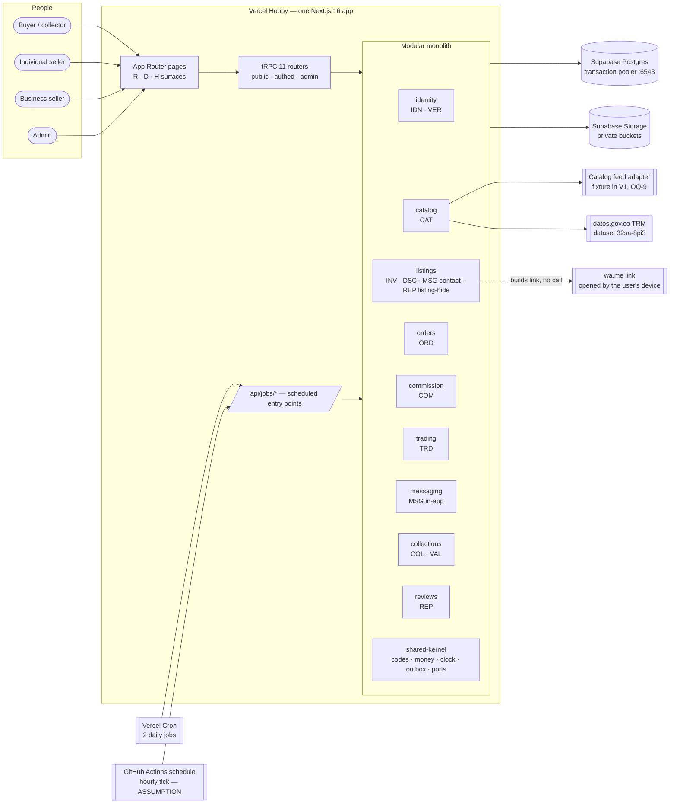

**The compile-time dependency graph is AD-1's graph, unchanged.** Plan-2 adds only these event subscriptions, and each rides an edge AD-1 already allows (PRD §4.3):

| Publisher → subscriber | Event | Idempotency key | Allowed by |
| --- | --- | --- | --- |
| identity → commission | `BusinessApplicationApproved` | `businessId` | `commission → identity` |
| identity → listings | `BusinessApplicationApproved`, `BusinessApplicationRejected` | `applicationId` | `listings → identity` |
| orders → commission | `OrderPaymentConfirmedByBusiness`, `OrderClosed` | `orderId` | dashed edge `commission ⇢ orders` |
| orders → collections | `OrderClosed` | `orderId` | dashed edge `collections ⇢ orders` |
| commission → listings | `CommissionBalanceExhausted`, `CommissionBalanceReplenished` | `(businessId, ledgerSeq)` | dashed edge `listings ⇢ commission` |
| trading → (none) | `TradeAccepted` | — | — |

**Event payload types live in `shared-kernel/events/`.** A subscriber therefore never imports the publisher's module to read a payload type, and dashed edges stay free of compile-time dependencies (AD-SYS-2).

**Page-level composition across modules happens only in the UI layer.** For example, the card-detail page (2.2) shows seller reputation next to listings. `listings` cannot depend on `reviews`, since `reviews → orders → listings` would form a cycle. The page therefore calls `listings.getCardDetail` and `reviews.getAggregates(sellerIds)` as two tRPC queries and merges them in the React Server Component. No module-level code composes across that gap.

---

## 3. Hexagonal shape of every module

Every code module has the same internal shape. The table in each module section names only its concrete ports.

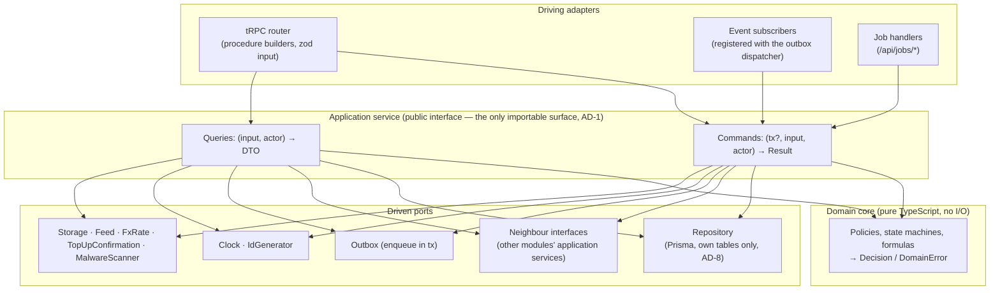

**Rules that apply to every module:**
- The domain core imports nothing but `shared-kernel` (enforced by lint, AD-SYS-6).
- Neighbour interfaces are TypeScript interfaces declared in the *consumer* module's `ports/` folder. Each is bound in the composition root to the provider's application service, and in tests to a fake (NFR-SYS-3).
- A module's public surface is `src/modules/<name>/index.ts`. Importing any other path of another module fails lint (AD-1).

**Seed folder shape** (owned by the code once it exists):

```
src/
  app/                      Next.js routes (pages, /api/trpc, /api/jobs)
  server/trpc/              procedure builders, root router, error formatter
  modules/<name>/
    index.ts                public application service + DTO types
    domain/                 pure policies, machines, formulas
    application/            commands, queries, subscribers
    infra/                  Prisma repository, adapters
    ports/                  neighbour + external interfaces this module consumes
    messages/es-CO/         humanMessage templates keyed by code
    __tests__/
  shared-kernel/            codes, Decision, money, clock, ids, outbox, events, ports
prisma/schema.prisma        one schema; each model's owner in a `/// @owner <module>` doc comment
```

---

## 4. Stack and deployment envelope

**Stack.** Inherited from `project-context.md` and not re-decided here:
- Next.js 16.3.3 with the App Router
- tRPC 11.18
- Prisma 7.6 with `@prisma/adapter-pg`
- Supabase Postgres and Storage (free tier)
- Better Auth 1.x
- Tailwind 4.3.3
- Vercel Hobby
- cuid2 ids, integer COP, timestamps stored in UTC and rendered in `America/Bogota`

**Environments.**

| Environment | Database | Storage | Feed / TRM / top-up ports | Clock |
| --- | --- | --- | --- | --- |
| Test (CI and local) | Docker Compose Postgres 16, direct connection | in-memory `ObjectStorage` fake | fixture feed with fault switches (ADD-§8.3), fixture TRM, admin `TopUpConfirmationPort` | virtual, seeded at `2026-10-01T15:00:00Z` |
| Preview / production | Supabase: runtime via the transaction pooler (port 6543), migrations via the direct connection (port 5432) | Supabase Storage, private buckets | the fixture feed until OQ-9 names a source; live datos.gov.co TRM; admin top-up adapter | system clock behind the `Clock` port |

**Scheduling on Vercel Hobby.** Hobby allows 2 cron jobs per project. Each runs once per day, anywhere within its scheduled hour. The architecture therefore makes **no correctness rule depend on a scheduler** (AD-SYS-6, AD-ORD-2, AD-TRD-3). Schedulers only *materialize* states that reads and commands already derive, and trigger external fetches.

| Trigger | Schedule | Runs |
| --- | --- | --- |
| Vercel Cron `daily-morning` | `0 12 * * *` UTC (07:00–07:59 Bogotá) | TRM fetch for today; expiry materialization (orders, offers); failed-delivery digest; never-attempted outbox sweep |
| Vercel Cron `daily-night` | `30 5 * * *` UTC (00:30–01:29 Bogotá) | commission reconciliation (FR-COM-8); retention purge (ADD-§9.4); expiry materialization catch-up (orders, offers); orphan-upload sweep; `ContactRequestLog` 7-day purge; `AuthThrottleEvent` 24-hour purge; oversell invariant check (ADD-§10) |
| GitHub Actions `schedule` hourly tick [ASSUMPTION — gate item G-3] | `5 12-23,0-1 * * *` UTC (07:05–20:05 Bogotá) | TRM retry while today's rate is missing (NFR-CAT-4); never-attempted outbox sweep; orders/offers expiry materialization |
| Admin buttons | on demand | feed ingestion start and continue (2.3), TRM retry (2.3), reconciliation (7.4), event replay (§7.3) |

Every `/api/jobs/*` entry point:
- requires the `JOBS_SECRET` bearer header;
- is idempotent;
- takes a transaction-scoped single-flight lock (AD-SYS-4).

If the gate rejects G-3, NFR-CAT-4 is amended to two attempts per day (07:00 and a manual retry), and carry-forward-with-stale-flag (AD-CAT-3) covers the gap.

**Connection budget.**
- Runtime uses the pg `Pool` with `max: 1` per serverless instance, through the Supabase transaction pooler.
- Tests use `max: 60` against Docker Postgres, so the ≥ 50-connection concurrency proofs of NFR-SYS-10 run on real connections.

---

## 5. System-wide decisions (AD-SYS)

### AD-SYS-1 — One Decision shape and one code registry

- **Status:** [ADOPTED]
- **Binds:** `shared-kernel/codes.ts`, `shared-kernel/decision.ts`, every `modules/*/messages/es-CO/*`, the tRPC error formatter in `server/trpc/errors.ts`, every router; NFR-SYS-1, NFR-SYS-13; ADD-§3.1, ADD-§3.2; OQ-7.
- **Prevents:** two modules inventing different refusal shapes; a code thrown by a non-owner; the same code mapped to different HTTP/tRPC codes; English, internal or PascalCase text reaching a user; a regulated value inside a citation.
- **Rule:**
  1. `codes.ts` exports one `const` registry. Each entry has these fields:
     - `code`
     - `kind: 'DomainError' | 'DecisionCode'`
     - `owner` (a code module or `shared-kernel`)
     - `trpc` (for DomainErrors only)
  2. `class DomainError` can be constructed only through `raise(code, citations, inputs)` with a `code` whose `owner` equals the calling module. This is checked by the lint rule `tezg/error-owner`, which compares the file path to the registry.
  3. Every `Decision` has:
     - `outcome ∈ {allowed, allowedWithNotice, rejected, paused, unverified, withdrawn, hidden, stale, excluded, ranked, notValued, unfulfillable}`
     - `reasonCode` (a registry key)
     - `humanMessage` (rendered server-side from `messages/es-CO/<code>.ts`)
     - `citations: [{ rule, inputs }]`, with length ≥ 1
     - `occurredAt` (from `Clock`)
  4. When a decision concerns an order, `citations[0].inputs.orderId` is present (EC-29).
  5. Citation `inputs` values are typed `CitationValue = string | number | boolean | null` and pass the regulated-field filter of AD-SYS-8.
  6. CI fails when:
     - a registry row has no test that triggers it and asserts the full shape;
     - a template contains a PascalCase token matching `/\b[A-Z][a-z]+(?:[A-Z][a-z]+)+\b/`;
     - a template contains a phrase from ADD-§1.2;
     - two rows share a `code`.
  7. `RequestValidationFailed` is owned by `shared-kernel`. It is produced only by the tRPC input parser from zod issues as `{ field, issue }[]`. A module never raises it (OQ-7). A refusal that depends on stored state (for example "the last active rejection reason") is a domain rule and gets its own owner code (§8).
- **Trade-off:** every new refusal costs a registry row, a template and a test before it can ship. In return, NFR-SYS-1/13 become mechanical checks rather than review judgement.

**DomainError → tRPC code mapping** (the error formatter applies this table; no router overrides it):

| Family | tRPC code | Codes |
| --- | --- | --- |
| Not signed in | `UNAUTHORIZED` | `NotAuthenticated` |
| Not allowed / not visible | `FORBIDDEN` | `AdminOnly`, `EmailNotVerified`, `LegalIdentityAccessDenied`, `*NotOwnedByCaller`, `*NotVisibleToCaller` |
| Unknown id | `NOT_FOUND` | `*NotFound`, `TargetNotFound` |
| Throttled | `TOO_MANY_REQUESTS` | `AuthRateLimited`, `ContactRateLimited` |
| Shape invalid | `BAD_REQUEST` | `RequestValidationFailed`, `MissingRequiredField`, `Invalid*`, `EmptyComponentList`, `EmptyTradeOffer`, `ComprobanteInvalidFile`, `TopUpProofInvalidFile`, `TopUpAmountInvalid`, `SearchFilterTooBroad` |
| Every other domain rule | `CONFLICT` | all remaining DomainErrors |

The `*NotVisibleToCaller` codes map to `FORBIDDEN` even though AD-14/AD-15 hide existence. Their `humanMessage` never confirms that the id exists, and the response body is identical for "exists but hidden" and "unknown id".

### AD-SYS-2 — Transactional outbox under post-commit in-process dispatch

- **Status:** [ADOPTED]
- **Binds:**
  - `shared-kernel/outbox/`: tables `OutboxEvent` and `EventDelivery`, `outbox.enqueue(tx, event)`, `Dispatcher`, `Sweeper`;
  - every publisher (identity VER, orders, commission, trading) and every subscriber (commission, listings, collections);
  - admin procedures `admin.events.replay`, `admin.events.deliveries` and `admin.events.deliveryHealth` (§7.3); page 2.3's Entregas tab (the event panel) and the badge on admin rail item 10 "Entregas fallidas" (EXPERIENCE IA D);
  - `JobRun` (ownership only, rule 10; its use is §4 and §13);
  - NFR-SYS-6; OQ-2, OQ-4; refines AD-10; supersedes AD-19's transaction clause.
- **Prevents:**
  - an event lost between commit and dispatch with no trace (for example, the commission deduction for a confirmed sale);
  - a failed subscriber being silently forgotten;
  - a delivery that crashed mid-attempt being retried forever, or never;
  - a delivery stuck in `pending` staying invisible;
  - automatic retries racing a human replay;
  - regulated data persisted in event rows.
- **Rule:**
  1. A publisher calls `outbox.enqueue(tx, event)` inside the same `$transaction` that commits the state change. An event that is published never exists without its state change, and the reverse holds too.
  2. `OutboxEvent(id cuid2 PK, type text, aggregateId text, payload jsonb, createdAt timestamptz)`. There is no `dispatchStartedAt`: dispatch state lives per subscriber in `EventDelivery`.
  3. `EventDelivery(eventId FK, subscriber text, status 'pending'|'delivered'|'failed', attempts int, lastErrorCode text null, createdAt timestamptz, lastAttemptAt timestamptz null, firstFailedAt timestamptz null, lastFailedAt timestamptz null, deliveredAt timestamptz null, PK(eventId, subscriber))`. `outbox.enqueue` inserts one `pending` row per subscriber registered for the event type in §7.1, in the publisher's transaction. An event type with no subscriber gets no row. A subscriber added later needs a backfill migration that inserts its `pending` rows. The three timestamps mean different things (decision log #43):
     - `lastAttemptAt` is when the latest attempt started (rule 4 step 1, or a replay claim). Next to `attempts` it shows retries whose failure was never recorded.
     - `firstFailedAt` is set once, with `COALESCE`, when the row first becomes `failed`, and a later failure never resets it. A row leaves `failed` only through a successful replay, to `delivered`, so `firstFailedAt` is also when the row became `failed`.
     - `lastFailedAt` is the most recent recorded failure: the first transition to `failed`, or a failed replay.
  4. **Attempt procedure.** Every automatic attempt to deliver one `(eventId, subscriber)` runs these steps:
     1. A short transaction, committed on its own: `UPDATE EventDelivery SET attempts = attempts + 1, lastAttemptAt = now WHERE (eventId, subscriber) AND status='pending' AND attempts < 3`. If it affects 0 rows and the row is still `pending` with `attempts = 3`, a conditional update sets `status='failed'`, `firstFailedAt=COALESCE(firstFailedAt, now)`, `lastFailedAt=now` and `lastErrorCode='DeliveryAttemptsExhausted'`, and the attempt stops. Any other 0-row result also stops the attempt.
     2. The handler transaction: `SELECT … FROM EventDelivery WHERE (eventId, subscriber) AND status='pending' FOR UPDATE SKIP LOCKED`. No row means another worker holds it or it is no longer `pending`, and the attempt stops. Otherwise the handler runs, then the row is set to `status='delivered'`, `deliveredAt=now`. The handler's state and the delivery row commit together.
     3. If the handler throws, the handler transaction rolls back. A separate transaction sets `status='failed'`, `firstFailedAt=COALESCE(firstFailedAt, now)`, `lastFailedAt=now` and `lastErrorCode` = the error's registry code or `'Unexpected'`, never its message.
     Step 1 counts the attempt before the handler runs, so a crash inside step 2 (a timeout or a killed instance) still spends one attempt.
  5. After the command's transaction commits, the tRPC adapter runs `Dispatcher.dispatch(eventIds)` synchronously, before the response is returned. It runs the attempt procedure once for each `pending` delivery of those events. **A `failed` delivery is never retried automatically. A delivery whose failure was never recorded is attempted at most 3 times in total.**
  6. The sweeper selects `EventDelivery` rows with `status='pending' AND createdAt < now − 60 s`, ordered by `createdAt`, `LIMIT 50`, and runs the attempt procedure on each. It runs from every hourly tick and from both daily crons. The sweeper works only on `pending` rows and the replay (rule 7) only on `failed` rows, so the two never touch the same delivery.
  7. `admin.events.replay({ eventId, subscriber })` re-runs exactly one subscriber for one event. It is allowed only when that delivery is `failed`; otherwise it raises `EventDeliveryNotReplayable`. It claims the row with `SELECT … WHERE status='failed' FOR UPDATE SKIP LOCKED` and runs the handler in that transaction (§7.3). A replay sets `lastAttemptAt` to its claim time in both outcomes. A failed replay also sets `lastFailedAt`, and never changes `firstFailedAt`. It writes one `EventReplayLog` row. Running it N ≥ 2 times yields one effect, because subscribers are idempotent by the natural keys in §7.
  8. Payloads contain only the fields listed in §7. The canary scan of AD-SYS-8 runs over `OutboxEvent.payload` and `EventDelivery.lastErrorCode`.
  9. Admin rail item 10 "Entregas fallidas" (EXPERIENCE IA D) carries a badge with the count of `failed` deliveries, the age of the oldest by `firstFailedAt`, and the count of deliveries still `pending` more than 24 h after `createdAt` (`stuckPendingCount`). The `daily-morning` job writes one `FailedDeliveryDigest(date, count, oldestFirstFailedAt, stuckPendingCount)` row, which page 2.3's Entregas tab shows as one line above its table. The tab lists both sets. The badge, the tab label and the digest line read `admin.events.deliveryHealth()`, and the list reads `admin.events.deliveries` (§7.3). There is no email in V1.
  10. `OutboxEvent`, `EventDelivery`, `EventReplayLog` (append-only), `FailedDeliveryDigest` and `JobRun` (§4) are the only tables owned by `shared-kernel` (a refinement of AD-8: infrastructure, not domain data). The retention purge deletes `delivered` rows older than 90 days [ASSUMPTION ADD-§9.4 extension], and `JobRun` rows older than 90 days. These are technical purges: they are not gated by launch gate LG-2. Failed and `pending` rows are never purged.
- **Trade-off:**
  - Every publishing command pays one extra insert, and one extra round trip per subscriber before the response.
  - A crash between commit and dispatch, or during an attempt, delays the delivery until the next sweep, not forever. While the best-effort tick runs (G-3, §4) that is ≤ 1 h between 07:17 and 20:17 Bogotá and up to about 6.5 h overnight (00:30 → 07:00). Without the tick it is up to 17.5 h (07:00 → 00:30).
  - Every automatic attempt costs one extra short transaction (rule 4, step 1). A handler that crashes its instance 3 times ends `failed` with `DeliveryAttemptsExhausted` and waits for a human replay.
  - We accept this latency to avoid an external queue on a free-tier deployment.

### AD-SYS-3 — Commission is triggered by the first of two order events

- **Status:** [ADOPTED] (Phase 1 gate decision on OQ-3, recorded here as an amendment to AD-3)
- **Binds:** `commission` subscribers `onOrderPaymentConfirmedByBusiness` and `onOrderClosed`; the pure function `commissionTrigger(facts)` in `commission/domain/`; `CommissionLedgerEntry`; FR-COM-4, FR-COM-5; AD-3; ADD-§5.
- **Prevents:** a sale whose business never confirms payment going uncharged; a sale charged twice; delivery order changing the amount or the rate.
- **Rule:**
  1. AD-3's trigger text becomes: "commission deducts on `OrderPaymentConfirmedByBusiness` **or** `OrderClosed`, whichever is delivered first, once per `orderId`." The first delivered event performs the insert. The values depend only on the order's facts, never on which event arrived first.
  2. Both payloads carry the same two facts, `sellerReceivedConfirmedAt` and `buyerItemReceivedConfirmedAt` (ADD-§5). Both handlers compute the values with one pure function, `commissionTrigger(facts)` in `commission/domain/`:
     - `commissionTriggeredAt = min(non-null of sellerReceivedConfirmedAt, buyerItemReceivedConfirmedAt)`;
     - `trigger = 'businessConfirmed'` when `sellerReceivedConfirmedAt ≤ buyerItemReceivedConfirmedAt` or `buyerItemReceivedConfirmedAt` is null, otherwise `'buyerClosed'`.
     The handler then reads `rateBps` = the `CommissionRateSetting` with the greatest `effectiveFrom ≤ commissionTriggeredAt`. A table test covers the fact pairs `(t1, null)`, `(null, t2)`, `t1 < t2`, `t1 > t2` and `t1 = t2`.
  3. They then run AD-COM-2. A partial unique index `CommissionLedgerEntry(orderId) WHERE kind='Deduction'` makes the second event a no-op.
  4. `orders` never calls `commission` (there is no edge).
- **Trade-off:** a buyer-closed charge can land on a business that never confirmed payment. The ledger line names the trigger and links the support contact (FR-COM-4), and disputes are handled by humans.

### AD-SYS-4 — Transaction handles, pooler mode and one global lock order

- **Status:** [ADOPTED]
- **Binds:**
  - every command that spans modules (`reserveForPurchase`, `reserveForTrade`, `releaseReservation`, `getTradeability(tx)`, `getInventoryUnitIds`);
  - every advisory lock; every job;
  - the Prisma client factory in `shared-kernel/db.ts`;
  - NFR-SYS-10; PRD §7 pooler question.
- **Prevents:**
  - a cross-module command opening its own transaction (a partial commit);
  - session-scoped state lost behind the transaction pooler;
  - deadlocks between purchase, trade, cancel and expiry paths;
  - two concurrent runs of the same job.
- **Rule:**
  1. A synchronous command that must join the caller's transaction takes `tx: Tx` as its **first** parameter. It never calls `$transaction` itself, and lint `tezg/no-nested-tx` enforces this.
  2. Runtime connects through the Supabase transaction pooler (port 6543) with `@prisma/adapter-pg`. The pg driver issues unnamed prepared statements, which are compatible with transaction pooling. Migrations use the direct connection (`DIRECT_URL`).
  3. Only transaction-scoped Postgres state is allowed: `pg_advisory_xact_lock`, `pg_try_advisory_xact_lock`, `SET LOCAL`. Lint `tezg/no-session-state` bans `pg_advisory_lock`, `pg_try_advisory_lock`, `SET ` without `LOCAL`, `LISTEN` and `PREPARE` in source and raw SQL.
  4. Advisory-lock keys are `hashtextextended('<namespace>:<id>', 0)`. The namespaces are:
     - `orders:buyer`
     - `trd:seller`
     - `msg:contact:req`
     - `msg:contact:ip`
     - `col:owner`
     - `job:<name>`
  5. **Global lock order.** Every transaction acquires locks in this sequence and never goes backwards:
     0. the subscriber's own `EventDelivery` row (subscriber and replay transactions only, AD-SYS-2 rules 4 and 7);
     1. advisory locks, in ascending key order;
     2. the calling module's target aggregate row (`Order`, `TradeOffer`, `BusinessApplication`, `CommissionAccount`, …);
     3. `InventoryUnit` rows, by ascending id;
     4. other rows of the calling module (sibling offers, by ascending id);
     5. projections (`SellerCommissionState`).
     `Listing` rows count as position 4 for `listings`. The one exception is the commission projection subscriber (AD-INV-3 rule 4), which locks `SellerCommissionState` and then updates that business's `Listing` rows. It cannot deadlock, because no transaction waits for `SellerCommissionState` while holding a `Listing` row lock: listing creation takes the projection `FOR SHARE` before its insert, and edits, hides and reserves never lock the projection. A fixed-order pair of advisory locks that no other transaction takes together is also allowed (AD-MSG-1 rule 3). Position 0 cannot deadlock: publishers only insert `EventDelivery` rows, which no other transaction sees before commit, and the attempt step (AD-SYS-2 rule 4, step 1) touches that one row and nothing else, so no transaction that holds another lock waits for an `EventDelivery` row.
  6. Postgres errors `40P01` (deadlock) and `40001` (serialization) are retried by the transaction helper at most 2 times with the same input, then surfaced as `'Unexpected'`. Any other error is never retried.
  7. A job holds `pg_try_advisory_xact_lock(job:<name>)` for each batch transaction. If the lock is not acquired, that batch run is a no-op. Long jobs spanning several transactions (feed ingestion) use a row lease instead (AD-CAT-1).
  8. The default isolation level is READ COMMITTED. Correctness comes from conditional updates (AD-SYS-5) and the lock order above, never from SERIALIZABLE.
  9. `db()` in `shared-kernel/db.ts` returns the ambient transaction client when one is open (tracked with `AsyncLocalStorage` by the transaction helper), otherwise the pooled client. A neighbour query called inside a transaction resolves its client through `db()` and never opens a second connection, which would wait forever with `max: 1`. A test calls every offered query inside an open transaction with a pool of 1 and asserts that it completes.
- **Trade-off:**
  - Session features (session advisory locks, `LISTEN/NOTIFY`) are unavailable.
  - `max: 1` connections per serverless instance serializes a single instance's parallel queries.
  - Per-seller and per-buyer advisory locks serialize a single account's writes, which is the intended cost of deadlock freedom.

### AD-SYS-5 — Every state transition is one conditional UPDATE

- **Status:** [ADOPTED]
- **Binds:** every state machine in ADD-§4 (BusinessApplication, Order facts, TradeOffer, CommissionAccount crossing, TopUpRequest, PostPurchasePrompt, Review and Listing visibility) and every "set once" fact; NFR-SYS-10; NFR-IDN-2, NFR-VER-1, NFR-INV-1..3, NFR-ORD-1, NFR-COM-1, NFR-TRD-1, NFR-COL-1.
- **Prevents:** check-then-act races; double transitions from double submits or stale tabs; two admins deciding the same item.
- **Rule:**
  1. A transition is `UPDATE <table> SET <to-state>, version = version + 1 WHERE id = :id AND <from-state predicate> [AND version = :v] RETURNING *`.
  2. If 0 rows are returned, the command re-reads the row inside the same transaction and maps the state it finds to the loser's DomainError. For example, the fact is already set → `…AlreadyConfirmedByRole` with the original timestamp; a terminal state → `…NoLongerActive` / `…NotOpen` / `…NotPending`.
  3. A `SELECT` followed by an unconditional `UPDATE` of a state column is forbidden. Lint `tezg/no-select-then-write` flags a repository method that reads and then writes the same model without a `where` predicate on the state column.
  4. Each machine has a concurrency test: 50 connections × 100 repetitions, asserting exactly one winner and 49 explained losers per repetition.
- **Trade-off:** each repository method needs a hand-written predicate and a loser-mapping branch. There is no generic "save aggregate".

### AD-SYS-6 — Determinism boundary and test seams

- **Status:** [ADOPTED]
- **Binds:**
  - `shared-kernel/ports/`: `Clock`, `IdGenerator`, `EventBus` (test binding of the dispatcher), `ObjectStorage`, `CatalogFeedSource`, `FxRateSource`, `TopUpConfirmationPort`, `MalwareScanner`;
  - the test harness network guard; the seed script; the latency benchmark suite; the page accessibility checks;
  - NFR-SYS-3, NFR-SYS-4, NFR-SYS-9, NFR-SYS-11; EC-42, EC-43.
- **Prevents:** tests that pass only at certain wall-clock times; hidden network calls; seeds whose dates contradict the time model; expiry correctness depending on a cron that Hobby runs only daily.
- **Rule:**
  1. Lint `tezg/no-system-clock` bans the following inside `src/modules/**` and `src/shared-kernel/**` (except `shared-kernel/clock/system.ts`):
     - `Date.now()`
     - `new Date()` with no arguments
     - `performance.now()`
     - SQL `now()`, `current_timestamp`, `clock_timestamp()`
  2. Every transaction receives `now` once from `Clock` and passes it as a SQL parameter.
  3. Lint `tezg/no-direct-io` bans `fetch`, `http`, `https`, `net` and the Supabase JS client outside `modules/*/infra/` adapters that implement a port.
  4. The test harness replaces `net.Socket.prototype.connect`. Any socket to a host other than the test Postgres fails the test (NFR-SYS-3).
  5. Every time-based state (order expiry, offer expiry, price staleness, cooldowns, contact windows) is **derived at read and enforced in the command predicate** from `now`. A scheduled job only materializes it for reporting and reclaims quantity; a test that never runs the job still sees the correct state.
  6. The seed computes every date from the virtual clock's seed instant. Seeded reviews of a business are dated after that business's `approvedAt` (EC-43). Seeded order ages match the ADD-§8 time model (EC-42).
  7. Every latency NFR (NFR-SYS-9 and the module p95 targets) has a benchmark in the latency suite. The suite runs against the Docker Compose PostgreSQL with the PRD §3 seed, or the scale seed an NFR names, and follows the PRD §7 measurement protocol (A-2). Each benchmark asserts its p95 target, so a missed target fails the suite.
  8. Every page spec has an automated axe check that asserts zero serious or critical violations (NFR-SYS-11). EXPERIENCE.md owns the accessible behaviour; the manual keyboard pass per page spec is a release checklist item.
- **Trade-off:**
  - Each module passes `now` explicitly through its calls.
  - Derived expiry means every list query carries an extra `expiresAt > :now` predicate and an index on it.

### AD-SYS-7 — Branded money and one set of formulas

- **Status:** [ADOPTED]
- **Binds:**
  - `shared-kernel/money/`: brands `Cop`, `UsdCents`, `CopPerUsdCentavos`, `ReferencePrice`, `Bps`, and the helpers `copFromUsd`, `commissionOf`, `changePercent`, `formatCop`, `formatUsd`, `driftBound`, `averageTenths`;
  - all repositories mapping money columns;
  - ADD-§2; NFR-SYS-5, NFR-COM-4, NFR-VAL-3.
- **Prevents:** float rounding on pesos; a reference price summed into a listing total; locale-dependent formatting; silent overflow.
- **Rule:**
  1. Money columns are `bigint` (`Int` → `BigInt` in Prisma). Repositories convert them to `number` through `assertSafeInteger`, which throws `'Unexpected'` above `Number.MAX_SAFE_INTEGER`.
  2. Brands are nominal (`number & { readonly __brand: 'Cop' }`). `ReferencePrice` is a distinct object `{ usdCents: UsdCents, cop: Cop, observedAt, source, copDerivation: 'sourceNative' | 'fxDerived', fxRateDate? }` and is not assignable to `Cop`. Staleness is computed at read from `observedAt` and `now`, never stored.
  3. Lint `tezg/money` bans the following in files importing `shared-kernel/money`, and in every `modules/{commission,collections,orders,listings}/domain`:
     - `Math.round`, `Math.floor`, `Math.ceil`
     - `toFixed`, `parseFloat`
     - `Intl.NumberFormat`
     - the `/` operator on a branded value
     The rule is type-aware (it uses the TypeScript type checker), so it catches the operator on any expression whose type carries a money brand, not only on named variables. The helpers themselves use `BigInt` arithmetic.
  4. Each helper implements its ADD-§2 formula exactly. A property test compares it with a `BigInt` reference over 10,000 random inputs.
  5. `formatCop` renders `$` + dot thousands separators + ` COP`, and a negative amount with U+2212 (`−$5.000 COP`).
- **Trade-off:** it is verbose (`copFromUsd(usd, rate)` instead of arithmetic). BigInt helpers are slower than `number`, which is negligible at these volumes.

### AD-SYS-8 — Server-side authorization, regulated data and uploads

- **Status:** [ADOPTED], with the V1 scanner binding [ASSUMPTION — gate item G-4]
- **Binds:**
  - the procedure builders `publicProcedure`, `authedProcedure`, `adminProcedure`, `devProcedure` (§9.2) and the middleware `requireCanBuy`;
  - the generated authorization test;
  - `shared-kernel/regulated.ts`; `ObjectStorage`; `MalwareScanner`; the upload endpoints (VER documents, comprobante, top-up proof);
  - the append-only audit tables;
  - AD-13, AD-14, AD-16, AD-17; NFR-SYS-2, 7, 8, 12, 14; NFR-IDN-3; NFR-VER-4 (the 5 MB limit; the 1–3 document cap is `documentKeys` in §6.2).
- **Prevents:** a role supplied by the client; a regulated value in logs, errors, citations or event payloads; a hostile upload served inline; an audit row edited after the fact.
- **Rule:**
  1. Every procedure is built from exactly one builder. `authedProcedure` resolves `actor = { userId }` from the Better Auth session. Roles and seller kind are fetched server-side through `identity.getCapabilities(userId)`, never from input.
  2. A generated test enumerates the router tree and asserts the following:
     - Every non-public procedure called without a session → `NotAuthenticated`.
     - Every `adminProcedure` called by a non-admin → `AdminOnly`.
     - No zod input schema has a key named `role`, `roles`, `sellerKind`, `isAdmin` or `capabilities` (NFR-IDN-3).
  3. Regulated fields are declared in `regulated.ts`:
     - `legalIdentity.*`
     - document and comprobante object keys
     - top-up proof keys
     - signed URLs
     - phone numbers
     - message bodies
  4. The logger, the error formatter, `Decision` construction and `outbox.enqueue` pass values through a redactor keyed by that list. A CI canary test seeds unique canary strings into every regulated field, runs all module suites, and scans captured logs, error bodies, citations and outbox payloads for them. The expected count is 0.
  5. Uploads go only to private buckets:
     - `ver-documents`
     - `order-comprobantes`
     - `topup-proofs`
  6. The upload pipeline runs these checks in order. A failure raises the owner's invalid-file code with the specific cause.
     1. Size ≤ 5 MiB.
     2. Magic bytes: JPEG `FF D8 FF`, PNG `89 50 4E 47 0D 0A 1A 0A`, PDF `25 50 44 46 2D`.
     3. `MalwareScanner.scan(bytes)`.
  7. The V1 `MalwareScanner` binding is `StructuralScanner` [ASSUMPTION G-4]. It:
     - rejects a PDF containing `/JavaScript`, `/JS`, `/Launch`, `/EmbeddedFile` or `/OpenAction` names;
     - re-encodes JPEG/PNG by decoding and re-encoding the pixels, which drops metadata and trailing payloads.
  8. Object keys are `cuid2` and never derived from user input.
  9. Reads use signed URLs with a TTL of 600 s and the response headers `Content-Disposition: attachment` and `X-Content-Type-Options: nosniff`. Admin viewers render the file in a sandboxed `<iframe sandbox>` from the signed URL.
  10. Every admin action writes one row to its owner module's append-only audit table (`LegalIdentityAccessLog`, `RejectionReasonChange`, `CapabilityAuditRead`, `ListingModerationLog`, `ReviewModerationLog`, `CommissionRateSetting`, `TopUpDecisionLog`, `OrderLookupLog`, `SupportContactChange`, `EventReplayLog`), and to `CommissionLedgerEntry` (written once, AD-COM-2 rule 3). The application DB role has `UPDATE` and `DELETE` revoked on these tables, and a migration test asserts the grants. The `retention-purge` job runs under a separate `retention` DB role that holds `DELETE` only on rows past the ADD-§9.4 periods.
- **Trade-off:** the structural scanner does not detect malware in image codecs or unknown PDF exploits. ClamAV-class scanning is deferred (§14). Until then, admins open uploads only inside the sandboxed viewer, as NFR-SYS-14 requires.

---

## 6. Module architecture

Every module section has the same parts, in this order:
- **Responsibility and host**
- **Ports**: what the module offers to neighbours and what it consumes
- **Data model**: tables, keys and constraints, all owned by the host module (AD-8)
- **Procedures and routes**: tRPC router, procedure builder, the codes each procedure can return
- **Component diagram**
- **Alternatives**: the options rejected for the core decision
- **Decisions** (`AD-<CODE>-n`)

**Conventions for every data model:**
- Ids are `text` cuid2 primary keys.
- Money is `bigint` COP (AD-SYS-7).
- Timestamps are `timestamptz` in UTC.
- Every state-machine table has `version int not null default 0` (AD-SYS-5).
- Each model in `schema.prisma` carries a `/// @owner <module>` comment. Lint `tezg/table-owner` fails when a repository touches a model whose owner is another module.

**Reads inside a transaction.** Commands that join a caller's transaction take `tx` as their first parameter (AD-SYS-4). A neighbour *query* called inside a transaction does not take a parameter. It resolves its client through `db()`, which returns the ambient transaction when one is open (AD-SYS-4 rule 9). A read inside a transaction therefore never asks the pool for a second connection. With `max: 1` per instance, a second connection would wait forever.

---

### 6.1 IDN — User, Role & Seller-Type Access Manager

**Responsibility and host.** `identity`. It derives every capability from current facts, runs the individual-seller profile step, keeps the two seller tracks exclusive, and gates authentication. Every module that asks "who is this user and what may they do?" asks `identity`.

**Ports.**

| Direction | Port | Shape | Used by |
| --- | --- | --- | --- |
| Offered | `getCapabilities(userId)` | `{ capabilities, sellerKind, derivedFrom[] }` | tRPC middleware `requireCanBuy`; every module's commands |
| Offered | `getListingEligibility(userId)` | `Decision` + `listingKind`, `verified` | `listings` (create, reactivate) |
| Offered | `getSellerKinds(userIds ≤ 500)` | `[{ userId, sellerKind, verified }]` | `listings` (DSC rows, badges) |
| Offered | `getSellerVerification(sellerId)` | `{ status: 'Approved' \| 'Pending' \| 'Rejected' \| 'none' }` | `listings.reserveForPurchase` (inside the caller's transaction) |
| Offered | `getMessagingEligibility(recipientId)` | `Decision` | `messaging` |
| Offered | `getReviewTarget(userId)` | `{ kind, verified }` | `reviews` |
| Offered | `getContactCard(sellerId)` | `{ displayName, contactPhoneE164 }` (regulated phone) | `listings` contact service only |
| Offered | `getDisplayNames(userIds ≤ 500)` | `[{ userId, displayName }]` (no phone, no email) | `messaging`, `reviews`, `listings` (trade handoff) |
| Consumed | `AuthSession` | the Better Auth session → `{ userId }` or none | procedure builders |
| Consumed | `Clock` | `now` | all commands |

**Data model.**

| Table | Key and constraints | Notes |
| --- | --- | --- |
| `User` (Better Auth core table, extended) | PK `id`; `email` unique | Added columns: `signupConsentAt`, `signupConsentVersion`, `isAdmin bool default false`, `sellerTrack text null CHECK (sellerTrack IN ('individual','business'))`. `emailVerified` is Better Auth's own column |
| `Session`, `Account`, `Verification` | Better Auth defaults | Owned by `identity`; never read by other modules |
| `IndividualSellerProfile` | PK/FK `userId`; `CHECK contactPhoneE164 ~ '^\+573[0-9]{9}$'`; `CHECK` meeting point inside the Colombia bbox | `displayName`, `contactPhoneE164` (regulated), `phoneSharingConsentAt`, `phoneSharingConsentVersion`, `meetingLat`, `meetingLng`, `meetingCity`, `completedAt` |
| `AuthThrottleEvent` [ASSUMPTION] | index `(scope, key, at)` | `scope ∈ {signInFail, signUp}`, `key` = account id or IP hash, never a raw IP; purged after 24 h |
| `CapabilityAuditRead` (append-only) | PK `id`; index `(targetUserId, at)` | `adminId`, `targetUserId`, `at` |

`isIndividualSellerProfileComplete` (PRD FR-IDN-2) is realized as `sellerTrack = 'individual'`, which is set in the same transaction that inserts `IndividualSellerProfile`.

**Procedures and routes.** Router `access`.

| Procedure | Builder | Codes |
| --- | --- | --- |
| `access.me` | `authedProcedure` | `NotAuthenticated` |
| `access.completeIndividualProfile` | `authedProcedure` | `AlreadyVerifiedBusiness`, `BusinessApplicationOnFile`, `IndividualSellerProfileAlreadyComplete`, `RequestValidationFailed` |
| `access.traceCapabilities` | `adminProcedure` | `AdminOnly` |
| `dev.access.*` (1.1 explorer) | `devProcedure` | exists only when `TEZG_DEV_SURFACES=true` |

Routes:
- 1.2 → `/vender/perfil` (fixed here; the UX index left it to Phase 3, EC-30)
- 1.3 → `/admin/cuentas`
- 1.1 → `/dev/idn`

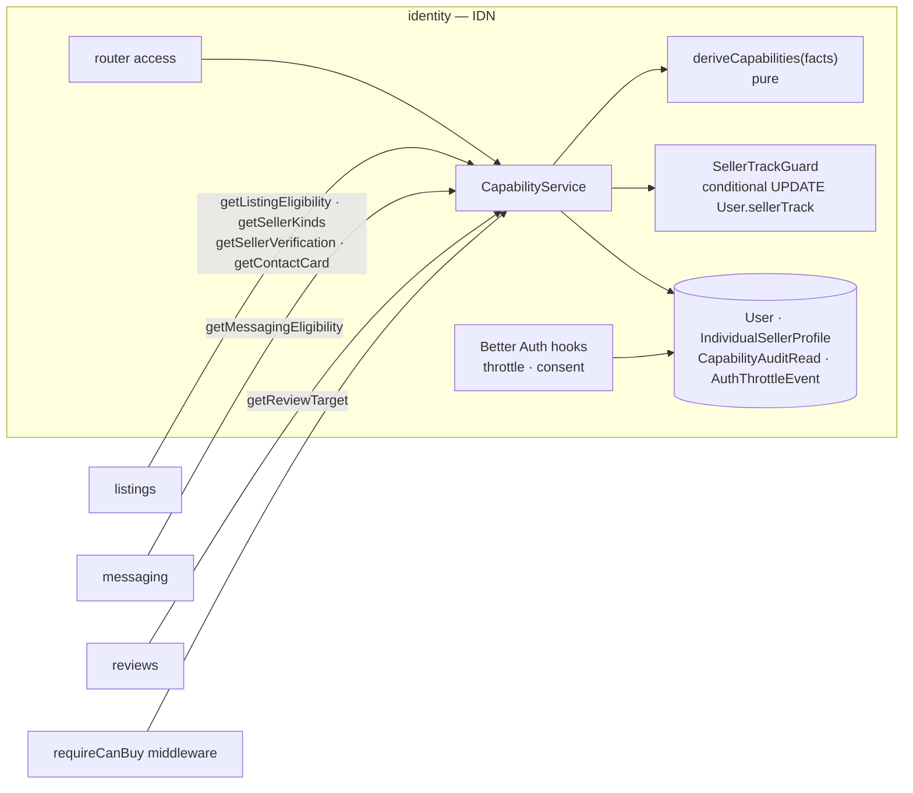

**Alternatives (exclusivity of seller tracks).**
1. *Lock the `User` row `FOR UPDATE`, read both states, then insert.* Rejected. It is correct under the lock, but it is the read-then-write shape that FR-IDN-4 and AD-SYS-5 forbid, and a missed lock silently reopens the race.
2. *A unique index across two tables* (profile and application). Rejected. Postgres cannot express a uniqueness constraint that spans two tables without triggers.
3. **Chosen:** one nullable column `User.sellerTrack`, set once by a conditional update (AD-IDN-2).

#### AD-IDN-1 — Capabilities come from one pure function over one fact read

- **Status:** [ADOPTED]
- **Binds:** `getCapabilities`, `getListingEligibility`, `getSellerKinds`, `getSellerVerification`, `getMessagingEligibility`, `getReviewTarget`, `traceCapabilities`; `requireCanBuy`; FR-IDN-1, FR-IDN-3, FR-IDN-5, FR-IDN-6; NFR-IDN-1, NFR-IDN-3; AD-16.
- **Prevents:** two queries disagreeing about the same user; a capability cached across a status change; a client-supplied role.
- **Rule:**
  1. One SQL statement loads the facts for up to 500 users: `User` flags, the latest `BusinessApplication` (`DISTINCT ON (businessId) … ORDER BY submittedAt DESC, id DESC`) and profile presence.
  2. One pure function `deriveCapabilities(facts)` produces every capability, `sellerKind` and `derivedFrom[]`. Every offered query in the ports table is a projection of its output. No query recomputes a rule on its own.
  3. `sellerKind`:
     - `'business'` when `sellerTrack = 'business'`;
     - `'individual'` when `sellerTrack = 'individual'`;
     - `'none'` otherwise.
  4. There is no cache. Each call reads current facts, so a status change shows on the next call (FR-IDN-6).
  5. `traceCapabilities` renders `derivedFrom[]` and inserts one `CapabilityAuditRead` row in the same transaction. It never selects columns of `BusinessApplicationLegalIdentity` (AD-VER-2).
  6. A table-driven test enumerates every combination of the facts `{emailVerified, consent, sellerTrack, latest application status}` and compares the result with the FR-IDN-1 table.
- **Trade-off:** there is one fact read per call with no memoization. At 500 ids the call stays one indexed statement, well within the 50 ms p95 of NFR-IDN-1.

#### AD-IDN-2 — Seller-track exclusivity is one conditional write on `User.sellerTrack`

- **Status:** [ADOPTED]
- **Binds:** `access.completeIndividualProfile`, `verification.submit`; `User.sellerTrack`; FR-IDN-2, FR-IDN-4, FR-VER-1 rule 1; NFR-IDN-2; AD-18; OQ-1 (gate answer: No).
- **Prevents:** a profile and an application both succeeding for one account; a "graduation" in either direction; a read-then-write check.
- **Rule:**
  1. Profile completion runs `UPDATE "User" SET "sellerTrack"='individual' WHERE id=:u AND "sellerTrack" IS NULL`. If 1 row changes, it inserts `IndividualSellerProfile` in the same transaction.
  2. Application submission runs `UPDATE "User" SET "sellerTrack"='business' WHERE id=:u AND "sellerTrack" IS DISTINCT FROM 'individual'` as the first write of its transaction, then applies the VER rules (AD-VER-3).
  3. On 0 rows, the loser re-reads the row in the same transaction and maps it:
     - A profile loser whose `sellerTrack='business'` gets `AlreadyVerifiedBusiness` if the latest application is `Approved`, otherwise `BusinessApplicationOnFile`.
     - A profile loser whose `sellerTrack='individual'` gets `IndividualSellerProfileAlreadyComplete`.
     - An application loser gets `IndividualSellerProfileAlreadyComplete`.
  4. `sellerTrack` is never cleared. A `Rejected` business stays `'business'` (OQ-1).
  5. The NFR-IDN-2 test runs both commands behind a barrier on two connections, 100 times. After each repetition it asserts that no row has both `sellerTrack='individual'` and a `BusinessApplication`.
- **Trade-off:** one more column on the Better Auth `User` table. That table is ours to extend through Better Auth's `additionalFields`.

#### AD-IDN-3 — `canBuy` gate, consent and authentication throttle

- **Status:** [ADOPTED], with the throttle store [ASSUMPTION]
- **Binds:** `requireCanBuy`; the Better Auth configuration (email verification required, `hooks.before` on sign-in and sign-up); `AuthThrottleEvent`; FR-IDN-1, FR-IDN-7; NFR-SYS-12, NFR-SYS-14; OQ-5, OQ-11.
- **Prevents:** buying or messaging from an unverified email; an account created without recorded consent; credential stuffing at the default Better Auth rate.
- **Rule:**
  1. Sign-up requires `consentAccepted=true` with the current privacy-notice version. It writes `signupConsentAt` and `signupConsentVersion` in the same insert as the user.
  2. `requireCanBuy` wraps every procedure that creates an order, a trade offer, a contact message, a conversation or a review. When `canBuy=false` it raises `EmailNotVerified`, citing `derivedFrom`.
  3. The throttle hook counts `AuthThrottleEvent` rows in the window. At the OQ-11 limit it refuses with `AuthRateLimited`, citing the retry time. The limits are 10 failed sign-ins per account and 30 per IP per 15 min, and 5 sign-ups per IP per hour.
  4. The IP is stored only as `ipHmac(ip)`, the shared HMAC-SHA256 helper keyed by `IP_HMAC_KEY` (S-7).
- **Trade-off:** the count-then-insert throttle can admit a few extra attempts under exact concurrency. It is abuse damping, not a correctness boundary, so it takes no advisory lock.

---

### 6.2 VER — Business Verification Workflow

**Responsibility and host.** `identity`. It moves a business from application to `Approved` or `Rejected` only by an admin action. It confines legal identity to one audited read path, applies the per-reason reapplication policy, and publishes the two application events. It also serves the admin review queue (`verification.queue`, FR-VER-2; NFR-VER-3) and keeps each business's payment instructions for orders (`verification.updatePaymentInstructions`, `getBusinessPaymentInstructions`, FR-VER-9).

**Ports.**

| Direction | Port | Shape | Used by |
| --- | --- | --- | --- |
| Offered | `getBusinessPaymentInstructions(businessId)` | the instruction object, only for `Approved` | `orders` (snapshot at creation) |
| Offered | `getBusinessName(businessId)` | `{ businessName }` | `commission`, `messaging` |
| Published | `BusinessApplicationApproved`, `BusinessApplicationRejected` | ADD-§5 payloads | `commission`, `listings` |
| Consumed | `ObjectStorage` | put/sign/delete in bucket `ver-documents` | submission, review |
| Consumed | `MalwareScanner` | `scan(bytes)` | submission uploads (AD-SYS-8) |
| Consumed | `Outbox` | `enqueue(tx, event)` | approve, reject |

**Data model.**

| Table | Key and constraints | Notes |
| --- | --- | --- |
| `BusinessApplication` | PK `id`; FK `businessId → User`; **partial unique `(businessId) WHERE status='Pending'`**; `CHECK (status='Pending') = (decidedAt IS NULL)`; `CHECK status<>'Rejected' OR (rejectionReasonCode IS NOT NULL AND (reapplyBarred OR reapplyNotBefore IS NOT NULL))` | `status`, `version`, `businessName`, `city`, `externalPresenceUrl`, `submittedAt`, `consentAt`, `consentVersion`, `decidedBy`, `decidedAt`, `rejectionReasonCode`, `rejectionNote`, `reapplyNotBefore`, `reapplyBarred` |
| `BusinessApplicationLegalIdentity` | PK/FK `applicationId` | `type ∈ {NIT, CC}`, `number`, `documentKeys text[]` (1–3). Regulated. Split from the application so that one repository file is the only reader (AD-VER-2) |
| `BusinessProfile` | PK/FK `businessId` | `publicName`, `city`, `externalPresenceUrl`, `bankName`, `accountType`, `accountNumber`, `holderName`, `qrObjectKey?`, `updatedAt`. Upserted on each submission and editable by the business |
| `RejectionReason` | PK `code`; `CHECK (barred AND cooldownDays IS NULL) OR (NOT barred AND cooldownDays BETWEEN 0 AND 365)` | `textEsCo` (10–300), `active` |
| `RejectionReasonChange` (append-only) | PK `id` | `code`, `adminId`, `before jsonb`, `after jsonb`, `at` |
| `ApplicationDecisionLog` (append-only) | PK `id`; unique `applicationId` | `adminId`, `decision`, `reasonCode?`, `at` |
| `LegalIdentityAccessLog` (append-only) | PK `id`; index `(applicationId, at)` | `actorId?` (null only for `job:` rows), `applicationId`, `fieldsRead text[]`, `outcome ∈ {granted, denied}`, `procedure`, `at` |

**Procedures and routes.** Router `verification`.

| Procedure | Builder | Codes |
| --- | --- | --- |
| `verification.submit` (tRPC 11 `FormData` input) | `authedProcedure` | `MissingRequiredField`, `RequestValidationFailed`, `IndividualSellerProfileAlreadyComplete`, `ApplicationAlreadyPending`, `AlreadyVerifiedBusiness`, `ReapplicationBarred`, `ReapplicationCooldownActive`, `InvalidDocumentFile` (§8) |
| `verification.myStatus` | `authedProcedure` | — |
| `verification.updatePaymentInstructions` | `authedProcedure` | `NotBusinessAccount`, `RequestValidationFailed` |
| `verification.queue` | `adminProcedure` | `AdminOnly` |
| `verification.getApplicationForReview` | `authedProcedure` + in-body admin check (so that a non-admin denial is audited) | `LegalIdentityAccessDenied`, `ApplicationNotFound` |
| `verification.approve` / `verification.reject` | `adminProcedure` | `ApplicationNotFound`, `ApplicationNotPending`, `RejectionReasonUnknown` |
| `verification.reasons.list` / `upsert` / `setActive` | `adminProcedure` | `RequestValidationFailed`, `LastActiveReasonRequired` (§8) |
| `verification.legalIdentityAudit` (5.4) | `adminProcedure` | `AdminOnly` |

Routes:
- 5.1 → `/tienda/solicitud`
- 5.2 → `/tienda/estado`
- 5.3 → `/admin/solicitudes`, detail `/admin/solicitudes/<applicationId>`
- 5.4 → `/admin/auditoria/datos-legales`
- 5.5 → `/admin/politicas/motivos`

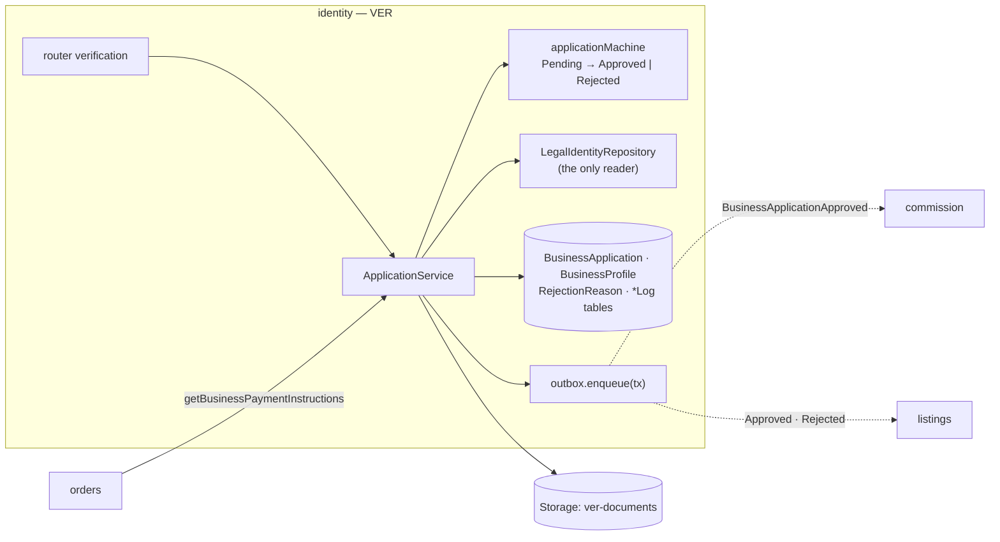

**Alternatives (decision race).**
1. *An application-level mutex per application.* Rejected. Behind the transaction pooler it would need session state (AD-SYS-4 rule 3).
2. *SERIALIZABLE isolation for decisions.* Rejected. It surfaces as retries instead of explained losers, and the loser would not learn who won.
3. **Chosen:** one conditional transition plus audit plus outbox in one transaction (AD-VER-1).

#### AD-VER-1 — A decision is one conditional transition with its audit row and event

- **Status:** [ADOPTED]
- **Binds:** `verification.approve`, `verification.reject`, `verification.reasons.setActive`; `BusinessApplication`, `ApplicationDecisionLog`, `RejectionReason`, `OutboxEvent`; FR-VER-3, FR-VER-4, FR-VER-8; NFR-VER-1; ADD-§4.1.
- **Prevents:** two admins both deciding; an event for the losing decision; a decided application missing `decidedBy`; later policy edits rewriting past decisions; zero active rejection reasons after two concurrent deactivations.
- **Rule:**
  1. Reject first reads the reason with `SELECT … FROM "RejectionReason" WHERE code=:c AND active FOR SHARE`. A missing row raises `RejectionReasonUnknown`. The share lock blocks a concurrent deactivation until the decision commits.
  2. The transition is `UPDATE "BusinessApplication" SET status=:to, "decidedBy", "decidedAt"=:now, version=version+1 [, "rejectionReasonCode", "rejectionNote", "reapplyNotBefore" = :now + cooldownDays × 1 day | "reapplyBarred"=true] WHERE id=:id AND status='Pending'`.
  3. On 0 rows, the loser re-reads and raises `ApplicationNotPending`, citing `{status, decidedBy, decidedAt}`. An unknown id raises `ApplicationNotFound`.
  4. The same transaction inserts `ApplicationDecisionLog` (its unique `applicationId` is a second guard) and enqueues exactly one event.
  5. The policy is copied onto the application at decision time. `RejectionReason` edits never touch decided rows (FR-VER-8).
  6. `reasons.setActive(code, false)` locks every active reason with `SELECT … WHERE active ORDER BY code FOR UPDATE`. If `code` is not among the rows (already inactive), the call is a no-op and writes no change row. If `code` is the only row returned, it raises `LastActiveReasonRequired`. Otherwise it deactivates the reason and writes one `RejectionReasonChange` row. `reasons.upsert` never writes `active`; only `setActive` does. Two concurrent deactivations of the last two reasons therefore leave one active.
- **Trade-off:** a reason deactivated while a reject is in flight waits for that reject to commit. That wait is rare and short.

#### AD-VER-2 — Legal identity has one reader, and every read or denial is logged

- **Status:** [ADOPTED]
- **Binds:** `BusinessApplicationLegalIdentity`; `identity/infra/legalIdentityRepository.ts`; `verification.getApplicationForReview`; `LegalIdentityAccessLog`; the lint rule `tezg/legal-identity-confined`; FR-VER-5; NFR-VER-2, NFR-VER-3 (signed-URL issue); AD-13, AD-14, AD-17.
- **Prevents:** legal identity leaking through another query, a log line or an event; an unaudited read; a denial that leaves no trace.
- **Rule:**
  1. Only `legalIdentityRepository.ts` may reference the Prisma model `BusinessApplicationLegalIdentity` or its bucket prefix. The lint rule `tezg/legal-identity-confined` fails on any other file, and CI greps the compiled output as a second check.
  2. For an admin, `getApplicationForReview` reads the row, signs the document URLs (600 s) and inserts `LegalIdentityAccessLog{outcome:'granted', fieldsRead}`, all in one transaction.
  3. For a non-admin, it first commits `LegalIdentityAccessLog{outcome:'denied'}` in its own transaction and then raises `LegalIdentityAccessDenied`. The denial row survives the error.
  4. All `legalIdentity.*` fields and document keys are listed in `regulated.ts` (AD-SYS-8).
  5. NFR-VER-2 compares the log count with an instrumented counter in the repository. They must be equal.
  6. Jobs reach the table only through two repository functions: `listReferencedDocumentKeys()` for `orphan-upload-sweep` and `purgeExpired(before)` for `retention-purge`. Each call writes one `LegalIdentityAccessLog{outcome:'granted', fieldsRead:['documentKeys'], procedure:'job:<name>'}` row with a null `actorId` (`CHECK (actorId IS NOT NULL OR procedure LIKE 'job:%')`), so the counter equality of rule 5 includes job reads.
- **Trade-off:** the split table costs one join on the review detail. The build also depends on a custom lint rule.

#### AD-VER-3 — One pending application per business, and reapplication derived from the snapshot

- **Status:** [ADOPTED]
- **Binds:** `verification.submit`; the partial unique index on `BusinessApplication`; FR-VER-1, FR-VER-6, FR-VER-7; ADD-§4.1.
- **Prevents:** two pending applications from a double submit; a cooldown judged with the current policy instead of the snapshot; a cooldown that depends on a job.
- **Rule:**
  1. The submit transaction runs in this order:
     1. the AD-IDN-2 write;
     2. read the latest application for the business;
     3. apply FR-VER-1 rules 2–4 and FR-VER-6, using the snapshot fields and `now`;
     4. insert the new `Pending` row;
     5. upsert `BusinessProfile`.
  2. A unique violation on the partial index raises `ApplicationAlreadyPending`.
  3. `ReapplicationCooldownActive` applies while `now < reapplyNotBefore`. At `now = reapplyNotBefore` the submission succeeds (the FR-VER-6 boundary test).
  4. Documents are uploaded to `ver-documents` before the transaction, under cuid2 keys. If the transaction aborts, the keys are deleted after the rollback. Keys never referenced by a row are removed by the nightly orphan sweep (§13).
- **Trade-off:** the upload happens before the domain checks. A refused submission still costs an upload and a delete.

---

### 6.3 CAT — Catalog & Price Reference Service

**Responsibility and host.** `catalog`, which has no module dependencies. It holds one identity per card or product, browses and facets the catalog (`catalog.browse`, FR-CAT-1), ingests the feed idempotently with quarantine, stores reference-price observations and the TRM, and answers provenance and freshness.

**Ports.**

| Direction | Port | Shape | Used by |
| --- | --- | --- | --- |
| Offered | `browse(filters, page, pageSize ≤ 100)` | entries, total, facets | tRPC `catalog.browse`; `listings` (DSC `view=entries`) |
| Offered | `matchEntryIds(filters)` | `{ ids[] ≤ 20,000 }` or `tooBroad` | `listings` (DSC `view=listings`) |
| Offered | `getEntries(ids ≤ 500)` | `{ entries[], missing[] }` | `listings`, `collections` |
| Offered | `getEntry(id)` | entry, or raises `CatalogEntryNotFound` | `listings.getCardDetail` |
| Offered | `resolveItemRefs(refs ≤ 500)` | `[{ ref, kind } \| missing]` | `listings` (and through it `trading`, OQ-6) |
| Offered | `getPriceProvenance(ids ≤ 500, period ∈ {7,30,90})` | per entry: last reference, trend, freshness | `listings` (card detail), `collections` (VAL) |
| Offered | `getReferencePricesAsOf(ids ≤ 500, asOf)` | the latest observation at or before `asOf`, with `stale` relative to `asOf` | `collections` (VAL) |
| Offered | `getSetSummaries(setIds ≤ 500)` | `[{ setId, name, cardEntryCount }]`, where `cardEntryCount` counts `kind=card` entries | `collections` (completion denominator, AD-COL-1) |
| Offered | `getPriceHistory(ids ≤ 500, from, to)` | the observations in `[from, to]` plus the last one before `from` | `collections` (VAL history) |
| Offered | `getFxRate(date)` | `{ copPerUsdCentavos, validFrom, validTo, stale }` | `collections` (display only) |
| Consumed | `CatalogFeedSource` | `openRun() → rows` (fixture in V1, OQ-9) | ingestion |
| Consumed | `FxRateSource` | `getRateCovering(date)` (ADD-§6) | TRM job |

**Data model.** Postgres extensions `unaccent` and `btree_gist` are enabled by migration.

| Table | Key and constraints | Notes |
| --- | --- | --- |
| `CatalogSet` | PK `id`; unique `code` | `name`, `era`, `releaseDate`, `cardCount` (printed total) |
| `CatalogEntry` | PK `id`; **unique `externalKey`**; FK `setId`; index `(setId, numberSort)`; btree `nameKey text_pattern_ops` | `kind ∈ {card, sealedProduct}`, `name`, `nameKey = tezg_unaccent_lower(name)` (an immutable wrapper function), `number`, `numberSort`, `pokemon`, `colour`, `style`, `artist`, `imageUrl` |
| `CatalogEntryRevision` | PK `id`; index `(catalogEntryId, at)` | `runId`, `changedFields text[]`, `before jsonb`, `after jsonb` |
| `ReferencePriceObservation` | PK `id`; **unique `(catalogEntryId, source, observedAt)`**; `CHECK cop >= 0`; `CHECK (copDerivation='fxDerived') = (fxRateDate IS NOT NULL AND usdCents IS NOT NULL)` | `usdCents?`, `cop`, `copDerivation`, `fxRateDate?`, `runId`. Append-only; no `stale` column |
| `FxRate` | PK `id`; **`EXCLUDE USING gist (daterange(validFrom, validTo, '[]') WITH &&)`** | `copPerUsdCentavos`, `validFrom`, `validTo`, `source`, `fetchedAt` |
| `FeedIngestionRun` | PK `id`; **partial unique `((true)) WHERE status='Running'`** | `status ∈ {Running, Completed, Failed}`, `cursor int`, `leaseUntil`, `leaseToken`, `created`, `updated`, `unchanged`, `quarantined`, `deferredNoFx`, `startedAt`, `endedAt` |
| `QuarantinedFeedRow` | PK `id`; unique `(runId, rowNumber)` | `externalKey?`, `reasonCode` (ADD-§8.1), `rawRow jsonb` |

**Procedures and routes.** Router `catalog`.

| Procedure | Builder | Codes |
| --- | --- | --- |
| `catalog.browse`, `catalog.entry`, `catalog.provenance` | `publicProcedure` | `CatalogEntryNotFound`, `RequestValidationFailed` |
| `catalog.feed.start` | `adminProcedure` | `FeedRunInProgress` |
| `catalog.feed.continue(runId)` | `adminProcedure` | `FeedRunInProgress` (a live lease held by another caller) |
| `catalog.feed.runs`, `catalog.feed.quarantine(runId, reason?)` | `adminProcedure` | `AdminOnly` |
| `catalog.fx.status`, `catalog.fx.retry` | `adminProcedure` | `AdminOnly` |

Routes:
- 2.1 → `/catalogo` (fixed here; EC-30)
- 2.2 → `/c/<catalogEntryId>` (composed by `listings`, §6.5)
- 2.3 → `/admin/catalogo`

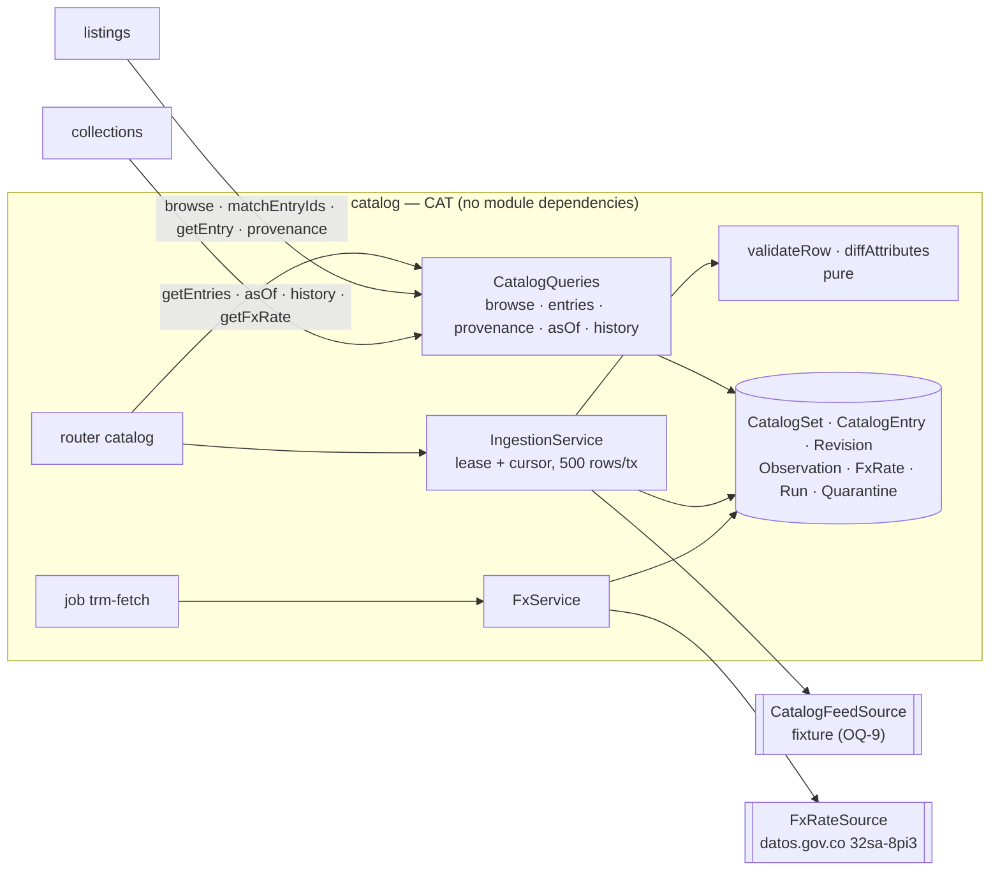

**Alternatives (ingestion on serverless).**
1. *One request that ingests the whole file.* Rejected. A 10,000-row run near the 120 s NFR is close to the function limit, and a crash loses the position.
2. *A queue worker.* Rejected. The deployment has no worker tier (§4).
3. **Chosen:** a resumable run with a lease and cursor, 500 rows per transaction, driven by repeated `continue` calls (AD-CAT-1).

#### AD-CAT-1 — Feed ingestion is a resumable, leased run of idempotent batches

- **Status:** [ADOPTED]
- **Binds:** `catalog.feed.start`, `catalog.feed.continue`; the scheduled run in `daily-night`; `FeedIngestionRun`, `QuarantinedFeedRow`, `CatalogEntry`, `CatalogEntryRevision`, `ReferencePriceObservation`; FR-CAT-2, FR-CAT-3, FR-CAT-4; NFR-CAT-2.
- **Prevents:** two concurrent runs; a crash leaving a half-applied batch; a rerun creating duplicates; a renamed card getting a new id.
- **Rule:**
  1. `start` inserts a `Running` row. A unique violation on the partial index raises `FeedRunInProgress`, citing the running run's id and start time.
  2. `continue(runId)` claims the run with `UPDATE … SET "leaseUntil"=:now + 90 s, "leaseToken"=:t WHERE id=:id AND status='Running' AND ("leaseUntil" IS NULL OR "leaseUntil" < :now)`, with a fresh random `:t`. If 0 rows change, it re-reads the run: one that is no longer `Running` returns `{done:true, status}`, and a live lease held by another caller raises `FeedRunInProgress`.
  3. While holding the lease, it processes batches of 500 rows. Each batch is one transaction that:
     - first renews and verifies the lease with `UPDATE … SET "leaseUntil"=:now + 90 s WHERE id=:id AND "leaseToken"=:t`. If 0 rows change, another caller has taken the run: the batch rolls back and `continue` stops, returning `{done:false, cursor}`;
     - validates each row with the pure `validateRow`;
     - quarantines invalid rows (`ON CONFLICT (runId, rowNumber) DO NOTHING`);
     - upserts valid rows by `externalKey`;
     - writes one `CatalogEntryRevision` for each row whose attributes differ;
     - inserts observations `ON CONFLICT DO NOTHING`;
     - advances `cursor` and the counters.
  4. `continue` stops starting new batches after 50 s of wall time and returns `{done, cursor}`. The 2.3 console calls it again until `done`. The scheduled run loops in-process for up to 240 s, and the next day's run finishes any remainder.
  5. `catalogEntryId` is never reassigned. A new `externalKey` always creates a new entry, and entries are never merged (FR-CAT-4).
  6. Rerunning the same file converges: every valid row counts as `unchanged` and every invalid row is quarantined again under the new `runId`.
  7. A non-transient source error (an unreadable file, a schema mismatch) sets `status='Failed'` and `endedAt` under the same token check. Before inserting, `start` runs `UPDATE … SET status='Failed', "endedAt"=:now WHERE status='Running' AND COALESCE("leaseUntil", "startedAt") < :now − 24 h`, so an abandoned run stops blocking new ones.
- **Trade-off:** an admin-started run needs the console tab to keep calling `continue`. Closing the tab pauses the run until the lease expires and someone continues it.

#### AD-CAT-2 — Observations are immutable, converted to COP once, and aged at read

- **Status:** [ADOPTED]
- **Binds:** `ReferencePriceObservation`; `copFromUsd`; `getPriceProvenance`, `getReferencePricesAsOf`, `getPriceHistory`; FR-CAT-5, FR-CAT-6, FR-CAT-7; NFR-CAT-1, NFR-CAT-3; ADD-§2.1, ADD-§2.2.
- **Prevents:** a stored `stale` flag drifting from the clock; a price re-converted at read with a different TRM; an interpolated, blended or substituted value; a reference price treated as `Cop`.
- **Rule:**
  1. A USD-only row is converted at insert with `copFromUsd(usdCents, rate)`. The rate is the `FxRate` covering the Bogotá date of `observedAt`, or the latest earlier one. `fxRateDate` records that rate's `validFrom`.
  2. If no rate exists on or before that date, the row is not stored and is counted in `deferredNoFx` [ASSUMPTION]. A later rerun ingests it.
  3. `stale` is computed only at read, as `now − observedAt > freshnessThresholdHours` (configuration, default 36). Nothing stores it.
  4. Provenance for ≤ 500 ids uses two indexed statements: `DISTINCT ON (catalogEntryId)` for the latest observation, and the latest observation at or before `asOf − period` for the trend baseline. When there is no baseline, `changePercent = null` with `TrendNoBaseline`.
  5. Every displayed value equals a stored row byte for byte (NFR-CAT-3). There is no code path that averages or combines rows.
  6. The DTO type is `ReferencePrice` (AD-SYS-7) and cannot be assigned to `Cop`.
- **Trade-off:** a USD observation keeps the TRM of its own date forever. That is correct provenance, but two cards observed on different days use different rates (VAL reports the drift bound, FR-VAL-1).

#### AD-CAT-3 — The TRM is stored with the source's validity and never invented

- **Status:** [ADOPTED], with the hourly retry [ASSUMPTION — gate item G-3]
- **Binds:** `FxRate`; job `trm-fetch` (`daily-morning`, plus the hourly tick); `catalog.fx.retry`; `getFxRate`; FR-CAT-8; NFR-CAT-4; ADD-§6.
- **Prevents:** overlapping rates; a weekend rate fabricated by copying; a request path waiting on the source; a float parse of `valor`.
- **Rule:**
  1. `trm-fetch` is a no-op when a row already covers today's Bogotá date.
  2. Otherwise it calls `FxRateSource.getRateCovering(today)`, which retries transport failures at most 3 times.
  3. `valor` is parsed as a decimal string into centavos, rounded half-up.
  4. The row is inserted as delivered by the source (`validFrom`, `validTo`). An exclusion-constraint conflict with an identical row is treated as already stored. A conflict with a *different* value keeps the existing row and logs `FxRateSourceMismatch` for the admin (2.3).
  5. `getFxRate(date)` returns the covering row. If none covers the date, it returns the latest earlier row with `stale=true`, citing `FxRateCarriedForward`. No row is ever written for a gap.
  6. No request path calls `FxRateSource` (lint `tezg/no-direct-io` plus port binding).
- **Trade-off:** until the day's rate arrives, conversions and displays carry the previous rate with a stale label. On Hobby without G-3, that can last until the admin retries.

---

### 6.4 INV — Listing & Shared Inventory Engine

**Responsibility and host.** `listings`. It covers listings of cards, sealed products and bundles; one quantity per physical stock pool; reservation and release inside the caller's transaction; purchasability, including the commission pause projection; withdrawal on rejection; and restocking. `listings` also hosts DSC (§6.5), the MSG contact service (§6.9) and listing hide (§6.12).

**Ports.**

| Direction | Port | Shape | Used by |
| --- | --- | --- | --- |
| Offered | `getListingForPurchase(listingId)` | `{ sellerId, kind, visible }`, or raises `ListingNotFound` | `orders` (self-purchase check before reserving) |
| Offered | `reserveForPurchase(tx, listingId, qty, buyerId)` | `{ reservationRef, exhaustedListingIds[], snapshot }` | `orders` |
| Offered | `reserveForTrade(tx, listingId, 1)` | `{ reservationRef, exhaustedListingIds[] }` | `trading` |
| Offered | `releaseReservation(tx, reservationRef)` | `void` | `orders`, `trading` |
| Offered | `getTradeability(listingId)` | `Decision` with `sellerId`, `availability` (it reads the ambient transaction when called inside one) | `trading` |
| Offered | `getInventoryUnitIds(listingId)` | `unitIds[]` | `orders` (expiry pre-step, AD-ORD-2) |
| Offered | `resolveItemRefs(refs ≤ 500)` | delegates to `catalog.resolveItemRefs` | `trading` (OQ-6) |
| Offered | `getAvailabilitySummary(catalogEntryIds ≤ 500, area?)` | `[{ catalogEntryId, lowestPriceCop?, availableCount }]` | `collections` (wishlist) |
| Offered | `generateContactMessage({kind, listingId, requesterId, tradeSummary?})` | see §6.9 | tRPC `inventory.contact`; `trading` |
| Offered | `listingModerationLog(filters, page)` | log rows | admin RSC 11.4 (§6.12) |
| Consumed | `identity.getListingEligibility`, `getSellerKinds`, `getSellerVerification`, `getContactCard`, `getDisplayNames` | see §6.1 | create, browse, reserve, contact |
| Consumed | `catalog.resolveItemRefs`, `getEntries` | see §6.3 | create, snapshot titles |
| Subscribed | `BusinessApplicationApproved` / `Rejected` | key `applicationId` | FR-INV-8 |
| Subscribed | `CommissionBalanceExhausted` / `Replenished` | seq-gated | FR-INV-7 |

`snapshot` is `{ title, itemRef?, condition?, unitPriceCop, components?[] }`, read inside the reservation transaction. Titles come from `catalog.getEntries` in the ambient transaction.

**Data model.**

| Table | Key and constraints | Notes |
| --- | --- | --- |
| `InventoryUnit` | PK `id`; **unique `(sellerId, catalogEntryId, condition)`**; **`CHECK (quantity >= 0)`**; `condition text NOT NULL CHECK (condition IN ('NM','LP','MP','HP','DMG','Sealed'))` | `quantity int` |
| `Listing` | PK `id`; FK `inventoryUnitId` (single listings only); `CHECK (kind='single') = (inventoryUnitId IS NOT NULL)`; `CHECK priceCop BETWEEN 1000 AND 100000000`; index `(sellerId)`; btree `(lat, lng)`; partial index `WHERE "hiddenAt" IS NULL AND "withdrawnAt" IS NULL AND "deactivatedAt" IS NULL` | `sellerId`, `sellerKindAtCreation`, `kind ∈ {single, bundle}`, `title?` (bundle), `priceCop`, `lat?`, `lng?`, `description`, `openToTrade`, `pausedAt`, `withdrawnAt`, `withdrawnReason`, `withdrawnByApplicationId`, `hiddenAt`, `hiddenReason`, `hiddenBy`, `deactivatedAt`, `version` |
| `BundleComponent` | PK `(listingId, inventoryUnitId)`; `CHECK perBundleQty BETWEEN 1 AND 4` | `catalogEntryId`, `condition` (copied from the unit for display) |
| `SellerCommissionState` | PK `businessId` | `lastAppliedSeq bigint`, `paused bool`, `appliedAt` |
| `AppliedApplicationDecision` | PK `applicationId`; index `(businessId, decidedAt)` | `businessId`, `decision`, `decidedAt`, `appliedAt`, `ignored bool` |
| `ListingModerationLog` (append-only) | see §6.12 | — |
| `ContactRequestLog` | see §6.9 | — |

The PRD's `Bundle` is realized as `Listing.kind='bundle'` plus `BundleComponent`. There is no separate bundle table, and no reservation or hold table (FR-INV-6).

**Procedures and routes.** Router `inventory`.

| Procedure | Builder | Codes |
| --- | --- | --- |
| `inventory.create` | `authedProcedure` | identity eligibility codes (propagated), `InvalidItemRef`, `InvalidPrice`, `InvalidLocation`, `OpenToTradeNotAllowed` |
| `inventory.createBundle` | `authedProcedure` | the above, plus `EmptyComponentList`, `SealedProductInBundle`, `RequestValidationFailed` |
| `inventory.update`, `inventory.restock`, `inventory.deactivate`, `inventory.reactivate` | `authedProcedure` | `ListingNotFound`, `ListingNotOwnedByCaller`, `InsufficientQuantity`, eligibility codes (reactivate) |
| `inventory.mine` (4.2), `inventory.get` (FR-INV-10) | `authedProcedure` / `publicProcedure` | `ListingNotFound` |
| `dev.inventory.race` (4.3) | `devProcedure` | — |

Routes:
- 4.1 → `/vender/nueva`
- 4.2 → `/vender`
- 4.3 → `/dev/inv`

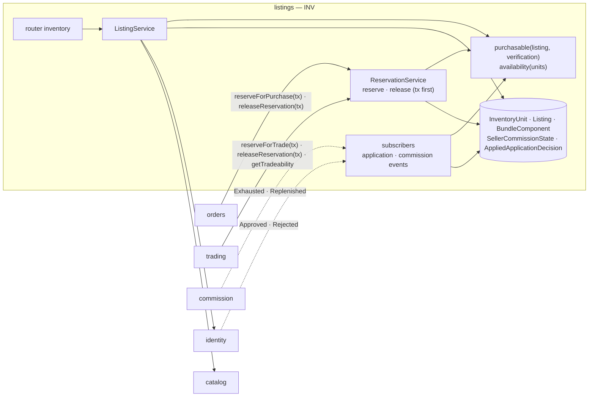

**Alternatives (how a reservation holds stock).**
1. *A reservation or hold row per order or offer, reclaimed by a job.* Rejected by FR-INV-6 and NFR-INV-3 ("no reservation row"). It also adds a table that three modules would write.
2. *Optimistic `version` on `InventoryUnit` with retries.* Rejected. Under 50-way contention it produces retry storms, and it still needs a conditional write.
3. **Chosen:** decrement the unit in the caller's transaction with one conditional `UPDATE` per unit, and store `reservationRef` on the caller's aggregate (AD-INV-2).

#### AD-INV-1 — One `InventoryUnit` per `(seller, item, condition)` is the only quantity

- **Status:** [ADOPTED] (resolves OQ-10 and refines AD-6)
- **Binds:** `InventoryUnit`, `Listing.inventoryUnitId`, `BundleComponent`; `inventory.create`, `createBundle`, `restock`; FR-INV-1, FR-INV-2, FR-INV-4, FR-INV-9; NFR-INV-1.
- **Prevents:** two copies of the same card in different conditions sharing one pool; a second listing of the same copy adding stock; negative stock.
- **Rule:**
  1. Create resolves the unit with `INSERT … ON CONFLICT (sellerId, catalogEntryId, condition) DO NOTHING RETURNING id`, then selects it. An existing unit is linked unchanged, and the input `quantity` is ignored (FR-INV-1 rule 3).
  2. Availability is computed on read and is never stored:
     - for a single listing, `unit.quantity`;
     - for a bundle, `min(floor(unit.quantity / perBundleQty))` over its components.
  3. `CHECK (quantity >= 0)` backs every decrement.
  4. Restock with `delta > 0` is `quantity = quantity + delta`. With `delta < 0` it is the conditional decrement of AD-INV-2 and raises `InsufficientQuantity` when it cannot apply. `delta = 0` is refused by the input schema (`RequestValidationFailed`).
  5. A bundle component whose catalog kind is `sealedProduct` raises `SealedProductInBundle`, naming the item, before any row is written.
- **Trade-off:** a seller who wants separate prices for the same copy gets separate listings on one pool. That is intended, but the listing form must show the shared stock.

#### AD-INV-2 — Reserve and release run inside the caller's transaction, with ascending conditional decrements

- **Status:** [ADOPTED]
- **Binds:** `reserveForPurchase`, `reserveForTrade`, `releaseReservation`; `Order.reservationRef`, `TradeOffer.reservationRef`; FR-INV-3, FR-INV-5, FR-INV-6; NFR-INV-1..4; AD-6; AD-SYS-4 rules 1 and 5.
- **Prevents:** an oversell under concurrency; a deadlock between bundle and single reservations; a leak after an aborted caller; a double release.
- **Rule:**
  1. Both reserve commands take `tx` first and never open a transaction.
  2. They check the listing in the PRD order:
     - purchase: `ListingNotFound` → `NotBusinessListing` → `ListingNotPurchasable`;
     - trade: `ListingNotFound` → `NotIndividualSellerListing`.
  3. `:req` is asserted to be an integer ≥ 1 before any SQL; a violation is a programming error (`'Unexpected'`). For each unit in **ascending `inventoryUnitId` order**, they run `UPDATE "InventoryUnit" SET quantity = quantity − :req WHERE id=:u AND quantity >= :req RETURNING quantity`. If 0 rows change, they raise `InsufficientQuantity{requested, available}` and the caller's transaction aborts. That rollback is the only undo.
  4. `exhaustedListingIds` comes from one query in the same transaction over listings that reference any decremented unit and now have availability 0.
  5. `reservationRef = {listingId, units:[{inventoryUnitId, qty}]}` is returned and stored by the caller on its own row.
  6. `releaseReservation(tx, ref)` increments the same units in ascending order. It is called only in the same transaction as the caller's conditional transition that affected 1 row (AD-ORD-2, AD-TRD-3), so it runs at most once.
  7. NFR-INV-3 asserts that no row is written anywhere except `InventoryUnit` during a reserve.
- **Trade-off:** quantity held by an order that expired but has not yet been materialized stays unavailable until one of the expiry triggers runs (AD-ORD-2 rule 7). With G-3, browse can show `Sold out` for up to 1 hour between 07:05 and 20:05 Bogotá, and up to about 6.5 hours overnight (00:30 → 07:00).

#### AD-INV-3 — Purchasability is fail-closed and projections apply only newer facts

- **Status:** [ADOPTED]
- **Binds:** `SellerCommissionState`, `Listing.pausedAt`, `AppliedApplicationDecision`; the subscribers `onCommissionBalanceExhausted`, `onCommissionBalanceReplenished`, `onBusinessApplicationApproved`, `onBusinessApplicationRejected`; `identity.getSellerVerification`; FR-INV-7, FR-INV-8; AD-3; ADD-§4.4.
- **Prevents:** a newly approved business selling before its commission state arrives; a lost or reordered event re-enabling a paused shop; an older rejection overriding a newer approval; a verification badge that disagrees with `identity`.
- **Rule:**
  1. `purchasable(listing)` = all of:
     - the seller's verification is `Approved`, read through `identity.getSellerVerification` in the ambient transaction;
     - `pausedAt IS NULL`;
     - availability ≥ 1;
     - `hiddenAt`, `withdrawnAt` and `deactivatedAt` are all null.
  2. One TypeScript predicate implements it. Its SQL twin covers only the terms stored in `listings` tables (`pausedAt`, availability and the three nulls), so it never reads `identity` tables. The verification term is composed in TypeScript: from `identity.getSellerKinds(…).verified` for a batch, and from `getSellerVerification` inside a reserve. A parity test runs both composed forms over the seed.
  3. A business listing created while its `SellerCommissionState` row is absent or `paused` gets `pausedAt=:now` at insert (fail-closed). The row is read `FOR SHARE`, the projection position in the global lock order.
  4. A commission event applies only if no row exists or `ledgerSeq > lastAppliedSeq`. It upserts the row and sets or clears `pausedAt` on all of the business's listings in one transaction. Redelivered, older and replayed events are no-ops.
  5. An application event inserts `AppliedApplicationDecision ON CONFLICT (applicationId) DO NOTHING`. It applies only if it inserted and its `decidedAt` is later than every applied decision for the business; otherwise it records `ignored=true`. Rejected withdraws with `withdrawnReason='ApplicationRejected'`. Approved clears only rows withdrawn for that reason.
  6. Individual-seller listings are never paused and never purchasable.
- **Trade-off:** `pausedAt` is written on every listing of the business at each crossing. That is O(listings per shop), accepted at the seed scale of ≤ 500 listings per business.

---

### 6.5 DSC — Marketplace Browse & Location Discovery

**Responsibility and host.** `listings`, with no tables of its own. It runs one geodesic query path for both seller kinds and both views, ranks deterministically, derives pickup on read, explains every row, and composes the card detail (OQ-8).

**Ports.**

| Direction | Port | Shape | Used by |
| --- | --- | --- | --- |
| Offered | `search(input)` | `{ results, excluded: { unusableLocation } }` | tRPC `discovery.search` |
| Offered | `getCardDetail(catalogEntryId, area?)` | entry, provenance, listing price, `hasActiveListings`, ranked listings | tRPC `discovery.cardDetail` |
| Consumed | `catalog.browse`, `matchEntryIds`, `getEntry`, `getPriceProvenance` | §6.3 | entries view, listings view, card detail |
| Consumed | `identity.getSellerKinds` | §6.1 | pickup, badge |

**Data model.** None. It reads `Listing`, `InventoryUnit` and `BundleComponent` in its own host.

**Procedures and routes.** Router `discovery`.

| Procedure | Builder | Codes |
| --- | --- | --- |
| `discovery.search` | `publicProcedure` | `InvalidSearchArea`, `RequestValidationFailed` |
| `discovery.cardDetail` | `publicProcedure` | `CatalogEntryNotFound` (propagated from `catalog`), `InvalidSearchArea` |
| `dev.discovery.explain` (3.2) | `devProcedure` | — |

Routes:
- 3.1 → `/cerca`
- 2.2 → `/c/<catalogEntryId>`
- 3.2 → `/dev/dsc`

The page composes `discovery.cardDetail` with `reputation.getAggregates(sellerIds)` in the RSC (§2).

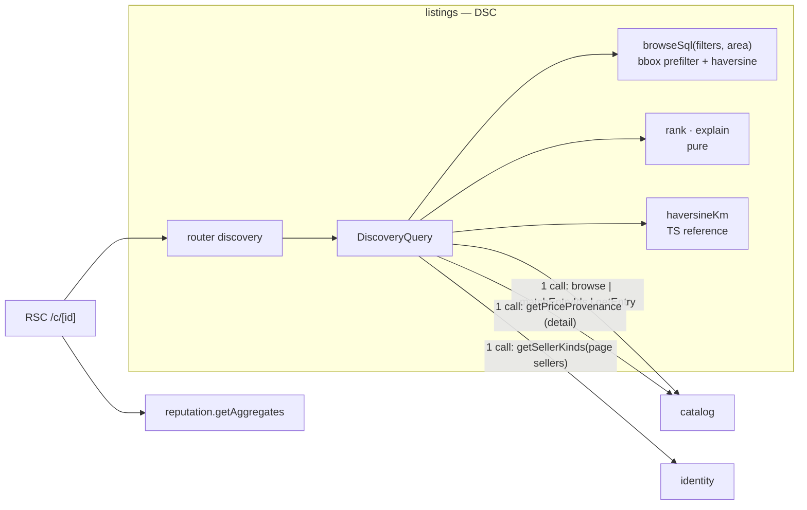

**Alternatives (where catalog filters are applied).**
1. *Join catalog tables from the listings SQL.* Rejected. It breaks table ownership (AD-8).
2. *A catalog-attribute projection copied onto listings.* Rejected. `catalog` cannot publish to `listings` without a new edge, and a sync job would drift.
3. **Chosen:** `catalog` resolves filters to entry ids (paged for `view=entries`; `matchEntryIds` for `view=listings`), and `listings` filters by `itemRef = ANY(:ids)` (AD-DSC-2).

#### AD-DSC-1 — One SQL path computes distance exactly like the TypeScript reference

- **Status:** [ADOPTED]
- **Binds:** `browseSql`, `haversineKm`; `discovery.search`, `discovery.cardDetail`, `getAvailabilitySummary`; FR-DSC-1..6; NFR-DSC-1..3; AD-5; ADD-§2.3, ADD-§2.4.
- **Prevents:** two query paths for two seller kinds; SQL and UI disagreeing at the boundary; an unstable order; a moderated listing leaking for one request.
- **Rule:**
  1. One function builds the SQL for both views and both seller kinds. It has no branch on seller kind.
  2. With an area, a bbox prefilter on `(lat, lng)` precedes the distance expression `2 × 6371.0088 × asin(sqrt(…))` in `double precision`. A row is included when `d <= radiusKm + 1e-6`.
  3. A property test compares the SQL distance with `haversineKm` for 1,000 random Colombian pairs, with a tolerance of `1e-6` km.
  4. Unusable locations (null, (0,0), outside the bbox) are counted in `excluded.unusableLocation` with `FILTER` in the same statement. With an area they are excluded. Without one they rank after the located rows with `distanceKm=null`.
  5. Order:
     - with an area: `(d, priceCop, id)`;
     - without an area: `(priceCop, id)`;
     - sold-out rows last when included.
  6. The default predicate is `hiddenAt IS NULL AND withdrawnAt IS NULL AND deactivatedAt IS NULL` and availability ≥ 1. Nothing is cached across requests.
  7. `view=entries` pages over `catalog.browse` with page size 24. One windowed statement (`row_number() OVER (PARTITION BY entry ORDER BY …) <= 5`, plus counts) returns the top 5 and `moreCount` per entry. A bundle row appears under each of its component entries [ASSUMPTION].
- **Trade-off:** haversine runs per row after the bbox prefilter, with no PostGIS. That is acceptable at 50,000 listings (NFR-DSC-1), and it keeps the extension set small.

#### AD-DSC-2 — Composition makes at most three neighbour calls per request, with no N+1

- **Status:** [ADOPTED]
- **Binds:** `DiscoveryQuery`; `catalog.browse` / `matchEntryIds` / `getEntry` / `getPriceProvenance`; `identity.getSellerKinds`; FR-DSC-4, FR-DSC-7; OQ-8.
- **Prevents:** per-row neighbour calls; pickup or badge values cached across requests; `catalog` depending on `listings`.
- **Rule:**
  1. A `search` or `cardDetail` request makes at most one call per neighbour port listed in the ports table: at most 3 calls in total. A test with counting fakes asserts this for pages of 1, 24 and 100 rows.
  2. `matchEntryIds` answers `tooBroad` above 20,000 ids [ASSUMPTION]. `search` then raises `SearchFilterTooBroad` (§8), asking the caller to narrow the filters. Empty catalog filters skip the call entirely.
  3. `pickupAvailable` and the verified badge come from the single `getSellerKinds` call for the page's distinct sellers. They are never stored.
  4. `getCardDetail` calls `catalog.getEntry` first. An unknown id propagates `CatalogEntryNotFound` unchanged. The listing price is the lowest `priceCop` among active, not-sold-out listings, or `null` ("no active listings").
- **Trade-off:** a very broad `view=listings` filter is refused instead of served. The 2.1 filter UI prevents that combination.

---

### 6.6 ORD — Order & Comprobante Confirmation

**Responsibility and host.** `orders`. It creates a business purchase and reserves at creation, keeps the comprobante, records three independent confirmation facts, cancels and expires unpaid orders, publishes the two order events, and answers visibility and closed-purchase queries.

**Ports.**

| Direction | Port | Shape | Used by |
| --- | --- | --- | --- |
| Offered | `hasClosedPurchase(buyerId, businessId)` | `{ closed, latestState }` | `reviews` |
| Published | `OrderPaymentConfirmedByBusiness`, `OrderClosed` | ADD-§5 | `commission`; `collections` (`OrderClosed` only) |
| Consumed | `listings.getListingForPurchase`, `reserveForPurchase`, `releaseReservation`, `getInventoryUnitIds` | §6.4 | create, cancel, expire |
| Consumed | `identity.getBusinessPaymentInstructions` | §6.2 | create |
| Consumed | `ObjectStorage` (`order-comprobantes`), `MalwareScanner`, `Outbox`, `Clock` | — | — |

**Data model.**

| Table | Key and constraints | Notes |
| --- | --- | --- |
| `Order` | PK `id`; index `(buyerId, createdAt)`; index `(businessId, buyerPaidConfirmedAt)`; **partial index `(expiresAt) WHERE buyerPaidConfirmedAt IS NULL AND cancelledAt IS NULL AND expiredAt IS NULL`**; **GIN `(reservedUnitIds)`** | `buyerId`, `businessId`, `listingId`, `listingSnapshot jsonb`, `qty`, `unitPriceCop`, `totalCop`, `paymentInstructionsSnapshot jsonb`, `reservationRef jsonb`, `reservedUnitIds text[]`, `comprobanteObjectKey?` (regulated), `comprobanteUploadedAt?`, `buyerPaidConfirmedAt?`, `sellerReceivedConfirmedAt?`, `buyerItemReceivedConfirmedAt?`, `cancelledAt?`, `cancelReason?`, `expiredAt?`, `expiresAt`, `version` |
| (same) | `CHECK totalCop = unitPriceCop * qty`; `CHECK sellerReceivedConfirmedAt IS NULL OR buyerPaidConfirmedAt IS NOT NULL`; `CHECK buyerItemReceivedConfirmedAt IS NULL OR buyerPaidConfirmedAt IS NOT NULL`; `CHECK NOT (cancelledAt IS NOT NULL AND expiredAt IS NOT NULL)`; `CHECK (cancelledAt IS NULL AND expiredAt IS NULL) OR buyerPaidConfirmedAt IS NULL` | These make the 3 unreachable combinations of FR-ORD-6 impossible in storage |
| `OrderLookupLog` (append-only) | PK `id` | `adminId`, `query jsonb` (ids only), `resultOrderIds text[]`, `at` |
| `SupportContactSetting` | PK `id='singleton'` | `email`, `whatsappE164?`, `updatedAt` |
| `SupportContactChange` (append-only) | PK `id` | `adminId`, `before`, `after`, `at` |

**Procedures and routes.** Router `orders`.

| Procedure | Builder | Codes |
| --- | --- | --- |
| `orders.create` | `authedProcedure` + `requireCanBuy` | `EmailNotVerified`, `SelfPurchaseNotAllowed`, `TooManyOpenOrders`, `ListingNotFound`, `NotBusinessListing`, `ListingNotPurchasable`, `InsufficientQuantity` |
| `orders.uploadComprobante` (`FormData`) | `authedProcedure` | `OrderNotOwnedByCaller`, `ComprobanteInvalidFile`, `ComprobanteLocked`, `OrderNoLongerActive` |
| `orders.confirmPaid` | `authedProcedure` | `OrderNotOwnedByCaller`, `ComprobanteNotYetUploaded`, `OrderAlreadyConfirmedByRole`, `OrderNoLongerActive` |
| `orders.confirmPaymentReceived` | `authedProcedure` | `OrderNotVisibleToCaller`, `OrderNotOwnedByCaller`, `ComprobanteMissingOnConfirm`, `OrderAlreadyConfirmedByRole`, `OrderNoLongerActive` |
| `orders.confirmItemReceived` | `authedProcedure` | `OrderNotOwnedByCaller`, `OrderConfirmationOutOfOrder`, `OrderAlreadyConfirmedByRole`, `OrderNoLongerActive` |
| `orders.cancel` | `authedProcedure` | `OrderNotOwnedByCaller`, `OrderNotCancellable` |
| `orders.get`, `orders.mine`, `orders.sales`, `orders.comprobanteUrl` | `authedProcedure` | `OrderNotVisibleToCaller` |
| `orders.adminLookup`, `orders.supportContact.get` / `set` | `adminProcedure` (`get` is public for the NFR-ORD-4 link) | `AdminOnly` |
| `dev.orders.timeline` (6.4) | `devProcedure` | — |

Routes:
- 6.1 → `/comprar/<listingId>`
- 6.2 → `/pedidos/<orderId>`
- 6.3 → `/tienda/pedidos`
- 6.4 → `/dev/ord`

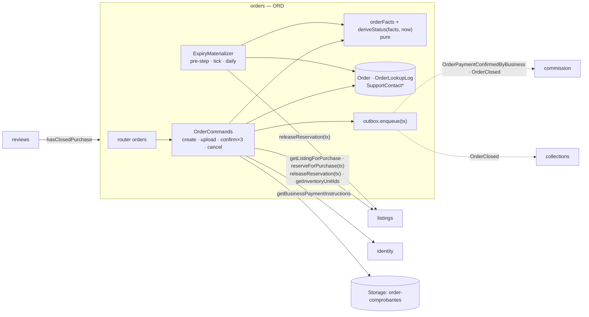

**Alternatives (reclaiming the stock of unpaid orders).**
1. *A sweep every 10 minutes (the PRD FR-ORD-8 text).* Rejected on Vercel Hobby, which allows 2 daily crons (§4). Correctness must not depend on the scheduler.
2. *A reservation table with TTL rows, reclaimed at read.* Rejected by FR-INV-6.
3. **Chosen:** expiry is derived at read and enforced in every command predicate. Stock is reclaimed by materialization from four triggers: the `orders.create` pre-step for the same listing, the hourly tick (G-3) and the two daily crons (AD-ORD-2).

#### AD-ORD-1 — Creation is serialized per buyer and counts open orders by the derived predicate

- **Status:** [ADOPTED]
- **Binds:** `orders.create`; advisory namespace `orders:buyer`; FR-ORD-1; OQ-11 limits `maxOpenOrdersPerBuyer=3`, `maxOpenOrdersPerBuyerPerBusiness=1`; NFR-ORD-2; AD-15.
- **Prevents:** two concurrent purchases both passing the open-order limit; an expired-but-unmaterialized order counting as open; a snapshot that disagrees with the reserved quantity.
- **Rule:**
  1. Before the main transaction:
     - `requireCanBuy`;
     - `listings.getListingForPurchase(listingId)`, whose `ListingNotFound` propagates;
     - `SelfPurchaseNotAllowed` when `sellerId = buyerId`;
     - the expiry pre-step of AD-ORD-2 for this listing's units.
  2. The main transaction runs in this order:
     1. `pg_advisory_xact_lock(orders:buyer:<buyerId>)`;
     2. count open orders with `buyerPaidConfirmedAt IS NULL AND cancelledAt IS NULL AND expiredAt IS NULL AND expiresAt > :now`, overall and for this business, raising `TooManyOpenOrders` with the open order ids;
     3. `reserveForPurchase(tx, …)`;
     4. `getBusinessPaymentInstructions`;
     5. insert `Order` with `totalCop = unitPriceCop × qty`, `expiresAt = :now + unpaidOrderTtl` (48 h), `reservationRef` and `reservedUnitIds`.
  3. No event is enqueued at creation.
  4. The price and title in the snapshot come from the `reserveForPurchase` result, which is read in the same transaction as the decrement.
- **Trade-off:** one buyer's concurrent purchases are serialized. That is intended, and it adds only lock wait for a single account.

#### AD-ORD-2 — Facts are set once by conditional updates; expiry is derived and materialized once

- **Status:** [ADOPTED]; the materialization triggers [ASSUMPTION — gate item G-3 and the FR-ORD-8 PRD-sync edit]
- **Binds:** `orders.confirmPaid`, `confirmPaymentReceived`, `confirmItemReceived`, `cancel`; `ExpiryMaterializer.expireDue(scope)`; the `Order` CHECKs; FR-ORD-3, FR-ORD-4, FR-ORD-5, FR-ORD-7, FR-ORD-8; NFR-ORD-1; AD-2; ADD-§4.2.
- **Prevents:**
  - a fact set twice;
  - a fact set out of order;
  - "paid" winning against an order already past `expiresAt`;
  - a reservation released twice or never;
  - an event published twice.
- **Rule:**
  1. **Paid** is `UPDATE … SET "buyerPaidConfirmedAt"=:now WHERE id AND "buyerId"=:actor AND "comprobanteObjectKey" IS NOT NULL AND "buyerPaidConfirmedAt" IS NULL AND "cancelledAt" IS NULL AND "expiredAt" IS NULL AND "expiresAt" > :now` [PRD-sync: FR-ORD-3 gains `expiresAt > now`].
  2. **Business** and **item** use the same shape on their own column, requiring `buyerPaidConfirmedAt IS NOT NULL`.
  3. On 0 rows, the loser re-reads and maps:
     - fact already set → `OrderAlreadyConfirmedByRole`, citing the original timestamp;
     - cancelled or expired, or `expiresAt ≤ now` with no payment → `OrderNoLongerActive`, citing the state and its time;
     - item before paid → `OrderConfirmationOutOfOrder`.
  4. When the loser finds `expiresAt ≤ now` with `expiredAt` null, it materializes the expiry (rule 6) in the same transaction, commits, and only then returns `OrderNoLongerActive`. The transaction helper supports "commit, then return the error".
  5. Business confirm enqueues `OrderPaymentConfirmedByBusiness`. Item confirm enqueues `OrderClosed`, with bundle lines expanded per component (`qty = perBundleQty × order qty`). Each is enqueued only when its update affected 1 row.
  6. `expireDue(scope)` runs one transaction per order: `UPDATE … SET "expiredAt"=:now, "cancelReason"='Unpaid' WHERE id AND "buyerPaidConfirmedAt" IS NULL AND "cancelledAt" IS NULL AND "expiredAt" IS NULL AND "expiresAt" <= :now RETURNING "reservationRef"`. On 1 row it calls `releaseReservation(tx, ref)`. Cancel is identical, setting `cancelledAt`, and requires `expiresAt > :now` (otherwise `OrderNotCancellable`, and the order is materialized as expired).
  7. `expireDue` has four triggers:
     - the `orders.create` pre-step: a separate short transaction per order before the main transaction, scoped to `reservedUnitIds && :listingUnitIds`, `ORDER BY "expiresAt"`, limit 20;
     - the GitHub Actions hourly tick;
     - the `daily-morning` cron;
     - the `daily-night` catch-up.
     Tick and cron run in batches of 200 until 50 s pass.
  8. `deriveStatus(facts, now)` returns `Expired` whenever `expiresAt ≤ now` with no payment, cancellation or expiry, whether or not the expiry has been materialized.
  9. NFR-ORD-1 includes the paid-versus-expiry race at `now = expiresAt`.
- **Trade-off:** quantity is reclaimed with a lag of up to 1 hour between 07:05 and 20:05 Bogotá and up to about 6.5 hours overnight with G-3, or up to 17.5 hours without G-3, unless someone tries to buy the same listing. Status and every command are always correct.

#### AD-ORD-3 — One visibility predicate, a read-only admin lookup, and a locked comprobante

- **Status:** [ADOPTED]
- **Binds:** `orderVisibility(actor)`; `orders.get`, `mine`, `sales`, `comprobanteUrl`, `uploadComprobante`, `adminLookup`; `OrderLookupLog`, `SupportContactSetting`, `SupportContactChange`; FR-ORD-2, FR-ORD-6, FR-ORD-9, FR-ORD-10; NFR-ORD-3, NFR-ORD-4; AD-14, AD-15, AD-17.
- **Prevents:** a business seeing an order before the buyer's paid confirmation; an existence leak through different error bodies; an admin changing an order; a comprobante replaced after payment; an orphaned regulated file.
- **Rule:**
  1. Every order read uses one SQL predicate: `"buyerId"=:actor OR ("businessId"=:actor AND "buyerPaidConfirmedAt" IS NOT NULL)`. A miss raises `OrderNotVisibleToCaller`, with an identical body for "not yours" and "unknown".
  2. Upload runs in this order:
     1. validate (AD-SYS-8 pipeline);
     2. put under a new cuid2 key;
     3. `UPDATE … SET "comprobanteObjectKey"=:k WHERE id AND "buyerId"=:actor AND "buyerPaidConfirmedAt" IS NULL AND "cancelledAt" IS NULL AND "expiredAt" IS NULL AND "expiresAt" > :now RETURNING` the previous key.
     On 0 rows the new object is deleted and the call raises `ComprobanteLocked` (paid) or `OrderNoLongerActive`. On success the previous object is deleted after commit.
  3. `adminLookup` has no write path to `Order`. It inserts one `OrderLookupLog` per call and shows `EventDelivery` rows for the order.
  4. `hasClosedPurchase` is `EXISTS (… "buyerItemReceivedConfirmedAt" IS NOT NULL)`, plus `deriveStatus` of the latest order.
  5. `Order` has no balance, escrow or payment-status column. A schema test asserts this (NFR-ORD-3).
  6. A paid order that has no business confirmation after 7 days shows the support contact from `SupportContactSetting` (NFR-ORD-4). No job acts on it.
- **Trade-off:** the admin cannot fix a stuck order in-app. Support resolves it outside the platform, which is AD-2's accepted gap.

---

### 6.7 COM — Commission Ledger & Purchasability

**Responsibility and host.** `commission`. It keeps one prepaid balance per verified business in an append-only ledger. It charges each order once, confirms top-ups through a port, publishes exactly one event per threshold crossing, and reconciles the balance to the peso.

**Ports.**

| Direction | Port | Shape | Used by |
| --- | --- | --- | --- |
| Published | `CommissionBalanceExhausted`, `CommissionBalanceReplenished` | `{ businessId, ledgerSeq, balanceAfter }` | `listings` (AD-INV-3) |
| Subscribed | `BusinessApplicationApproved` | key `businessId` | FR-COM-1 |
| Subscribed | `OrderPaymentConfirmedByBusiness`, `OrderClosed` | key `orderId` | FR-COM-4 (AD-SYS-3) |
| Consumed | `identity.getBusinessName` | §6.2 | admin console labels |
| Consumed | `TopUpConfirmationPort` | `confirm(requestId, actor) / reject(requestId, reason, actor)` → the domain command | V1: the admin adapter (ADD-§7) |
| Consumed | `ObjectStorage` (`topup-proofs`), `MalwareScanner`, `Outbox`, `Clock` | — | — |

**Data model.**

| Table | Key and constraints | Notes |
| --- | --- | --- |
| `CommissionAccount` | PK `businessId` | `balanceCop bigint` (may be negative), `state ∈ {Funded, Exhausted}`, `ledgerSeq bigint`, `version`, `openedAt`; `CHECK (state='Funded') = (balanceCop > 0)` |
| `CommissionLedgerEntry` (append-only) | PK `id`; **unique `(businessId, seq)`**; **partial unique `(orderId) WHERE kind='Deduction'`**; unique `(topUpRequestId) WHERE kind='TopUp'`; `CHECK (kind='Deduction' OR amountCop > 0)`; `CHECK amountCop >= 0` | `kind`, `amountCop`, `orderId?`, `topUpRequestId?`, `rateBps?`, `baseCop?`, `trigger?`, `commissionTriggeredAt?`, `balanceAfter`, `at` |
| `TopUpRequest` | PK `id`; index `(status, submittedAt)` | `businessId`, `amountCop` (`CHECK BETWEEN 20000 AND 10000000`), `transferReference`, `proofObjectKey` (regulated), `status ∈ {Pending, Confirmed, Rejected}`, `rejectionReason?`, `decidedBy?`, `decidedAt?`, `version` |
| `TopUpDecisionLog` (append-only) | PK `id`; unique `topUpRequestId` | `adminId`, `decision`, `at` |
| `CommissionRateSetting` (append-only) | PK `id`; unique `effectiveFrom`; `CHECK rateBps BETWEEN 0 AND 10000` | `rateBps`, `effectiveFrom`, `setBy`, `setAt` |
| `ReconciliationRun` | PK `id` | `scope`, `accountsChecked`, `discrepancies jsonb`, `at` |

**Procedures and routes.** Router `commission`.

| Procedure | Builder | Codes |
| --- | --- | --- |
| `commission.myAccount` (7.1), `commission.myLedger` (7.2) | `authedProcedure` | `NotBusinessAccount` |
| `commission.requestTopUp` (`FormData`) | `authedProcedure` | `NotBusinessAccount`, `TopUpAmountInvalid`, `TopUpProofInvalidFile` (§8), `RequestValidationFailed` |
| `commission.myTopUps`, `commission.topUpProofUrl` | `authedProcedure` | `TopUpNotVisibleToCaller` |
| `commission.admin.topUpQueue`, `confirmTopUp`, `rejectTopUp` (7.3) | `adminProcedure` | `TopUpNotPending`, `TopUpNotFound` |
| `commission.admin.ledger(businessId, trigger?)`, `reconcile(businessId?)`, `setRate` (7.4) | `adminProcedure` | `CommissionRateNotFutureDated` (§8, `setRate`), `RequestValidationFailed` |
| `dev.commission.race` (7.5) | `devProcedure` | — |

Routes (from the UX route index):
- 7.1 → `/tienda/saldo`
- 7.2 → `/tienda/movimientos`
- 7.3 → `/admin/recargas`
- 7.4 → `/admin/comisiones/ajustes`
- 7.5 → `/dev/com`

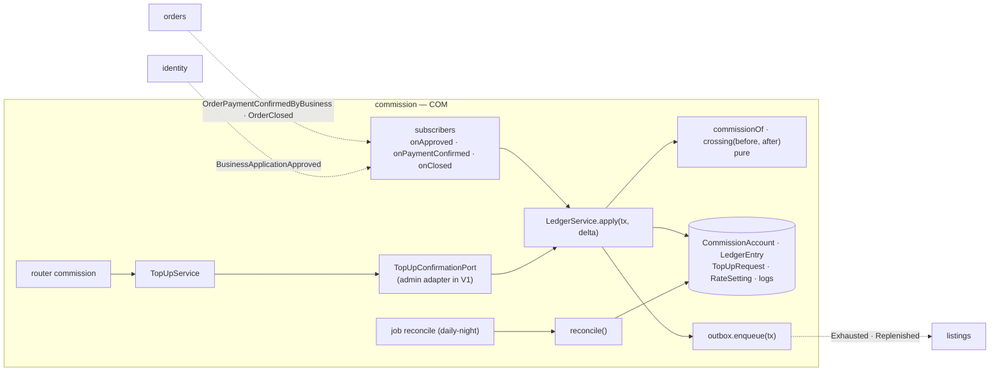

**Alternatives (how to keep the balance and the ledger consistent).**
1. *Store only the ledger and compute the balance by `SUM` on read.* Rejected. Crossings could not be detected atomically: two concurrent deductions would both compute their "before" from the same sum.
2. *Read the balance, compute, write it back with an optimistic `version`.* Rejected. It is the read-modify-write that AD-19 forbids, and retries under contention could republish crossings.
3. **Chosen:** one atomic `UPDATE … RETURNING` on the account row derives `before` and `after`. The ledger entry and any crossing event are written in the same transaction (AD-COM-1).

#### AD-COM-1 — Every balance change is one atomic account update plus one ledger entry

- **Status:** [ADOPTED]
- **Binds:** `LedgerService.apply(tx, { businessId, delta, entry })`; `CommissionAccount`, `CommissionLedgerEntry`; `commission.reconcile`; FR-COM-3, FR-COM-4, FR-COM-6, FR-COM-8; NFR-COM-1, NFR-COM-2; AD-19; AD-SYS-5.
- **Prevents:** a lost update; a seq gap; a crossing published twice or never; a ledger that does not sum to the balance.
- **Rule:**
  1. `apply` runs `UPDATE "CommissionAccount" SET "balanceCop" = "balanceCop" + :delta, "ledgerSeq" = "ledgerSeq" + 1, state = CASE WHEN "balanceCop" + :delta > 0 THEN 'Funded' ELSE 'Exhausted' END, version = version + 1 WHERE "businessId" = :b RETURNING "balanceCop" AS after, "ledgerSeq"`. `before = after − delta`. The row lock serializes concurrent changes, so each one observes consecutive values. If no row is returned (the account does not exist yet), `apply` throws `'Unexpected'`; the delivery is marked `failed` and can be replayed once the account exists (AD-SYS-2 rules 5 and 7).
  2. In the same transaction it inserts the entry with `seq = ledgerSeq` and `balanceAfter = after`.
  3. A crossing is decided by the pure `crossing(before, after)`:
     - from > 0 to ≤ 0 → enqueue `CommissionBalanceExhausted`;
     - from ≤ 0 to > 0 → enqueue `CommissionBalanceReplenished`.
     Otherwise nothing is enqueued.
  4. `reconcile(businessId?)` checks `balanceCop = Σ TopUp − Σ Deduction` and that the seqs are exactly `1..ledgerSeq`. It writes one `ReconciliationRun`. Any discrepancy is shown on the admin home. The `daily-night` job runs it for all accounts.
  5. The account is created only by the `BusinessApplicationApproved` subscriber, with `INSERT … ON CONFLICT (businessId) DO NOTHING`. Only when it inserted does it enqueue `CommissionBalanceExhausted{ledgerSeq:0, balanceAfter:0}` (FR-COM-1).
- **Trade-off:** the account row is a hot spot for a busy business. Each deduction holds it for one short transaction, which is fine at the seed volumes.

#### AD-COM-2 — A deduction is keyed by `orderId` and priced at the trigger time

- **Status:** [ADOPTED]
- **Binds:** subscribers `onOrderPaymentConfirmedByBusiness`, `onOrderClosed`; the partial unique index on `CommissionLedgerEntry(orderId)`; `commissionOf`; `CommissionRateSetting`; FR-COM-4, FR-COM-5, FR-COM-7; NFR-COM-1, NFR-COM-3 (deduction handler), NFR-COM-4; AD-SYS-3.
- **Prevents:** a second charge from a redelivery or from the other trigger; a rate chosen by processing time; a float in the commission path.
- **Rule:**
  1. The handler first computes `commissionTriggeredAt`, `trigger` and `rateBps` from the payload (AD-SYS-3 rule 2), then `c = commissionOf(totalCop, rateBps)` = `floor((totalCop × rateBps + 5000) / 10000)` in `BigInt`.
  2. A non-locking `SELECT 1 FROM "CommissionLedgerEntry" WHERE "orderId"=:o AND kind='Deduction'` returns success at once when the entry exists. This is the cheap path for a redelivery or for the second trigger.
  3. Otherwise it calls `apply(tx, −c, entry)`, which updates the account row first and then inserts the entry with `ON CONFLICT (orderId) WHERE kind='Deduction' DO NOTHING RETURNING id` (AD-COM-1 rules 1 and 2). If no row is returned, a concurrent delivery won: `apply` throws `DuplicateDeductionSentinel`, the transaction rolls back (undoing the account update and its seq), and the handler returns success. The entry is written once and never updated, in the global lock order (account row, then ledger row).
  4. When `c = 0`, the entry is still written, with `amountCop = 0` exempt from the `> 0` check by `CHECK (kind='Deduction' OR amountCop > 0)`. The balance is unchanged and no crossing can occur.
  5. A deduction is never refused, and the balance may go negative (AD-19).
  6. `setRate` refuses an `effectiveFrom` earlier than `now − 60 s` with `CommissionRateNotFutureDated` (FR-COM-7) and stores `max(effectiveFrom, now)`, so a new rate never applies to an order already triggered. A migration seeds `CommissionRateSetting{rateBps: 800, effectiveFrom: 1970-01-01T00:00Z, setBy: null}` (A-24), so the lookup of AD-SYS-3 rule 2 always finds a row.
- **Trade-off:** a concurrent duplicate takes the account row lock and then rolls back. That wastes one update, only when the two triggers race.

#### AD-COM-3 — Top-ups have one domain path behind `TopUpConfirmationPort`

- **Status:** [ADOPTED]
- **Binds:** `commission.requestTopUp`, `commission.admin.confirmTopUp`, `rejectTopUp`; `TopUpConfirmationPort`; `TopUpRequest`, `TopUpDecisionLog`; FR-COM-2, FR-COM-3, FR-COM-9; NFR-COM-3 (top-up confirmation); ADD-§7.
- **Prevents:** a credit applied twice by two admins; a v2 webhook needing a different domain path; the balance changing before confirmation.
- **Rule:**
  1. The V1 adapter is the admin action. A v2 provider webhook would implement the same port and call the same `confirmTopUp` command. No domain change is needed.
  2. Confirm runs `UPDATE "TopUpRequest" SET status='Confirmed', … WHERE id AND status='Pending'`, then `apply(tx, +amountCop)` with a `TopUp` entry and a `TopUpDecisionLog` row, all in one transaction. A loser gets `TopUpNotPending`, citing who decided and when.
  3. The confirmation response computes the "needed to resume" amount `X = 1 − balanceAfter` whenever `balanceAfter ≤ 0` (FR-COM-3). The low-balance notice (`0 < balance < lowBalanceThresholdCop`) is display-only.
  4. A business reads only its own requests. Any other id gets `TopUpNotVisibleToCaller`, with the same body as an unknown id.
- **Trade-off:** manual confirmation keeps a human in the money path during V1, with a queue measured in hours.

---

### 6.8 TRD — Trade Offer Negotiation

**Responsibility and host.** `trading`. It runs turn-based offers on individual-seller listings flagged `openToTrade`. Acceptance reserves through the purchase path. When the last unit is taken, competing offers are resolved deterministically. Completion is mutual and computed, and the handoff goes through the `listings` contact service.

**Ports.**

| Direction | Port | Shape | Used by |
| --- | --- | --- | --- |
| Published | `TradeAccepted` | ADD-§5 | no V1 subscriber |
| Consumed | `listings.getTradeability`, `resolveItemRefs`, `reserveForTrade(tx)`, `releaseReservation(tx)`, `generateContactMessage` | §6.4, §6.9 | offer, counter, accept, cancel, handoff |
| Consumed | `identity.getCapabilities` (through `requireCanBuy`), `identity.getDisplayNames` | §6.1 | offer, handoff |
| Consumed | `Outbox`, `Clock` | — | — |

**Data model.**

| Table | Key and constraints | Notes |
| --- | --- | --- |
| `TradeOffer` | PK `id`; **partial unique `(listingId, proposerId) WHERE status='Open'`**; index `(listingId, status)`; index `(sellerId, status)`; `CHECK (status IN ('Accepted','Cancelled')) OR reservationRef IS NULL`; `CHECK roundCount BETWEEN 1 AND 10` | `listingId`, `sellerId`, `proposerId`, `status`, `turn`, `roundCount`, `version`, `reservationRef jsonb?`, `unfulfillableReason?`, `proposerConfirmedAt?`, `sellerConfirmedAt?`, `cancelledBy?`, `acceptedAt?`, `expiresAt` |
| `TradeOfferRound` (immutable) | PK `(offerId, round)` | `actor ∈ {proposer, seller}`, `action ∈ {offer, counter, accept, reject, withdraw, markedUnfulfillable, cancel}`, `terms jsonb` (`offeredItems[]`, `cashCop`, `requestedQty: 1`), `note?`, `at` |

**Procedures and routes.** Router `trading`.

| Procedure | Builder | Codes |
| --- | --- | --- |
| `trading.offer` | `authedProcedure` + `requireCanBuy` | `EmailNotVerified`, `SelfTradeNotAllowed`, `NotIndividualSellerListing`, `ListingNotOpenToTrade`, `InsufficientQuantity`, `EmptyTradeOffer`, `DuplicateOpenOffer`, `InvalidItemRef` |
| `trading.counter` | `authedProcedure` | `NotYourTurn`, `TradeOfferNotOpen`, `TradeCounterUnchanged` (G-1), `TradeRoundLimitReached`, `EmptyTradeOffer` |
| `trading.accept` | `authedProcedure` | `NotYourTurn`, `TradeOfferNotOpen`, `ListingNotOpenToTrade`, `InsufficientQuantity` |
| `trading.reject`, `trading.withdraw` | `authedProcedure` | `NotYourTurn`, `TradeOfferNotOpen` |
| `trading.confirmCompletion` | `authedProcedure` | `TradeNotAccepted`, `TradeAlreadyConfirmedByRole` |
| `trading.cancel` | `authedProcedure` | `TradeNotCancellable` |
| `trading.get`, `trading.mine`, `trading.handoff` | `authedProcedure` | `TradeOfferNotVisibleToCaller` |
| `trading.admin.counts` | `adminProcedure` | — |
| `dev.trading.race` (8.4) | `devProcedure` | — |

Routes:
- 8.1 → `/intercambios/nueva?listing=<listingId>`
- 8.2 → `/intercambios/<offerId>`
- 8.3 → `/intercambios`
- 8.4 → `/dev/trd`

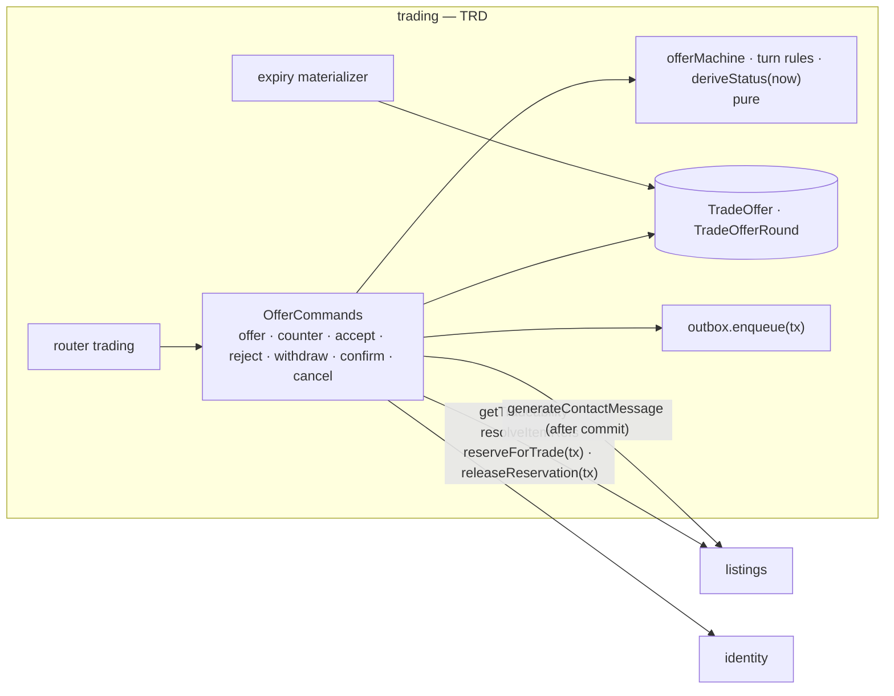

**Alternatives (resolving competing accepts on the last unit).**
1. *Mark sibling offers with `FOR UPDATE SKIP LOCKED`.* Rejected. A skipped row, whose loser then aborts, could stay `Open` on an exhausted listing, which FR-TRD-5 forbids.
2. *Lock every offer on the listing `FOR UPDATE` before accepting.* Rejected. With bundles sharing units across listings, the lock set is unknown until after the reservation, which invites deadlocks.
3. **Chosen:** a per-seller advisory lock serializes every trade mutation on that seller's listings. Offers can only compete for units of the same seller, so no concurrent accept can hold a sibling offer row (AD-TRD-2).

#### AD-TRD-1 — Every offer action is one conditional update on status, turn, version and expiry

- **Status:** [ADOPTED]; the unchanged-counter rule [ASSUMPTION — gate item G-1]
- **Binds:** `trading.offer`, `counter`, `accept`, `reject`, `withdraw`; `TradeOffer`, `TradeOfferRound`; FR-TRD-1, FR-TRD-2, FR-TRD-3, FR-TRD-9; NFR-TRD-2 (non-accept actions); AD-SYS-5; EC-11.
- **Prevents:** a double action from a stale tab; acting on an expired offer; unbounded rounds; a "counter" that changes nothing and only flips the turn.
- **Rule:**
  1. Every action runs `UPDATE "TradeOffer" SET … , version = version + 1 WHERE id=:id AND status='Open' AND turn=:actorRole AND version=:v AND "expiresAt" > :now`. `withdraw` omits `turn` and requires the proposer.
  2. On 0 rows, the re-read maps the result:
     - not `Open`, or `expiresAt ≤ now` → `TradeOfferNotOpen`, citing the status (derived `Expired` included);
     - wrong turn → `NotYourTurn`, citing whose turn it is;
     - stale `version` with the same status and turn → `TradeOfferNotOpen`, citing the latest round.
  3. `counter` additionally requires `roundCount < 10` (`TradeRoundLimitReached`). It refuses terms equal to the latest round's terms, compared after canonical sort, with `TradeCounterUnchanged` [G-1]. It then appends a round and flips `turn`.
  4. Rounds are immutable. Visibility is `proposerId = actor OR sellerId = actor`. Otherwise `TradeOfferNotVisibleToCaller`, with an identical body for unknown ids.
  5. Expiry is derived: `deriveStatus` returns `Expired` when `status='Open' AND expiresAt ≤ now`. The `daily-morning` job and the hourly tick materialize it with a conditional `Open → Expired`. No reservation exists on an `Open` offer, so materialization only changes the status.
  6. `offer` runs under `trd:seller` (AD-TRD-2 rule 1). Before inserting, it materializes the proposer's own expired `Open` offer on that listing with the conditional `Open → Expired` of rule 5. The partial unique `(listingId, proposerId) WHERE status='Open'` then raises `DuplicateOpenOffer` only for a live offer.
- **Trade-off:** a new code (`TradeCounterUnchanged`) and a PRD FR-TRD-2 sync edit, if the gate adopts G-1.

#### AD-TRD-2 — Accept is serialized per seller and resolves siblings in the same transaction

- **Status:** [ADOPTED]
- **Binds:** `trading.accept`; advisory namespace `trd:seller`; `listings.getTradeability`, `reserveForTrade`; FR-TRD-4, FR-TRD-5; NFR-TRD-1, NFR-TRD-2 (accept), NFR-TRD-3; AD-4, AD-6; AD-SYS-4 rule 5.
- **Prevents:** two accepts both succeeding on one unit; an `Open` offer left on an exhausted listing; a deadlock between bundle and single-listing accepts; a second `TradeAccepted` event.
- **Rule:**
  1. Every trade mutation on a seller's listings starts with `pg_advisory_xact_lock(trd:seller:<sellerId>)`. This applies to offer, counter, accept, reject, withdraw, cancel and expiry materialization.
  2. The accept transaction runs in this order, which follows the global lock order:
     1. the advisory lock;
     2. the own offer `Open → Accepted` (AD-TRD-1);
     3. `listings.getTradeability` in the ambient transaction;
     4. `reserveForTrade(tx, listingId, 1)`;
     5. store `reservationRef` and `acceptedAt`;
     6. `UPDATE "TradeOffer" SET status='Unfulfillable', "unfulfillableReason"='ListingNoLongerAvailable' WHERE "listingId" = ANY(:exhaustedListingIds) AND status='Open' AND id <> :own`, with one `markedUnfulfillable` round per row;
     7. enqueue `TradeAccepted`.
  3. If step 3 returns a refusal (the listing is gone, hidden, deactivated or no longer open to trade) or step 4 raises `InsufficientQuantity`, the transaction rolls back. The command then runs a follow-up transaction: the advisory lock, then `Open → Unfulfillable` with `unfulfillableReason='ListingNoLongerAvailable'` on its own offer. That is a no-op if already marked. It then returns the original error.
  4. Because of the seller lock, a losing accept that started after the winner reads `Unfulfillable` in its step 2 and gets `TradeOfferNotOpen`.
  5. After commit, the command calls `listings.generateContactMessage({kind:'trade', listingId, requesterId: proposerId, tradeSummary})` exactly once. Later page views regenerate the same deterministic text through `trading.handoff`.
  6. Individual-seller listings are never purchasable (AD-INV-3 rule 6), so a purchase never exhausts a trade unit. A restock decrement, a deactivation or a moderation hide does not take `trd:seller`. Open offers on the affected listing stay `Open` until an accept attempt fails and marks them (rule 3), or until they expire. The 8.2 page derives "not currently available" from `getTradeability` [ASSUMPTION].
- **Trade-off:** all trade writes for one seller are serialized, including unrelated listings. Individual sellers have low offer volume, so the cost is only wait time.

#### AD-TRD-3 — Completion is computed; cancel releases exactly once

- **Status:** [ADOPTED]
- **Binds:** `trading.confirmCompletion`, `trading.cancel`; `listings.releaseReservation`; FR-TRD-7, FR-TRD-8; OQ-6.
- **Prevents:** a stored `completed` flag drifting; a double release on a double-submitted cancel; a cancel after a party confirmed; `trading` importing `catalog`.
- **Rule:**
  1. Confirm runs `UPDATE … SET "<role>ConfirmedAt"=:now WHERE id AND status='Accepted' AND "<role>ConfirmedAt" IS NULL`. The re-read maps `TradeAlreadyConfirmedByRole` or `TradeNotAccepted`.
  2. `completed` is computed at read and is never a column.
  3. Cancel runs `UPDATE … SET status='Cancelled', "cancelledBy"=:actor WHERE id AND status='Accepted' AND "proposerConfirmedAt" IS NULL AND "sellerConfirmedAt" IS NULL RETURNING "reservationRef"`. On 1 row it calls `releaseReservation(tx, ref)`; on 0 rows it raises `TradeNotCancellable`.
  4. `Accepted` offers never expire (FR-TRD-9).
  5. Item refs are resolved only through `listings.resolveItemRefs`, which delegates to `catalog` (OQ-6). `trading` has no `catalog` edge.
- **Trade-off:** a trade abandoned after acceptance holds its unit until one party cancels, as AD-2 accepts for orders.

---

### 6.9 MSG — Contact Handoff & In-App Business Messaging

**Responsibility and host.**
- **Contact service** in `listings`: it composes the purchase or trade message and the `wa.me` link for individual-seller listings, deterministically, with no outbound call, and rate-limits requesters.
- **In-app messaging** in `messaging`: it runs buyer-to-business conversations with eligibility checked at send, polling, read state and a buyer-side mute.

**Ports.**

| Direction | Port | Shape | Used by |
| --- | --- | --- | --- |
| Offered (listings) | `generateContactMessage({kind, listingId, requesterId, tradeSummary?})` | `{ text, externalUrl, copyText, requesterDisplayName }` | tRPC `inventory.contact`; `trading` |
| Consumed (listings) | `identity.getContactCard`, `identity.getDisplayNames`, `catalog.getEntries` | §6.1, §6.3 | composition |
| Consumed (messaging) | `identity.getMessagingEligibility`, `identity.getBusinessName`, `identity.getDisplayNames`, `identity.getCapabilities` | §6.1, §6.2 | send, list |

**Data model.**

| Table | Owner | Key and constraints | Notes |
| --- | --- | --- | --- |
| `ContactRequestLog` | listings | PK `id`; index `(requesterId, at)`; index `(requesterId, sellerId, at)`; index `(ipHmac, at)` | `listingId`, `sellerId`, `ipHmac` (HMAC-SHA256 with a server key; never the IP), `kind`, `counted bool`, `at`. No phone and no text. Purged after 7 days |
| `Conversation` | messaging | PK `id`; **unique `(buyerId, businessId)`**; `CHECK buyerId <> businessId` | `lastSeq bigint`, `lastMessageAt`, `createdAt` |
| `Message` | messaging | PK `id`; **unique `(conversationId, seq)`**; **unique `(conversationId, senderId, clientMessageId)`**; `CHECK char_length(body) BETWEEN 1 AND 2000` | `senderId`, `body` (regulated, NFC), `clientMessageId`, `recipientVerificationAtSend`, `at` |
| `ConversationParticipant` | messaging | PK `(conversationId, userId)` | `role ∈ {buyer, business}`, `lastReadSeq bigint default 0`, `mutedAt?` (buyer only: `CHECK role='buyer' OR mutedAt IS NULL`) |

**Procedures and routes.**

| Procedure | Router, builder | Codes |
| --- | --- | --- |
| `inventory.contact({listingId})` | `inventory`, `authedProcedure` + `requireCanBuy` | `EmailNotVerified`, `NotIndividualSellerListing`, `ListingNotFound`, `ContactRateLimited` |
| `messaging.send({recipientId \| conversationId, body, clientMessageId})` | `messaging`, `authedProcedure` + `requireCanBuy` | `BusinessCannotInitiate`, `NotBusinessAccount`, `ConversationNotVisibleToCaller`, `RequestValidationFailed` |
| `messaging.inbox({cursor?})`, `messaging.thread({conversationId, afterSeq?})`, `messaging.unreadCount` | `authedProcedure` | `ConversationNotVisibleToCaller` |
| `messaging.markRead({conversationId, seq})`, `messaging.setMuted({conversationId, muted})` | `authedProcedure` | `ConversationNotVisibleToCaller` |
| `dev.messaging.inspect` (12.3) | `devProcedure` | — |

Routes:
- 12.1 → `/contactar/<listingId>`
- 12.2 → `/mensajes`, with the open thread at `/mensajes/<conversationId>` so a thread can be deep-linked
- 12.3 → `/dev/msg`

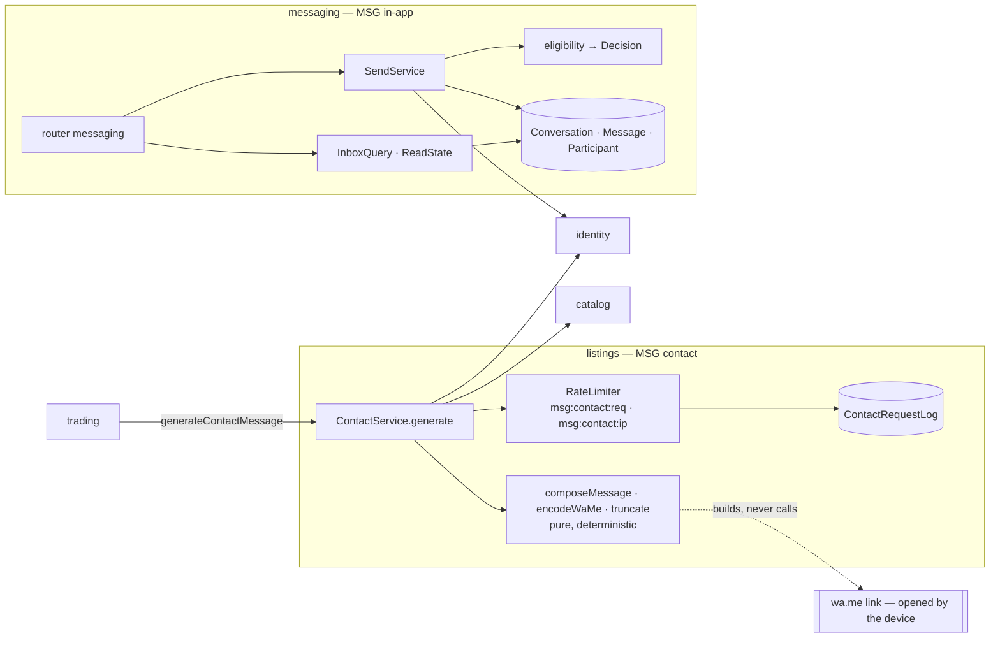

**Alternatives (in-app delivery).**
1. *Supabase Realtime or websockets.* Rejected. They need session state or a separate channel, and the NFR allows 35 s latency.
2. *Server-sent events.* Rejected. Vercel Hobby function duration limits make long-lived streams unreliable.
3. **Chosen:** cursor polling every 30 s, with the unread count and the thread delta returned in one round trip (AD-MSG-3).

#### AD-MSG-1 — Contact messages are composed deterministically and counted under an advisory lock

- **Status:** [ADOPTED]; the de-duplication and trade exemption [ASSUMPTION — PRD-sync EC-36, EC-37]
- **Binds:** `generateContactMessage`, `composeMessage`, `encodeWaMe`; `ContactRequestLog`; advisory namespaces `msg:contact:req`, `msg:contact:ip`; FR-MSG-1, FR-MSG-2, FR-MSG-3; NFR-MSG-1, NFR-MSG-3; FR-TRD-6; EC-36, EC-37, EC-40.
- **Prevents:** two outputs for the same input; a URL over 2,000 characters; a phone number in logs; an outbound call; a burst slipping past the limit through concurrent requests.
- **Rule:**
  1. The input is `{kind, listingId, requesterId, tradeSummary?}`. For trades, `requesterId` is the proposer [PRD-sync: FR-TRD-6 renames `counterpartId` to `requesterId`].
  2. Checks run in this order:
     1. `canBuy`;
     2. the listing exists and is visible (hidden, withdrawn or deactivated → `ListingNotFound`);
     3. individual-seller listing (`NotIndividualSellerListing`);
     4. rate limits.
  3. Rate limiting is a transaction that takes `msg:contact:req:<requesterId>` then `msg:contact:ip:<ipHmac>`, always in that fixed order (the exception allowed by AD-SYS-4 rule 5: no other transaction takes both namespaces, so no cycle can form), counts rows with `counted` in the rolling windows, and inserts one row.
     - The limits are 30 per hour per requester, 10 per requester per seller per day, and 60 per IP per hour. A breach raises `ContactRateLimited`, citing the retry time: the oldest counted row plus the window.
     - A repeat for the same `(requesterId, listingId)` within 60 min inserts `counted=false` and is not refused [EC-36].
     - `kind='trade'` calls skip the limiter entirely [EC-37].
  4. The pure composer:
     - NFC-normalizes every string;
     - fills the es-CO template;
     - encodes with RFC 3986;
     - truncates in the FR-MSG-2 order until `externalUrl ≤ 2000`: product name to a minimum of 20 graphemes, then offered item names longest first to 20, then "+N more items".
     Prices, cash, conditions, quantities and the seller name are never truncated, and neither is `copyText`. A property test asserts byte-identical output across 1,000 repeated calls.
  5. `externalUrl = https://wa.me/<E164 without +>?text=<encoded>`. No module calls it. The phone is read through `identity.getContactCard` and never logged.
- **Trade-off:** de-duplicated repeats and trade handoffs are not limited. Abuse through repeated trade offers is already bounded by `DuplicateOpenOffer` and the seller lock.

#### AD-MSG-2 — One conversation per pair, eligibility checked at send, idempotent retries

- **Status:** [ADOPTED]
- **Binds:** `messaging.send`; `Conversation`, `Message`, `ConversationParticipant`; `identity.getMessagingEligibility`; FR-MSG-4, FR-MSG-5, FR-MSG-6; NFR-MSG-4 (race); EC-14, EC-38.
- **Prevents:** duplicate conversations from a double start; a message to a rejected business; a business cold-messaging buyers; a network retry creating two messages.
- **Rule:**
  1. A send without a `conversationId` is a start:
     - A sender whose `sellerKind='business'` gets `BusinessCannotInitiate`. That also covers a business messaging itself.
     - Otherwise `INSERT … ON CONFLICT (buyerId, businessId) DO NOTHING`, then select the conversation.
  2. Eligibility is read in the send transaction:
     - `Approved` → allowed;
     - `Pending` → `allowedWithNotice` with `RecipientNotYetVerified`;
     - anything else → `NotBusinessAccount`. On this path the response carries the composed text back to the client so the user can copy it (FR-MSG-6).
     A reply from the business to its own buyer is always allowed while the business is `Approved` or `Pending`. A `Rejected` business's thread is read-only for both sides: a send from either side raises `NotBusinessAccount`.
  3. The send allocates `seq` with `UPDATE "Conversation" SET "lastSeq" = "lastSeq" + 1, "lastMessageAt" = :now WHERE id RETURNING "lastSeq"`. That also serializes concurrent sends in one conversation. It then inserts `Message` with `recipientVerificationAtSend` set to the eligibility status just read.
  4. A retry with the same `clientMessageId` hits the unique key and returns the original message unchanged (EC-14).
  5. An observed `Approved → Pending` status for a recipient is logged as an invariant breach (VER has no such transition) and treated as `Pending`.
- **Trade-off:** eligibility follows current state, not the state at the conversation's start (EC-38). A thread can become read-only mid-conversation after a rejection.

#### AD-MSG-3 — Read state is a monotonic seq; polling returns deltas

- **Status:** [ADOPTED]
- **Binds:** `messaging.inbox`, `thread`, `unreadCount`, `markRead`, `setMuted`; `ConversationParticipant`; FR-MSG-7, FR-MSG-8; NFR-MSG-2; EC-39.
- **Prevents:** unread counts going backwards from an older tab; an admin reading message bodies; leaking whether the other side read a message.
- **Rule:**
  1. `markRead` clamps `:seq` to the conversation's `lastSeq` (`LEAST(:seq, c."lastSeq")`), then runs `UPDATE … SET "lastReadSeq" = :seq WHERE conversationId AND userId=:actor AND "lastReadSeq" < :seq`. It is never lowered, and unread never goes negative.
  2. Unread per conversation = `lastSeq − lastReadSeq`. The total unread count excludes conversations where the caller has `mutedAt IS NOT NULL`. Mute is buyer-only, and the business sees no difference.
  3. The inbox is ordered by `(lastMessageAt desc, id)`, with a cursor on that pair. `thread` returns messages with `seq > afterSeq`. The client polls every 30 s while visible.
  4. The other participant's `lastReadSeq` is never returned (no read receipts, EC-39).
  5. No `adminProcedure` selects `Message.body`. The field is listed in `regulated.ts`, and lint `tezg/regulated-select` fails an admin router that selects it.
- **Trade-off:** up to 35 s of latency and one request per open tab every 30 s. That is acceptable at the NFR's volumes.

---

### 6.10 COL — Collection, Binder & Wishlist Manager

**Responsibility and host.** `collections`. It covers named collections, entries tied to the catalog or to an external link, binder layout and sorting, set completion, the wishlist with live availability (`collections.wishlist.*` over `listings.getAvailabilitySummary`, FR-COL-6), and exactly one post-purchase prompt per closed order.

**Ports.**

| Direction | Port | Shape | Used by |
| --- | --- | --- | --- |
| Subscribed | `OrderClosed` | key `orderId` | FR-COL-7 |
| Consumed | `catalog.getEntries`, `catalog.getSetSummaries` | §6.3 | entry validation, completion denominator |
| Consumed | `listings.getAvailabilitySummary` | §6.4 | wishlist |
| Consumed | `identity.getCapabilities` | §6.1 | actor |

**Data model.**

| Table | Key and constraints | Notes |
| --- | --- | --- |
| `Collection` | PK `id`; **unique `(ownerId, nameKey)`**; `CHECK char_length(name) BETWEEN 1 AND 60`; `CHECK binderRows BETWEEN 1 AND 5 AND binderCols BETWEEN 1 AND 5` | `ownerId`, `name`, `nameKey = tezg_unaccent_lower(name)`, `binderRows default 3`, `binderCols default 3`, `createdAt` |
| `CollectionEntry` | PK `id`; FK `collectionId ON DELETE CASCADE`; index `(collectionId, manualPosition)`; `CHECK (cardKind='catalog') = (catalogEntryId IS NOT NULL)`; `CHECK cardKind='catalog' OR (externalUrl ~ '^https://' AND char_length(externalUrl) <= 2048 AND char_length(externalTitle) BETWEEN 1 AND 120)`; `CHECK (source='PlatformPurchase') = (orderId IS NOT NULL)`; `CHECK qty BETWEEN 1 AND 999`; `CHECK acquiredPriceCop IS NULL OR acquiredPriceCop BETWEEN 0 AND 100000000` | `cardKind ∈ {catalog, external}`, `catalogEntryId?`, `externalUrl?`, `externalTitle?`, `externalImageUrl?`, `source ∈ {Manual, PlatformPurchase}`, `orderId?`, `qty`, `acquiredAt` (date), `acquiredPriceCop?`, `manualPosition int` |
| `WishlistEntry` | PK `id`; **unique `(ownerId, catalogEntryId)`** | `maxPriceCop?`, `note?` (≤ 200), `createdAt` |
| `PostPurchasePrompt` | PK `id`; **unique `orderId`**; index `(buyerId, status)` | `buyerId`, `lines jsonb` (payload lines of `OrderClosed`), `buyerItemReceivedConfirmedAt timestamptz` (copied from the `OrderClosed` payload; the order's close fact, used for `acquiredAt` by AD-COL-2 rule 2), `status ∈ {Pending, Accepted, Dismissed}`, `resolvedAt?`, `acceptedIntoCollectionId?`, `version` |

`CollectionEntry.orderId` is not unique, because a copy keeps `source` and `orderId` (FR-COL-4). There is no binder table (A-41): the layout lives on `Collection` and the positions on the entries.

**Procedures and routes.** Router `collections`.

| Procedure | Builder | Codes |
| --- | --- | --- |
| `collections.create`, `rename`, `delete` | `authedProcedure` | `CollectionNameTaken`, `CollectionLimitReached` (G-2), `CollectionNotFound` |
| `collections.addEntry`, `addExternal`, `updateEntry`, `removeEntry`, `moveEntry`, `copyEntry` | `authedProcedure` | `CollectionNotFound`, `CollectionEntryNotFound`, `InvalidExternalLink`, `InvalidCatalogEntry`, `RequestValidationFailed` |
| `collections.binder({collectionId, sort[], setId?})`, `setLayout`, `reorder` | `authedProcedure` | `CollectionNotFound` |
| `collections.wishlist.*` | `authedProcedure` | `RequestValidationFailed` |
| `collections.prompts.list`, `accept({promptId, collectionId})`, `dismiss` | `authedProcedure` | `PromptAlreadyResolved`, `CollectionNotFound` |

Routes:
- 9.1 → `/coleccion`, with the selected collection as `?coleccion=<collectionId>`
- 9.2 → `/coleccion/<collectionId>/agregar`, plus `/coleccion/agregar` with no id, which targets "General" and creates it on save (EC-07, EC-08)
- 9.3 → `/coleccion/deseos`
- 9.4 → `/sugerencias`

Every "not yours" id gets the same `*NotFound` body as an unknown id.

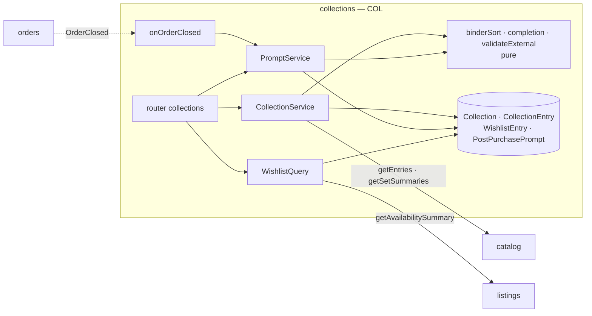

**Alternatives (catalog vs external entries).**
1. *Create a `CatalogEntry` for each external link.* Rejected. It writes a table that `catalog` owns (NFR-COL-3) and pollutes browse.
2. *A separate `ExternalCard` table.* Rejected. It would double every binder query and every sort.
3. **Chosen:** one entry table with a tagged union enforced by CHECK constraints (AD-COL-1).

#### AD-COL-1 — Entries are a CHECK-enforced tagged union, and collections are capped under an owner lock

- **Status:** [ADOPTED]; the limit code [ASSUMPTION — gate item G-2]
- **Binds:** `Collection`, `CollectionEntry`; advisory namespace `col:owner`; `collections.create` and first-use "General"; FR-COL-1..5; NFR-COL-2, NFR-COL-3; A-41.
- **Prevents:** an external entry masquerading as catalog-backed; a 51st collection from two concurrent creates; two "General" collections; a server fetch of a user URL.
- **Rule:**
  1. Create takes `pg_advisory_xact_lock(col:owner:<ownerId>)`, counts collections, and raises `CollectionLimitReached` at 50 [G-2; the PRD's generic refusal becomes a registry code]. It then inserts, and a unique violation on `nameKey` raises `CollectionNameTaken`.
  2. "First use" means an add by an owner who has no collection at all. That add creates "General" under the same lock with `ON CONFLICT (ownerId, nameKey) DO NOTHING`. The count is 0 on that path, so the limit cannot be reached there.
  3. Catalog entries are validated through one batched `catalog.getEntries`. A missing id raises `InvalidCatalogEntry` (§8), citing the id.
  4. External entries are validated by the pure `validateExternal` (https, lengths). A failure raises `InvalidExternalLink`. `collections` has no HTTP client (lint `tezg/no-direct-io`), and the image renders client-side with `referrerpolicy="no-referrer"`.
  5. Binder order is up to 3 sort keys, with `entryId` as the final tie-break. Completion is distinct owned `kind=card` catalog entries in the set, divided by the set's `kind=card` entry count from `catalog.getSetSummaries`, rounded down to a whole percentage. When that count is 0, completion is null.
- **Trade-off:** creating a collection is serialized per owner, a negligible cost.

#### AD-COL-2 — One prompt per closed order; accept creates entries exactly once

- **Status:** [ADOPTED]
- **Binds:** subscriber `onOrderClosed`; `PostPurchasePrompt`; `collections.prompts.accept`, `dismiss`; FR-COL-7; NFR-COL-1; AD-9, AD-10.
- **Prevents:** two prompts from a redelivery; duplicate entries from a double accept; `collections` reading or writing order state.
- **Rule:**
  1. The subscriber inserts the prompt `ON CONFLICT (orderId) DO NOTHING`, with `lines` and `buyerItemReceivedConfirmedAt` copied from the payload. `collections` cannot read `Order`, so the prompt keeps the one date that accept needs (decision log #45). Bundle lines arrive expanded per component (AD-ORD-2 rule 5).
  2. Accept runs `UPDATE … SET status='Accepted', "resolvedAt"=:now, "acceptedIntoCollectionId"=:c WHERE id AND "buyerId"=:actor AND status='Pending'`. On 1 row, it reads `Collection WHERE id=:c AND "ownerId"=:actor FOR SHARE`; no row raises `CollectionNotFound` and rolls the accept back. The same transaction then inserts one `CollectionEntry` per line with `source='PlatformPurchase'`, `orderId`, `qty`, `acquiredAt` = the Bogotá date of `buyerItemReceivedConfirmedAt`, and `acquiredPriceCop` = the line's `unitPriceCop` when present, otherwise null.
  3. On 0 rows, the re-read raises `PromptAlreadyResolved`, citing the status and `resolvedAt`.
  4. Dismiss is the same shape to `Dismissed`. Prompts never expire (A-43).
- **Trade-off:** a line for a card later removed from the catalog still creates an entry, because the snapshot is authoritative. Valuation shows it as not valued.

---

### 6.11 VAL — Collection Valuation & Trends

**Responsibility and host.** `collections`, with no tables. It computes a collection's value, its period trend and its history on request from reference prices. It never stores a valuation and never mixes reference prices with listing prices.

**Ports.**

| Direction | Port | Shape | Used by |
| --- | --- | --- | --- |
| Consumed | `catalog.getReferencePricesAsOf`, `getPriceHistory`, `getPriceProvenance`, `getFxRate` | §6.3 | value, trend, history |

**Procedures and routes.** Router `valuation`.

| Procedure | Builder | Codes |
| --- | --- | --- |
| `valuation.current({collectionId})` | `authedProcedure` | `CollectionNotFound` |
| `valuation.trend({collectionId, period})` | `authedProcedure` | `CollectionNotFound`, `InvalidValuationPeriod` |
| `valuation.history({collectionId, days ≤ 365})` | `authedProcedure` | `CollectionNotFound`, `RequestValidationFailed` |
| `dev.valuation.explain` (10.3) | `devProcedure` | — |

Routes:
- 10.1 → `/coleccion/valor?coleccion=<collectionId>&periodo=30`
- 10.2 → `/coleccion/valor/historial?coleccion=<collectionId>&periodo=30`
- 10.3 → `/dev/val`

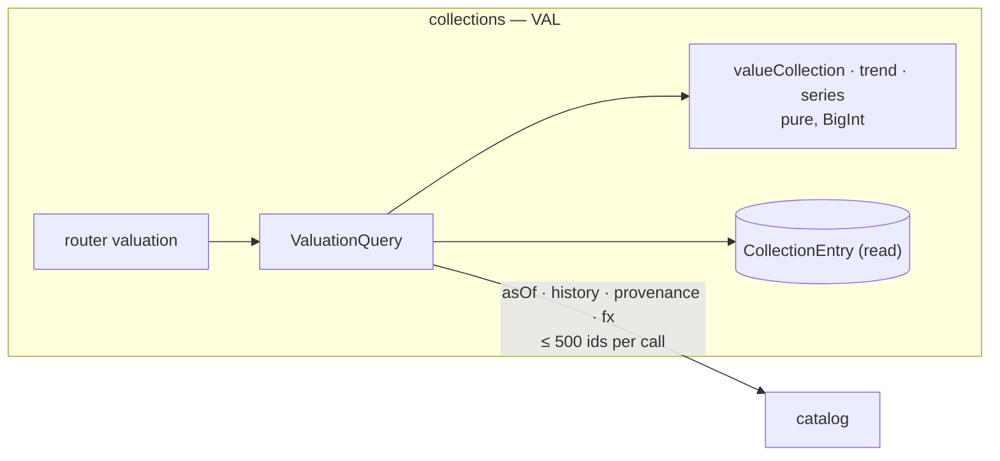

**Alternatives (where valuations come from).**
1. *Nightly valuation snapshots.* Rejected. They would go stale against edits, and FR-VAL says "computed on request, never stored".
2. *Value from listing prices.* Rejected. That is type-mixing, which FR-VAL-5 and AD-SYS-7 forbid.
3. **Chosen:** a pure function over batched reference-price reads (AD-VAL-1).

#### AD-VAL-1 — Valuation is a pure BigInt function over one batched as-of read

- **Status:** [ADOPTED]
- **Binds:** `valueCollection`, `ValuationQuery`; `catalog.getReferencePricesAsOf`; FR-VAL-1, FR-VAL-3, FR-VAL-5; NFR-VAL-1..3; AD-SYS-7.
- **Prevents:** a float sum; a listing price inside a valuation; a hidden adjustment for conversion drift; N+1 calls to `catalog`.
- **Rule:**
  1. Load the collection's entries, take the distinct catalog ids, and call `getReferencePricesAsOf` in chunks of 500 with `asOf = now`.
  2. For each entry:
     - an external entry → `notValued` with `ExternalEntryNotInCatalog`;
     - no price → `notValued` with `NoReferencePrice`;
     - otherwise `entryValueCop = cop × qty`, with `stale` entries included and counted in `staleCount`.
  3. `totalCop` is the exact BigInt sum. `conversionDriftBoundCop = floor(Σ qty over fx-derived entries / 2)` is reported and never applied.
  4. The output is `{ totalCop, valuedCount, notValued[], staleCount, asOf, conversionDriftBoundCop }`. Every excluded entry carries its DecisionCode.
  5. The input type accepts only `ReferencePrice`. A type test asserts that `Cop` from a listing cannot be passed (FR-VAL-5).
- **Trade-off:** each request re-reads prices, which costs one catalog statement per 500 distinct cards and stays within NFR-VAL-2.

#### AD-VAL-2 — Trend and history are recomputed from current entries

- **Status:** [ADOPTED]
- **Binds:** `valuation.trend`, `valuation.history`; `changePercent`; `catalog.getPriceHistory`; FR-VAL-2, FR-VAL-4; A-46, A-54.
- **Prevents:** division by a zero baseline; a history that silently mixes past compositions; interpolated prices.
- **Rule:**
  1. `period ∈ {7, 30, 90, 365}`, otherwise `InvalidValuationPeriod`.
  2. `V(t)` values the current entries as of `t`.
  3. `changePercent = round_half_up((V(now) − V(start)) × 10000 / V(start)) / 100`, computed by the shared BigInt helper `roundHalfAwayFromZero(num, den)`. BigInt division truncates toward zero, so the helper rounds the magnitude and restores the sign; tests cover ±0.5 at both signs. When `V(start) = 0`, it is `null` with `ValuationNoBaseline`.
  4. `marketChangePercent` applies the same formula to entries whose `acquiredAt ≤ start` [ASSUMPTION A-46].
  5. The history makes one `getPriceHistory` call per 500 ids. The pure `series` carries each price forward day by day, marked `stale` after the freshness threshold, and never interpolates. At most 365 points.
  6. Every label reads "What your current cards were worth" (A-54).
- **Trade-off:** past values change when entries are edited. That is documented in the label, and it avoids snapshot storage.

---

### 6.12 REP — Seller Reputation & Moderation

**Responsibility and host.**
- **Reviews** in `reviews`: purchase-verified reviews of businesses, open reviews of individual sellers, aggregates computed at read, and review moderation.
- **Listing hide/unhide** in `listings` (FR-REP-5).
- **The combined audit view** (FR-REP-6) is composed in the admin RSC from both modules' public log queries. There is no shared table and no `reviews → listings` edge.

**Ports.**

| Direction | Port | Shape | Used by |
| --- | --- | --- | --- |
| Offered (reviews) | `getAggregates(sellerIds ≤ 500)` | `[{ sellerId, average, count }]` | RSC composition on 2.2 and 3.1 |
| Offered (reviews) | `moderationLog(filters, page)` | log rows | RSC 11.4 |
| Offered (listings) | `listingModerationLog(filters, page)` | log rows | RSC 11.4 |
| Consumed (reviews) | `orders.hasClosedPurchase`, `identity.getReviewTarget`, `identity.getDisplayNames` | §6.6, §6.1 | write, list |

**Data model.**

| Table | Owner | Key and constraints | Notes |
| --- | --- | --- | --- |
| `Review` | reviews | PK `id`; **unique `(reviewerId, targetUserId)`**; index `(targetUserId, createdAt desc) WHERE hiddenAt IS NULL`; `CHECK rating BETWEEN 1 AND 5`; `CHECK char_length(text) <= 1000`; `CHECK reviewerId <> targetUserId` | `targetKind ∈ {business, individual}`, `purchaseVerified bool`, `hiddenAt?`, `hiddenReason?`, `hiddenBy?`, `editedAt?`, `createdAt`, `version` |
| `ReviewModerationLog` (append-only) | reviews | PK `id`; index `(at)` | `reviewId`, `action ∈ {hide, unhide}`, `reasonCode`, `note?` (≤ 500), `adminId`, `ratingSnapshot`, `textSnapshot`, `at` |
| `ListingModerationLog` (append-only) | listings | PK `id`; index `(at)` | `listingId`, `action`, `reasonCode`, `note?`, `adminId`, `titleSnapshot`, `sellerId`, `at` |

**Procedures and routes.**

| Procedure | Router, builder | Codes |
| --- | --- | --- |
| `reputation.write({targetUserId, rating, text})`, `reputation.edit` | `reputation`, `authedProcedure` + `requireCanBuy` | `TargetNotFound`, `NotVerifiedPurchaser`, `DuplicateReview`, `ReviewNotFound` |
| `reputation.profile({userId, page})` | `publicProcedure` | `TargetNotFound` |
| `reputation.admin.hide`, `unhide`, `search`, `log` | `adminProcedure` | `ReviewNotFound` |
| `inventory.admin.hide`, `unhide`, `log` | `inventory`, `adminProcedure` | `ListingNotFound` |

Routes:
- 11.1 → `/perfil/<userId>/resena`
- 11.2 → `/perfil/<userId>`
- 11.3 → `/admin/moderacion`
- 11.4 → `/admin/auditoria/moderacion`

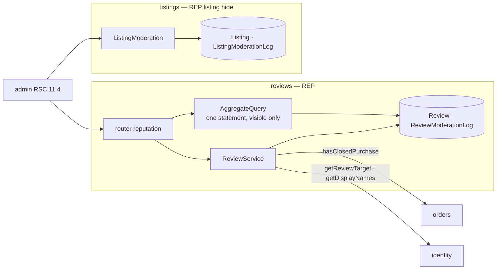

**Alternatives (the combined audit view).**
1. *One shared moderation table.* Rejected. It breaks table ownership (AD-8).
2. *`reviews` querying `listings` for its log.* Rejected. There is no allowed edge, and adding one would create a cycle through `orders`.
3. **Chosen:** each module exposes its own log query, and the admin RSC merges them by `at` (AD-REP-3).

#### AD-REP-1 — A review's verification is snapshotted at write, one review per reviewer and target

- **Status:** [ADOPTED]
- **Binds:** `reputation.write`, `edit`; `Review`; `orders.hasClosedPurchase`; `identity.getReviewTarget`; FR-REP-1, FR-REP-2; NFR-REP-1 (paid-but-not-closed refusal); EC-32, EC-43.
- **Prevents:** a business review without a closed purchase; duplicate reviews from a double submit; editing a hidden review back into view.
- **Rule:**
  1. The target is read through `getReviewTarget`:
     - a business must be `Approved`, otherwise `TargetNotFound`;
     - an individual must have a complete profile, otherwise `TargetNotFound`;
     - a reviewer equal to the target gets `TargetNotFound` before the insert, so user input never reaches `CHECK reviewerId <> targetUserId`.
  2. For a business, `hasClosedPurchase(reviewer, target)` must be `closed`, otherwise `NotVerifiedPurchaser`, citing `latestState`. Then `purchaseVerified=true`. For an individual, `purchaseVerified=false`.
  3. The insert's unique violation raises `DuplicateReview`.
  4. Edit runs `UPDATE … SET rating, text, "editedAt"=:now WHERE id AND "reviewerId"=:actor AND "hiddenAt" IS NULL`. On 0 rows it raises `ReviewNotFound` (EC-32).
  5. Seeded reviews of a business are dated after its `approvedAt` (EC-43).
- **Trade-off:** `purchaseVerified` is not re-evaluated if the purchase facts change later. Order facts are write-once, so they cannot change.

#### AD-REP-2 — Aggregates are computed at read from the same snapshot as the list

- **Status:** [ADOPTED]
- **Binds:** `reputation.profile`, `getAggregates`; `averageTenths`; FR-REP-3, FR-REP-7; NFR-REP-1 (hide-versus-post aggregate race), NFR-REP-2, NFR-REP-3.
- **Prevents:** a stored average drifting from visible reviews; a hidden review counted; an aggregate and a list disagreeing within one page.
- **Rule:**
  1. One statement over `WHERE "hiddenAt" IS NULL` returns `count` and `sum` per target. `average = round_half_up(10 × sum / count) / 10`, computed by `averageTenths` in BigInt.
  2. The profile runs the aggregate and the first page of 20 in one `REPEATABLE READ` read-only transaction. This is the one sanctioned exception to AD-SYS-4 rule 8, for reads only.
  3. The application DB role has `DELETE` revoked on `Review` (NFR-REP-3). A migration test asserts the grant.
- **Trade-off:** the aggregate is computed on every read, which is one indexed statement for ≤ 500 sellers.

#### AD-REP-3 — Hide and unhide are conditional, logged with snapshots, and reversible

- **Status:** [ADOPTED]
- **Binds:** `reputation.admin.hide`, `unhide`, `search`; `inventory.admin.hide`, `unhide`; `ReviewModerationLog`, `ListingModerationLog`; FR-REP-4, FR-REP-5, FR-REP-6; NFR-REP-1 (hide-versus-post aggregate race); EC-34, EC-35.
- **Prevents:** a double hide writing two log rows; a moderation action with no audit trail; audit rows that lose the content that was hidden.
- **Rule:**
  1. Hide runs `UPDATE … SET "hiddenAt"=:now, "hiddenReason", "hiddenBy" WHERE id AND "hiddenAt" IS NULL RETURNING` the content. On 1 row, the log row with snapshots is inserted in the same transaction. On 0 rows, the command returns an explained no-op (`allowedWithNotice`, citing the existing hide) and writes no log row.
  2. Unhide is the mirror image with `"hiddenAt" IS NOT NULL`.
  3. A hidden listing leaves discovery on the next request (AD-DSC-1 rule 6). Hiding it never touches reservations or open orders.
  4. Admin review search uses `tezg_unaccent_lower(text) LIKE tezg_unaccent_lower(:q)` with escaped wildcards (EC-34). There is no export.
  5. The 11.4 view merges the two log queries by `(at desc, id)`, 50 per page, with filters by type, reason and date applied in each query.
- **Trade-off:** the merged view pages two sources in the RSC. Deep pages cost two queries each, which is fine at admin volumes.

---

## 7. Event catalog

### 7.1 Events, subscribers and idempotency keys

Every event is an `OutboxEvent` row written in the publisher's transaction (AD-SYS-2 rule 1). The row's `id` is the event id. `type` is the event name. `aggregateId` is the first key of the payload. The payloads are exactly the ADD-§5 payloads. This document adds no field (AD-9), and every field passes the regulated-field redactor (AD-SYS-8 rule 4).

| Event | Published by (command, AD) | Payload (ADD-§5) | Subscriber → handler | Idempotency (natural key, enforced by) | Effect |
| --- | --- | --- | --- | --- | --- |
| `BusinessApplicationApproved` | identity: `verification.approve` (AD-VER-1) | `{ applicationId, businessId, businessName, approvedAt, approvedBy }` | commission → `onBusinessApplicationApproved` | `businessId`: `CommissionAccount` PK, `INSERT … ON CONFLICT DO NOTHING` (AD-COM-1 rule 5) | Opens the account. Only on insert, enqueues `CommissionBalanceExhausted{ledgerSeq:0, balanceAfter:0}` |
| | | | listings → `onBusinessApplicationApproved` | `applicationId`: `AppliedApplicationDecision` PK (AD-INV-3 rule 5) | Clears `withdrawnAt` on listings withdrawn for `ApplicationRejected`, if this is the newest decision. The badge is never stored (AD-DSC-2 rule 3) |
| `BusinessApplicationRejected` | identity: `verification.reject` (AD-VER-1) | `{ applicationId, businessId, reasonCode, reapplyNotBefore \| barred, rejectedAt }` | listings → `onBusinessApplicationRejected` | `applicationId`: `AppliedApplicationDecision` PK (AD-INV-3 rule 5) | Withdraws the business's listings with `withdrawnReason='ApplicationRejected'`, if this is the newest decision |
| `OrderPaymentConfirmedByBusiness` | orders: `orders.confirmPaymentReceived` (AD-ORD-2) | `{ orderId, businessId, buyerId, totalCop, lines, sellerReceivedConfirmedAt, buyerItemReceivedConfirmedAt }` | commission → `onOrderPaymentConfirmedByBusiness` | `orderId`: partial unique `CommissionLedgerEntry(orderId) WHERE kind='Deduction'` (AD-COM-2 rule 2) | One deduction if first (AD-SYS-3) |
| `OrderClosed` | orders: `orders.confirmItemReceived` (AD-ORD-2) | `{ orderId, buyerId, businessId, totalCop, lines, sellerReceivedConfirmedAt, buyerItemReceivedConfirmedAt }`, bundles expanded | commission → `onOrderClosed` | `orderId`: same partial unique index | One deduction if first (AD-SYS-3) |
| | | | collections → `onOrderClosed` | `orderId`: `PostPurchasePrompt.orderId` unique (AD-COL-2) | One `Pending` prompt |
| `CommissionBalanceExhausted` | commission: `LedgerService.apply` on a crossing to ≤ 0, and account opening (AD-COM-1) | `{ businessId, ledgerSeq, balanceAfter }` | listings → `onCommissionBalanceExhausted` | `ledgerSeq` gate: apply if no `SellerCommissionState` row or `ledgerSeq > lastAppliedSeq` (AD-INV-3 rule 4) | Sets `pausedAt` on the business's listings |
| `CommissionBalanceReplenished` | commission: `LedgerService.apply` on a crossing to > 0 (AD-COM-1) | `{ businessId, ledgerSeq, balanceAfter }` | listings → `onCommissionBalanceReplenished` | same `ledgerSeq` gate | Clears `pausedAt` |
| `TradeAccepted` | trading: `trading.accept` (AD-TRD-2 rule 2, step 7) | `{ tradeOfferId, listingId, sellerId, proposerId, terms, acceptedAt }` | none in V1 | `tradeOfferId` (reserved) | Reserved for notifications. The event is still written, so a v2 subscriber can process history. Because no subscriber exists, `outbox.enqueue` writes no `EventDelivery` row; that subscriber needs a backfill migration that inserts its `pending` rows (AD-SYS-2 rule 3) |

**Rules every subscriber follows.**
1. A handler runs in its own transaction, under the attempt procedure of AD-SYS-2 rule 4. It writes its state and sets its `EventDelivery` row to `delivered` together.
2. Its natural key makes a redelivery, a sweep or a replay a no-op. A test delivers every event 3 times, in both orders where there are two triggers, and asserts one effect.
3. A handler reads only its own tables and the payload. It never calls back into the publisher (AD-1, AD-9).
4. The `ledgerSeq` gate makes the listings projection insensitive to order: `Replenished(seq 5)` followed by a late `Exhausted(seq 4)` leaves the listings resumed.

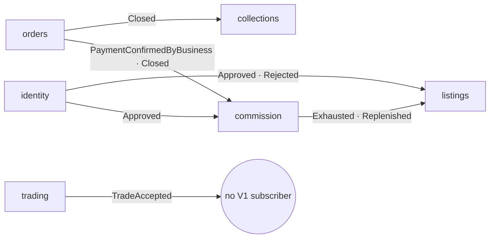

Every arrow above goes through the outbox. None is a compile-time import, so AD-1's graph is unchanged. The dashed edges of AD-1 (`commission ⇢ orders`, `listings ⇢ commission`, `collections ⇢ orders`) are exactly these subscriptions.

### 7.2 Delivery rules

AD-SYS-2 holds the rules. In short:
- **Enqueue** happens in the publisher's transaction and writes one `pending` delivery row per registered subscriber.
- **Dispatch** is synchronous after commit, before the response. Each delivery goes through the attempt procedure (AD-SYS-2 rule 4), one handler transaction per subscriber.
- **Failure** writes `EventDelivery(failed)` with the registry code only. Nothing retries a `failed` delivery automatically.
- **Stuck `pending` deliveries** (a crash between commit and dispatch, or during an attempt) are picked up by the sweeper after 60 s. A delivery gets at most 3 automatic attempts; the next one marks it `failed` with `DeliveryAttemptsExhausted`. The sweeper runs on every hourly tick and on both daily crons.
- **Visibility.** The badge on admin rail item 10 "Entregas fallidas" counts `failed` deliveries, with the age of the oldest by `firstFailedAt`, and `pending` deliveries older than 24 h. `daily-morning` writes one `FailedDeliveryDigest` row, shown as one line on page 2.3's Entregas tab. The NFR-SYS-6 success metric is "0 deliveries unresolved for more than 24 h": `failed` rows with `firstFailedAt` older than 24 h, plus `pending` rows with `createdAt` older than 24 h (PRD §22; ADD-§10; decision log #43).

The test binding (`EventBus`) runs the same dispatcher against the test database. A fault switch makes one named subscriber throw, which is how the replay path is tested.

### 7.3 Replay

| Aspect | Rule |
| --- | --- |
| Procedure | `admin.events.replay({ eventId, subscriber })`, `adminProcedure`, on page 2.3's event panel |
| Allowed when | the delivery row exists with `status='failed'`. A `pending` or `delivered` row, or no row at all, raises `EventDeliveryNotReplayable` (§8) |
| Effect | re-runs that one handler for that one event, in the transaction that claims the row. On success, the delivery becomes `delivered`, with `attempts + 1` and `lastAttemptAt` set. On a throw, the transaction rolls back and a separate transaction records the new `lastErrorCode`, `lastAttemptAt` and `lastFailedAt`; `firstFailedAt` is unchanged and the delivery stays `failed`. The 3-attempt cap of AD-SYS-2 rule 4 applies to automatic attempts only |
| Concurrency | the replay claims the row with `SELECT … WHERE (eventId, subscriber) AND status='failed' FOR UPDATE SKIP LOCKED`; there is no advisory lock. If nothing is claimed, a plain read decides: a row that is still `failed` is held by a concurrent replay, and the call is a no-op that returns the current delivery status; any other state raises `EventDeliveryNotReplayable` |
| Audit | one `EventReplayLog(adminId, eventId, subscriber, outcome, at)` row per call, append-only (AD-SYS-8 rule 10) |
| Idempotency | a replay of an effect that already happened is a no-op through the natural key (§7.1). A test replays each handler twice and asserts one effect |

**Read procedures.** The event panel and its signals read through these procedures (decision log #42). All are `adminProcedure`, so a non-admin gets `AdminOnly`, and all are owned by `shared-kernel`.

| Procedure | Returns | Read by |
| --- | --- | --- |
| `admin.events.deliveries({ kind: 'failed' \| 'stuck', cursor? })` | 25 rows per page, oldest first: `failed` rows by `firstFailedAt`, or `pending` rows older than 24 h by `createdAt`; each with `attempts`, `lastErrorCode`, `lastAttemptAt` and `lastFailedAt` | page 2.3, Entregas tab |
| `admin.events.deliveryHealth()` | `{ failedCount, oldestFirstFailedAt, stuckPendingCount, latestDigest }` | the rail item 10 badge, the Entregas tab label and its digest line |
| `admin.jobs.tickHealth()` | `{ lastTickStartedAt, tickSilent }`, derived at read time from `JobRun` (§4) | page 2.3's header and the rail item 5 marker |

---

## 8. Code registry additions

ADD-§3.1 and ADD-§3.2 stay the source for the existing rows, which remain valid unchanged. This includes rows that no module section re-mentions, such as `IndividualSellerProfileIncomplete`, `SellerNotVerified`, `ListingUnverified`, `ListingPausedBalanceExhausted`, `ListingLocationUnusable` and `ReferencePriceStale`. The rows below are **new** in Phase 3. Each one enters `shared-kernel/codes.ts` with a template in `messages/es-CO/` and a triggering test (AD-SYS-1 rule 6).

### 8.1 New DomainErrors

| Code | Owner | tRPC | Trigger | FR / source | Decision |
| --- | --- | --- | --- | --- | --- |
| `TradeCounterUnchanged` | trading | `CONFLICT` | A counter whose terms are equal to the current round's terms (normalized: item multiset and `cashCop`) | FR-TRD-2; EC-11 | AD-TRD-1 [G-1] |
| `TradeRoundLimitReached` | trading | `CONFLICT` | A counter that would create round 11 | FR-TRD-2; A-29 | AD-TRD-1 |
| `CollectionLimitReached` | collections | `CONFLICT` | Creating a 51st collection | FR-COL-1 | AD-COL-1 [G-2] |
| `InvalidCatalogEntry` | collections | `BAD_REQUEST` | Adding a catalog entry whose id `catalog.getEntries` reports as missing | FR-COL-2 | AD-COL-1 rule 3 |
| `CommissionRateNotFutureDated` | commission | `BAD_REQUEST` | Setting a rate whose `effectiveFrom` is earlier than now (60 s tolerance) | FR-COM-7 | AD-COM-2 rule 6 |
| `LastActiveReasonRequired` | identity | `CONFLICT` | Deactivating the only active rejection reason | FR-VER-8 (PRD-sync, §15.2) | AD-VER-1 rule 6 |
| `SearchFilterTooBroad` | listings | `BAD_REQUEST` | `view=listings` catalog filters that match more than 20,000 entries | FR-DSC-1 | AD-DSC-2 rule 2 |
| `InvalidDocumentFile` | identity | `BAD_REQUEST` | A VER document that fails the upload pipeline (size, magic bytes, scanner). The cause is cited | FR-VER-1; NFR-SYS-14 | AD-SYS-8 rule 6 |
| `TopUpProofInvalidFile` | commission | `BAD_REQUEST` | A top-up proof that fails the upload pipeline | FR-COM-2; NFR-SYS-14 | AD-SYS-8 rule 6 |
| `TopUpNotFound` | commission | `NOT_FOUND` | An unknown top-up id on an admin read or decision | FR-COM-3 | AD-COM-3 |
| `EventDeliveryNotReplayable` | shared-kernel | `CONFLICT` | Replaying a delivery that is not `failed` | NFR-SYS-6; OQ-4 | AD-SYS-2 rule 7 |
| `DeliveryAttemptsExhausted` | shared-kernel | none: never thrown, stored in `EventDelivery.lastErrorCode` | A `pending` delivery reaches its fourth automatic attempt after 3 attempts whose outcome was never recorded | NFR-SYS-6 | AD-SYS-2 rule 4 |

`shared-kernel` now owns three codes: `RequestValidationFailed` (transport), `EventDeliveryNotReplayable` and `DeliveryAttemptsExhausted` (the outbox it owns, AD-SYS-2 rule 10). None concerns domain data.

`ComprobanteInvalidFile` (orders) stays as it is. Each upload has its own owner's code because `tezg/error-owner` forbids a shared "invalid file" code across three modules.

### 8.2 New DecisionCodes

| DecisionCode | Owner | Meaning | FR | Decision |
| --- | --- | --- | --- | --- |
| `FxRateSourceMismatch` | catalog | A TRM re-fetch returned a value different from the stored rate for the same validity date. The stored rate is kept, and the conflict is logged on 2.3 | FR-CAT-8; NFR-CAT-3 | AD-CAT-3 |

### 8.3 Codes whose use changed

| Code | Change | Reason |
| --- | --- | --- |
| `RequestValidationFailed` | Produced only by the tRPC input parser. Three planned module uses moved to owner codes: `LastActiveReasonRequired`, `SearchFilterTooBroad`, `InvalidCatalogEntry` | AD-SYS-1 rule 7 (OQ-7) |
| `ContactRateLimited` | Not raised for a repeat within 60 min for the same `(requesterId, listingId)`, nor for `kind='trade'` | AD-MSG-1 rule 3; EC-36, EC-37 |
| `OrderNoLongerActive` | Also returned when `expiresAt ≤ now` but the expiry is not yet materialized | AD-ORD-2; AD-SYS-6 rule 5 |
| `TradeOfferNotOpen` | Also returned when the offer's `expiresAt ≤ now` but it is not yet materialized | AD-TRD-1; AD-SYS-6 rule 5 |

---

## 9. Explainability

### 9.1 One Decision on every surface

Every command outcome and every rendered status carries the AD-SYS-1 `Decision`. The table shows where each module's decisions surface.

| Surface kind | What is shown | Source |
| --- | --- | --- |
| Refusal banner (every form) | `humanMessage`, plus a link built from `citations[0].inputs` (`orderId`, `listingId`, `applicationId`) | the DomainError body |
| Status chip (listing, order, offer, application, top-up) | `outcome` + `humanMessage`; the chip's detail popover lists the citations | the query DTO's `decision` field |
| Price and valuation lines | `stale` / `excluded` / `notValued` decisions with the date or reason | `ReferencePrice` staleness at read (AD-SYS-7), AD-VAL-1 |
| Search results | `excluded.unusableLocation` count and `ranked` distance citation | AD-DSC-1 |
| Admin consoles | the loser's decision after a race (`…NotPending`, citing who and when) | AD-SYS-5 rule 2 |

A query DTO that renders a state includes `decision: Decision`. The page never recomputes a reason on the client. A contract test renders every registry code through the formatter and asserts the full shape, with no PascalCase token in `humanMessage` (NFR-SYS-1, NFR-SYS-13).

### 9.2 The H consoles (`/dev/*`)

The UX defines one console per module that the rubric's scenario tests exercise: 1.1 `/dev/idn`, 3.2 `/dev/dsc`, 4.3 `/dev/inv`, 6.4 `/dev/ord`, 7.5 `/dev/com`, 8.4 `/dev/trd`, 10.3 `/dev/val`, 12.3 `/dev/msg`.

| Aspect | Rule |
| --- | --- |
| Builder | `devProcedure` = `adminProcedure` + an environment guard. It is the fourth builder of AD-SYS-8 rule 1 |
| Existence | The `dev` router is mounted only when `TEZG_DEV_SURFACES=true`. The pages under `app/dev/` call `notFound()` otherwise. Production sets it to `false`. A build test asserts that the production build's router tree has no `dev.*` key |
| Data | Consoles call the same application services as the product pages. They add read-only explanation (`explain`, `timeline`, `inspect`) and scenario presets |
| Race presets | `dev.*.race` runs N concurrent commands against the test database through the real transaction helper. It is available only when the database URL is the Docker test database. Otherwise it raises `'Unexpected'` |
| Regulated data | Consoles show only redacted values (AD-SYS-8 rule 4). They never show a signed URL, a phone number or a message body |
| FR-INV-9 preset | 4.3 gains an "edit / restock / deactivate, with the lost race" preset [ASSUMPTION — EC-41], so FR-INV-9 is exercised by a scenario test and not only by page 4.2 |

---

## 10. Security

This table is the threat model for Plan-2. Each row names the threat, the control, and the test that proves it.

| # | Threat | Control | Proof |
| --- | --- | --- | --- |
| S-1 | A client supplies its own role or seller kind | Roles come only from `identity.getCapabilities` (AD-IDN-1, AD-16). No input schema has a role-like key | Generated authorization test (AD-SYS-8 rule 2) |
| S-2 | IDOR: reading another user's order, offer, conversation, top-up or application | Every read filters by the actor in the SQL predicate. A miss and a foreign id return the **identical body** (`*NotVisibleToCaller` or `*NotFound`) | Per-module test comparing the bodies for a foreign id and a random id byte for byte, except `occurredAt` |
| S-3 | A business sees an order before the buyer confirmed payment | One visibility predicate (AD-ORD-3, AD-15) | Test over all 6 derived states × 3 roles |
| S-4 | A regulated value leaks into logs, errors, citations, event payloads or dev consoles | `regulated.ts` + the redactor; `LegalIdentityRepository` as the only reader (AD-VER-2); lint `tezg/legal-identity-confined`, `tezg/regulated-select` | CI canary test (AD-SYS-8 rule 4), expected count 0 |
| S-5 | A hostile upload (polyglot, PDF with script, oversized file) | Size, magic bytes and `StructuralScanner`; private buckets; cuid2 keys; signed URLs with a 600 s TTL, `attachment` and `nosniff`; sandboxed viewer | Upload fixture suite: one file per rejection cause, plus a JPEG with a trailing payload that must come back re-encoded |
| S-6 | Contact scraping or spam through the contact handoff | `ContactRateLimited` per requester, per seller and per IP under advisory locks (AD-MSG-1). Phone numbers are released only through `generateContactMessage` | 50-connection limit test: exactly 30 allowed per hour |
| S-7 | Tracking users by raw IP | IPs are stored only as `ipHmac` = HMAC-SHA256 with `IP_HMAC_KEY` (server env, ≥ 32 bytes, never logged). `ContactRequestLog` is purged after 7 days and `AuthThrottleEvent` after 24 h | Schema test: no `inet` column and no column named `ip`; the purge test |
| S-8 | Credential stuffing and sign-up abuse | `AuthRateLimited` per account and per IP (AD-IDN-3, ADD-§9.3) | Throttle test at the 11th failed attempt |
| S-9 | An unauthenticated caller triggers a job | `/api/jobs/*` compares the `Authorization: Bearer` header with `JOBS_SECRET` in constant time. GitHub Actions and Vercel Cron both send it. Jobs are idempotent and single-flight (AD-SYS-4 rule 7) | Test: missing or wrong secret → 401 and no job row |
| S-10 | Search input as a wildcard (`%`, `_`) or an injection | All SQL is parameterized. Admin search escapes `\`, `%` and `_` before `LIKE … ESCAPE '\'` on `tezg_unaccent_lower` (AD-REP-3 rule 4). Public search uses catalog filters, not free text in `LIKE` | Test: the query `100%` matches only the literal |
| S-11 | Dev consoles reachable in production | `TEZG_DEV_SURFACES=false` and the router is not mounted (§9.2) | Build test on the production router tree |
| S-12 | An external collection image leaks the viewer's page or tracks them | The server never fetches a user URL (lint `tezg/no-direct-io`). The image renders client-side with `referrerpolicy="no-referrer"`, `loading="lazy"` and https only (AD-COL-1 rule 4) | Component test on the rendered attributes |
| S-13 | An admin action is changed or denied after the fact | Append-only audit tables with `UPDATE` and `DELETE` revoked (AD-SYS-8 rule 10). Legal-identity reads and denials are both logged | Migration grant test |
| S-14 | Moderation used to erase evidence | Hide, never delete (AD-12). The moderation log stores snapshots of what was hidden (AD-REP-3; EC-35) | Test: hide → edit is refused → unhide restores the identical text |
| S-15 | A cross-site request triggers a command | The Better Auth session cookie is `SameSite=Lax`, `HttpOnly` and `Secure`, so a cross-site `POST` carries no session. The `/api/trpc` handler also refuses a mutation whose `Origin` header is not the deployment origin | Test: a mutation with a foreign `Origin` → 403 and no write |

**Secrets** (Vercel environment, never in the repository): `DATABASE_URL`, `DIRECT_URL`, `BETTER_AUTH_SECRET`, `JOBS_SECRET`, `IP_HMAC_KEY`, `SUPABASE_SERVICE_ROLE_KEY` (server only, used by the `ObjectStorage` adapter). `TEZG_DEV_SURFACES` is a flag, not a secret.

---

## 11. Consistency matrix

This table maps each inherited AD to the Plan-2 decisions that implement it and the check that proves it holds.

| Inherited AD | Implemented by | Proof |
| --- | --- | --- |
| AD-1 Dependency direction | §3 module shape; AD-TRD-3 (`listings.resolveItemRefs`, OQ-6); AD-DSC-2 (composition in `listings`, OQ-8); §7.1 events instead of imports | Import-boundary lint; `tezg/table-owner` |
| AD-2 Three facts, no custody | AD-ORD-2 | 50×100 concurrency test per fact (AD-SYS-5 rule 4) |
| AD-3 Commission balance → purchasability | AD-SYS-3 (amended trigger), AD-COM-1, AD-COM-2, AD-INV-3 | Both-trigger test in both delivery orders; TS/SQL `purchasable` parity test |
| AD-4 Trading off `listings` | AD-TRD-1, AD-TRD-2, AD-TRD-3; AD-MSG-1 (`kind='trade'`) | Last-unit accept race; handoff generated once |
| AD-5 One location query path | AD-DSC-1 | TS/SQL distance parity test |
| AD-6 `InventoryUnit` owns quantity | AD-INV-1 (condition in the key, OQ-10), AD-INV-2 | 50×100 last-unit test; nightly oversell invariant check (ADD-§10) |
| AD-7 Independent catalog, listing and binder records | AD-COL-1 (tagged union with a `CHECK`) | Constraint test: an external entry with a `catalogEntryId` is refused by the database |
| AD-8 Table ownership | §6 data models; AD-SYS-2 rule 10 (shared-kernel infrastructure tables) | `tezg/table-owner` |
| AD-9 Snapshot payloads | §7.1 | Payload schema test per event; canary scan of `OutboxEvent.payload` |
| AD-10 Post-commit, in-process | AD-SYS-2 (refined with the outbox) | Crash-between-commit-and-dispatch test: the sweeper delivers the event once. Crash-during-attempt test: after 3 unrecorded attempts the delivery is `failed` with `DeliveryAttemptsExhausted` |
| AD-11 One owner per code | AD-SYS-1, §8 | `tezg/error-owner`; registry coverage in CI |
| AD-12 Hide, never delete | AD-REP-3, AD-INV-3 | No `DELETE` on reviews or listings in the source (grep test); grant test |
| AD-13 `legalIdentity` under Ley 1581 | AD-VER-2 | `tezg/legal-identity-confined`; canary test |
| AD-14 Signed URLs, 10-minute TTL | AD-SYS-8 rule 9 | URL expiry test with the virtual clock |
| AD-15 Business sees an order from `buyerPaidConfirmedAt` | AD-ORD-3 | Visibility matrix test (S-3) |
| AD-16 Roles derived server-side | AD-IDN-1, AD-SYS-8 rules 1–2 | Generated authorization test |
| AD-17 Comprobante is regulated | AD-SYS-8, AD-ORD-3 | Canary test; comprobante lock test |
| AD-18 Exclusivity by rejecting the second action | AD-IDN-2 (extended to `Pending` and `Rejected`, OQ-1) | 50×100 test: profile completion vs application submit |
| AD-19 Atomic decrement, may go negative | AD-COM-1, AD-COM-2 (transaction clause superseded by AD-SYS-2/3, OQ-2) | Concurrent deductions test; daily reconcile with 0 discrepancies |

---

## 12. Resolutions

### 12.1 PRD open questions and Phase 3 assumptions

| Item | Resolution | Where |
| --- | --- | --- |
| OQ-2 (AD-19 transaction vs event) | Keep the event. The outbox makes it durable and replayable. AD-19's transaction clause is superseded | AD-SYS-2, AD-SYS-3 |
| OQ-4 (failed-delivery log and replay) | `EventDelivery` and `admin.events.replay` in `shared-kernel` | AD-SYS-2, §7.3 |
| OQ-6 (`trading → catalog`) | No new edge. `trading` validates items through `listings.resolveItemRefs` | AD-TRD-3 rule 5 |
| OQ-7 (shared-kernel code) | `shared-kernel` owns `RequestValidationFailed`, produced only by the input parser | AD-SYS-1 rule 7 |
| OQ-8 (composition for browse and detail) | Composed in `listings`, at most 3 neighbour calls per request | AD-DSC-2 |
| OQ-9 (production feed) | **Not resolved here.** It is a team decision before launch. The feed stays behind `CatalogFeedSource`, and the fixture feed runs until then | §14 |
| OQ-10 and A-15 (condition key) | `InventoryUnit` is keyed by `(sellerId, itemRef, condition)` | AD-INV-1 |
| A-22 (10-minute expiry sweep) | Replaced. Expiry is derived at read and enforced in the command predicate. Hourly and daily jobs only materialize it | AD-SYS-6 rule 5, AD-ORD-2; PRD-sync edit on FR-ORD-8 (§15.2) |
| A-41 (`BinderEntry`) | `CollectionEntry` plus the binder layout. No separate table | AD-COL-1 |

### 12.2 UX edge cases owned by Phase 3

| EC | Resolution | Where |
| --- | --- | --- |
| EC-07 | Route form without an id: `/coleccion/agregar` targets "General" and creates it on save | §6.10 routes; AD-COL-1 rule 2 |
| EC-08 | The "General" option appears when the account has no collection | AD-COL-1 rule 2 |
| EC-11 | The server refuses an identical counter with `TradeCounterUnchanged` | AD-TRD-1 [G-1] |
| EC-14 | Send is idempotent on `(conversationId, senderId, clientMessageId)`; a retry returns the original message | AD-MSG-2 |
| EC-29 | A decision about an order carries `citations[0].inputs.orderId` | AD-SYS-1 rule 4 |
| EC-30 | 1.2 → `/vender/perfil`; 2.1 → `/catalogo` | §6.1, §6.3 |
| EC-32 | No edit while a review is hidden: the conditional update includes `hiddenAt IS NULL` and returns `ReviewNotFound` | AD-REP-1 rule 4 |
| EC-34 | Admin search is an exact substring, case- and accent-insensitive, with escaped wildcards | AD-REP-3 rule 4 |
| EC-35 | The moderation log stores snapshots (rating and text, or title and price). There is no export | AD-REP-3 |
| EC-36 | A repeat contact for the same `(requesterId, listingId)` within 60 min is logged but not counted | AD-MSG-1 rule 3 [PRD-sync] |
| EC-37 | Trade handoffs skip the contact limiter | AD-MSG-1 rule 3 [PRD-sync] |
| EC-38 | Messaging eligibility follows the business's current state; a thread reopens with the notice | AD-MSG-2 |
| EC-39 | No read receipts: the other side's `lastReadSeq` is never returned | AD-MSG-3 rule 4 |
| EC-40 | One parameter name: `requesterId` in both FR-TRD-6 and FR-MSG-1 | AD-TRD-2 rule 5; PRD-sync edit on FR-TRD-6 |
| EC-41 | A 4.3 console preset for FR-INV-9 [ASSUMPTION] | §9.2 |
| EC-42 | The seed computes every date from the virtual clock's seed instant, matching the ADD-§8 time model | AD-SYS-6 rule 6 |
| EC-43 | Seeded reviews of a business are dated after its `approvedAt` | AD-SYS-6 rule 6, AD-REP-1 rule 5 |

EC-33 (self-review detection) stays deferred to v2, as triaged in Phase 2.

---

## 13. Scheduled and background work

No correctness rule depends on any row in this table (AD-SYS-6 rule 5). Every job is behind `JOBS_SECRET`, idempotent, and single-flight under `job:<name>` (AD-SYS-4 rule 7).

| Job | Trigger (§4) | Owner | What it does | If it never runs |
| --- | --- | --- | --- | --- |
| `trm-fetch` | `daily-morning`; hourly tick while today's rate is missing [G-3]; admin button | catalog | Fetches the TRM for today (AD-CAT-3) | Carry-forward with `FxRateCarriedForward` (FR-CAT-8) |
| `feed-ingest` | admin button (start and continue) | catalog | Leased, resumable batches (AD-CAT-1) | Prices age and show as stale |
| `outbox-sweep` | hourly tick [G-3, best-effort]; `daily-morning`; `daily-night` | shared-kernel | Runs the attempt procedure on `pending` deliveries older than 60 s, at most 3 automatic attempts each (AD-SYS-2 rules 4 and 6) | Deliveries wait until the next run; the badge shows those `pending` for more than 24 h |
| `failed-delivery-digest` | `daily-morning` | shared-kernel | Writes `FailedDeliveryDigest(date, count, oldestFirstFailedAt, stuckPendingCount)`, shown as one line on page 2.3's Entregas tab | The live badge still counts failures and stuck deliveries |
| `expiry-materialize` | `orders.create` pre-step (scoped to the listing's units); hourly tick [G-3]; `daily-morning`; `daily-night` catch-up | orders, trading | Sets `expiredAt` / `Expired` on rows with `expiresAt ≤ now`. For orders it releases the reservation exactly once (AD-ORD-2 rule 6). `Open` offers hold no reservation, so only their status changes (AD-TRD-1 rule 5) | Reads and commands already treat the rows as expired. Quantity held by an expired order stays unavailable until the next run, or until someone tries to buy that listing and the pre-step reclaims it (AD-INV-2 trade-off) |
| `commission-reconcile` | `daily-night`; admin button (7.4) | commission | Checks every account against its ledger (AD-COM-1 rule 4) | Discrepancies surface later |
| `retention-purge` | `daily-night` | each owner | Applies ADD-§9.4 (5 and 10 years; closure + 1 year); deletes `delivered` event rows older than 90 days [ASSUMPTION] | Data is kept longer than the policy |
| `orphan-upload-sweep` | `daily-night` | identity, orders, commission | Deletes objects in the three private buckets that no row references and that are older than 24 h | Unreferenced files remain (private, no signed URL can be issued) |
| `contact-log-purge` | `daily-night` | listings | Deletes `ContactRequestLog` rows older than 7 days | The limiter reads only the last 24 h, so behaviour is unchanged |
| `auth-throttle-purge` | `daily-night` | identity | Deletes `AuthThrottleEvent` rows older than 24 h | Same as above, with the 15-minute and 1-hour windows |
| `oversell-check` | `daily-night` | listings | Counts units with negative `quantity` and stores the result for the admin home. Under AD-INV-2 there is no `reserved` column and the CHECK keeps the count at 0, so this is a placeholder until the stock-movement item in §14 lands | The metric is not measured that day |

---

## 14. Deferred

| Item | Why deferred | Revisit when |
| --- | --- | --- |
| ClamAV-class malware scanning | No free-tier host for a scanner daemon on Vercel Hobby. `StructuralScanner` plus the sandboxed viewer covers V1 [G-4] | Before production launch, or when uploads exceed 1,000 per month |
| Email digest of failed deliveries | No email provider in V1. The admin home badge and `FailedDeliveryDigest` cover it | When an email provider is added for notifications |
| Automated dependency-graph linter beyond import boundaries | The import-boundary lint and `tezg/table-owner` cover AD-1 and AD-8 in V1 | When a tenth code module is proposed |
| Vercel Pro cron (sub-daily schedules) | Hobby allows 2 daily crons; the GitHub Actions tick covers the gap [G-3] | If G-3 is rejected, or on moving to Pro |
| Production catalog and price feed (OQ-9) | A team decision, including the licence | Before launch |
| `TradeAccepted` subscribers (notifications) | No notification channel in V1 | With the notifications feature |
| Self-review detection (EC-33) | Out of scope (PRD §5) | v2 |
| Legal review of the retention periods (OQ-12) | A pre-launch task outside the architecture | Before launch |
| A meaningful oversell metric (ADD-§10) | The ADD-§10 formula (`reserved > quantity`) has no column to read under AD-INV-2, and a real check needs a stocked total per unit (a stock-movement ledger). Oversell prevention itself is covered by the CHECK and the NFR-INV race tests | Before launch, together with the ADD-§10 PRD-sync edit. Owner: the team; reviewed in the Phase 4 readiness report |
| Retrying rows skipped for missing FX (`deferredNoFx`) | Rows are counted, not stored; a rerun of the same file picks them up (§15.3) | With the production feed (OQ-9). Owner: the team; reviewed in the Phase 4 readiness report |

---

## 15. Gate items and PRD-sync edits

### 15.1 Decisions for the Phase 3 gate

| # | Question | Recommendation | If rejected |
| --- | --- | --- | --- |
| G-1 | Should the server refuse a counter-offer identical to the current round (`TradeCounterUnchanged`)? | **Yes.** Without it, turns can ping-pong until expiry, and the client-side check alone can be bypassed (EC-11) | Drop the code; an identical counter becomes a valid round that still counts toward the 10-round limit |
| G-2 | Should the 50-collection limit have its own code (`CollectionLimitReached`) instead of a generic refusal? | **Yes.** Every refusal needs an owner code (AD-SYS-1), and the UX needs a specific message | The PRD must name another existing code, which would break the one-owner rule |
| G-3 | Should a GitHub Actions hourly tick (`5 12-23,0-1 * * *` UTC) retry the TRM and materialize expiries? | **Yes.** It is free, and it brings the TRM retry close to NFR-CAT-4 without a paid plan | NFR-CAT-4 becomes two attempts per day (07:00 and a manual retry); expiry materialization runs twice a day. Correctness is unchanged |
| G-4 | Is `StructuralScanner` acceptable as the V1 `MalwareScanner`, with ClamAV deferred? | **Yes**, with the sandboxed viewer as the compensating control | Uploads are blocked until a hosted scanner is chosen, which blocks VER, ORD and COM |

**Gate outcome (2026-09-27).** The team accepted all four recommendations (decision log #17). The "If rejected" column stays for the record.

### 15.2 PRD-sync edits

These edits make the PRD match the architecture. The gate approved them, and they were applied to `prd.md` and `addendum.md` on 2026-09-27 (decision log #18). The NFR-CAT-4 row was not applied, because G-3 was accepted. The last three rows follow from the accepted review triage and §8.3.

| FR | Edit | Source |
| --- | --- | --- |
| FR-TRD-6 | `counterpartId` → `requesterId` | EC-40; AD-TRD-2 rule 5 |
| FR-TRD-2 | Add: an identical counter is refused with `TradeCounterUnchanged`; the 11th round with `TradeRoundLimitReached` | G-1; A-29 |
| FR-ORD-8 | Replace "a sweep every 10 minutes" with "expiry is derived at read and enforced by every command; scheduled jobs materialize it hourly and daily". Retires A-22 | AD-ORD-2; AD-SYS-6 rule 5 |
| FR-ORD-3 | The paid-confirmation predicate includes `expiresAt > now` | AD-ORD-2 |
| FR-MSG-3 | Add the 60-minute de-duplication per `(requesterId, listingId)` and the trade exemption | EC-36, EC-37; AD-MSG-1 |
| FR-COL-1 | The limit refusal is `CollectionLimitReached` | G-2 |
| FR-VER-8 | The last-active-reason refusal is `LastActiveReasonRequired`, not `RequestValidationFailed` (the 5.5 page keeps its copy) | AD-SYS-1 rule 7; §8.1 |
| FR-DSC-1 | A catalog filter matching more than 20,000 entries is refused with `SearchFilterTooBroad` | AD-DSC-2 rule 2 |
| NFR-CAT-4 | Only if G-3 is rejected: two attempts per day | G-3 |
| FR-COM-7 | Add: a past `effectiveFrom` is refused with `CommissionRateNotFutureDated`; a migration seeds the A-24 rate (800 bps) at the epoch | AD-COM-2 rule 6 |
| ADD-§10 | The oversell metric becomes "units with negative quantity (placeholder)" until the stocked-total check in §14 lands | §13 `oversell-check`; §14 |
| FR-TRD-5 | The losing accept also marks its own offer `Unfulfillable` when `getTradeability` refuses (listing gone, hidden, deactivated or closed to trade), not only on `InsufficientQuantity` | F-09; AD-TRD-2 rule 3 |
| FR-COL-2 | An unknown catalog id gets `InvalidCatalogEntry`, not `RequestValidationFailed` | §8.3; AD-COL-1 rule 3 |
| §21, §23 | OQ-2, OQ-4, OQ-6, OQ-7, OQ-8, OQ-10, A-15 and A-22 are marked resolved, citing §12.1 | §12.1 |

The addendum gained the §8.1 and §8.2 rows in ADD-§3.1 and ADD-§3.2, and the §8.3 changes of use, so it stays the contract-test source.

### 15.3 Other working assumptions in this document

These are tagged `[ASSUMPTION]` in the ADs. None blocks implementation. Each can be changed as configuration or a local rule.

| Where | Assumption | Revisit when |
| --- | --- | --- |
| AD-SYS-2 rule 10 | `delivered` event rows are purged after 90 days | Retention legal review (OQ-12) |
| AD-IDN-3 | Authentication throttles are stored in `AuthThrottleEvent` in Postgres, not an external store | If sign-in volume makes the table hot |
| AD-CAT-2 rule 2 | A feed row with no TRM on or before its date is skipped and counted in `deferredNoFx`, then picked up by a rerun | First production feed run |
| AD-DSC-1 rule 7 | A bundle appears under each of its component entries in `view=entries` | UX review of the entries view |
| AD-DSC-2 rule 2 | The `tooBroad` threshold is 20,000 entries | Catalog size exceeds 100,000 entries |
| AD-TRD-2 rule 6 | A restock decrement, deactivation or hide does not mark open offers `Unfulfillable`; page 8.2 derives "not currently available" | Offer volume per listing grows |
| AD-VAL-2 rule 4 | `marketChangePercent` covers entries acquired at or before the period start (A-46) | Valuation usability testing |
| §9.2 | A 4.3 preset exercises FR-INV-9 (EC-41) | Scenario test review |
| PRD FR-COM-3 (inherited) | `lowBalanceThresholdCop` defaults to 20,000; it is display-only | 30 days of launch data (OQ-11) |
